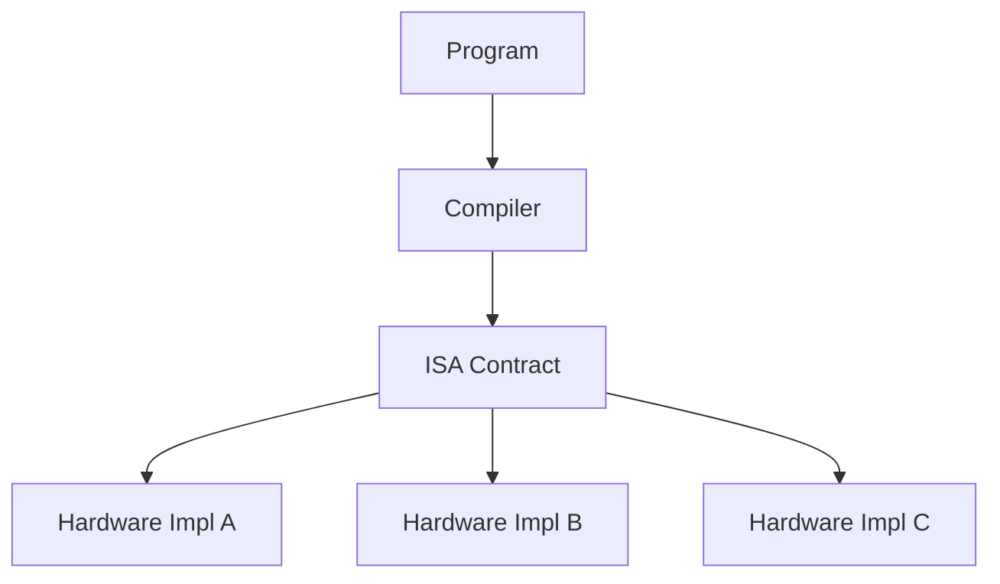

# 1.2 Why the ISA Matters

The ISA is a contract: any program built for an ISA runs on any compliant hardware, independent of the microarchitecture.

- Enables **software portability** across implementations.
- Lets hardware evolve (pipelining, caches, superscalar) without breaking programs.
- Standardizes how compilers and operating systems target a machine.

Previous: [1.1 What the ISA Specifies](1.1-what-isa-specifies.md)
Next: [1.3 Examples of Common ISAs](1.3-examples-isas.md)
