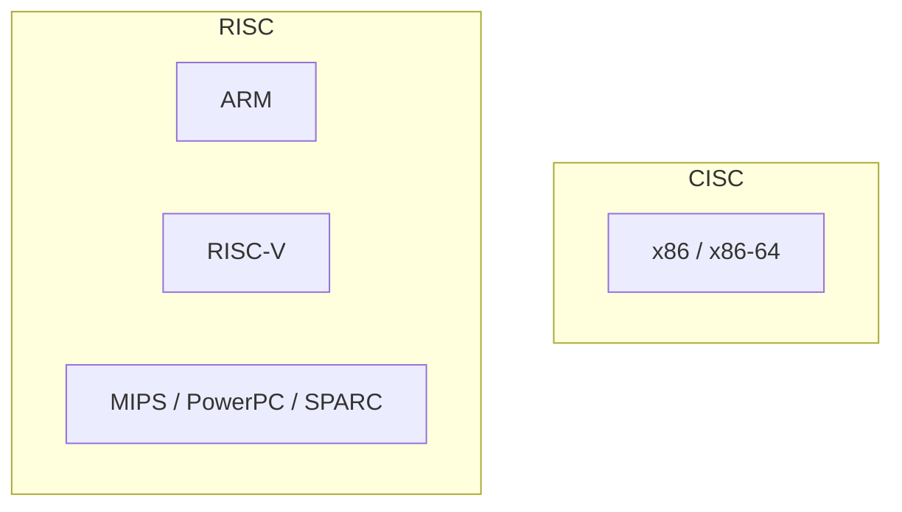

# 1.3 Examples of Common ISAs

- **x86 / x86-64**: dominant in PCs and servers.
- **ARM**: leader in mobile, embedded, and now laptops/cloud.
- **RISC-V**: open, extensible, popular in research and startups.
- **MIPS / PowerPC / SPARC**: historical or niche specialist use.

Previous: [1.2 Why the ISA Matters](1.2-why-isa-matters.md)
Next: [2.0 Reduced Instruction Set Computer (RISC)](2.0-risc.md)
