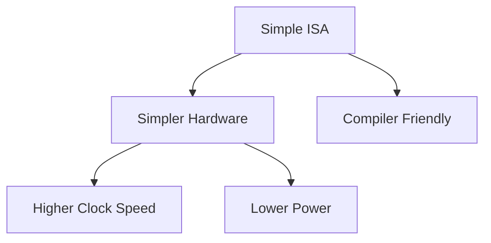

# 2.2 Advantages (RISC)

- Simpler, easier-to-verify hardware design.
- Higher clock speeds and efficient pipelines.
- Lower power consumption.
- Compilers can schedule and optimize effectively.

Previous: [2.1 Core Principles (RISC)](2.1-risc-core-principles.md)
Next: [2.3 Examples and Use Cases (RISC)](2.3-risc-examples.md)
