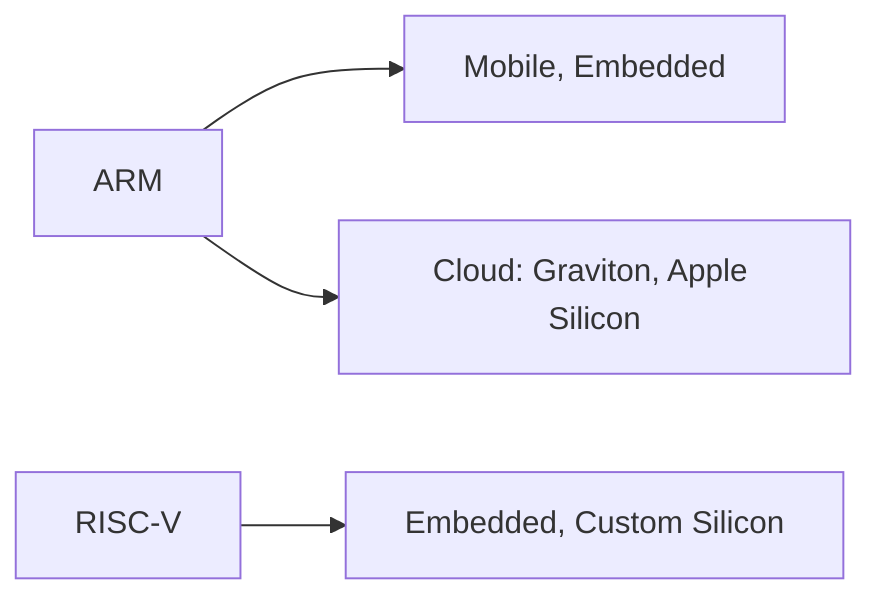

# 2.3 Examples and Use Cases (RISC)

- **ARM** and **RISC-V** are the leading RISC ISAs.
- Dominant in smartphones, tablets, embedded devices, and growing in laptops and cloud (Apple Silicon, AWS Graviton).

Previous: [2.2 Advantages (RISC)](2.2-risc-advantages.md)
Next: [3.0 Complex Instruction Set Computer (CISC)](3.0-cisc.md)
