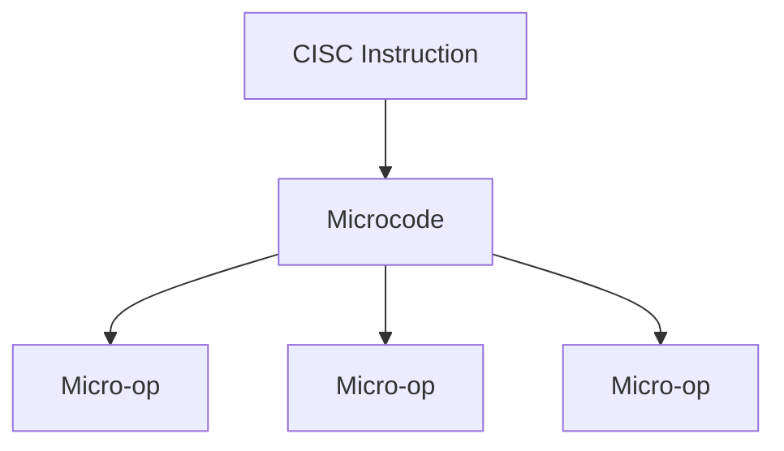

# 3.1 Core Principles (CISC)

CISC offers a rich instruction set where one instruction may do several low-level steps at once.

- **Rich instructions**: many specialized, powerful operations.
- **Variable length**: instructions differ in size.
- **Memory operands**: instructions can operate directly on memory.
- **Fewer instructions per task**: aims for compact programs.
- **Microcode**: complex instructions are internally broken into simpler steps.

Previous: [3.0 Complex Instruction Set Computer (CISC)](3.0-cisc.md)
Next: [3.2 Advantages (CISC)](3.2-cisc-advantages.md)
