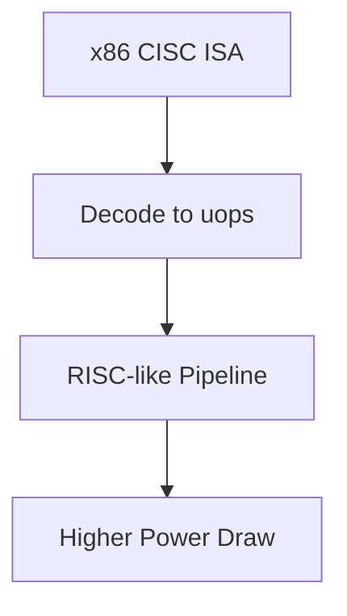

# 3.3 Trade-offs and Use Cases (CISC)

- More complex decoding; modern CISC translates to RISC-like internals.
- Higher power draw than RISC.
- **x86 / x86-64** dominates desktops and servers where compatibility and performance matter most.

Previous: [3.2 Advantages (CISC)](3.2-cisc-advantages.md)
