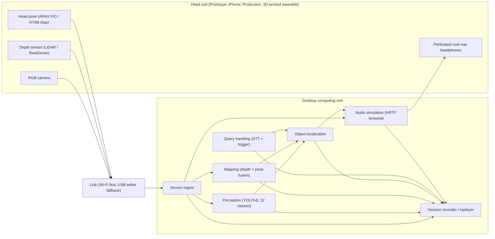

# Auris

Auris is a head-mounted navigation aid that helps a visually impaired — or blindfolded (replicating VI for the study) — user locate a desired object in a room. The user asks for an object by voice; the system, having mapped the room from the wearable's depth sensing, projects that object's characteristic sound — rendered spatially, as if the object itself were emitting it — and the user follows the sound. If the object cannot be found or has moved, the user is prompted to look around more.

> The former development plan, architecture, contracts, phases, hardware/cost breakdowns, evaluation plan, diagrams, site, and system code were cleared on 2026-09-03. This is the new development plan, decided 2026-09-04, written from the consolidated concept (see [§1](#1-concept)) and the literature consolidation in [`docs/auris-thesis/notes/`](docs/auris-thesis/notes/).

## Where things live

- Development plan (this document)
- Concept: [`.opencode/concept.md`](.opencode/concept.md) · plan summary for AI sessions: [`.opencode/plan.md`](.opencode/plan.md)
- Thesis skeleton: [`docs/auris-thesis/paper.md`](docs/auris-thesis/paper.md); IEEE variant planned (not created): `docs/auris-thesis/ieee.md`
- Literature-review notes: [`docs/auris-thesis/notes/`](docs/auris-thesis/notes/)

## 1. Concept

The full concept text lives in [`.opencode/concept.md`](.opencode/concept.md). In brief:

- **User** — visually impaired, or blindfolded (replicating VI for the study).
- **Environment** — a single indoor room with obstacles (furniture, walls) and various everyday objects.
- **Goal** — the user locates their desired object.
- **Navigation aid** — sounds are projected by the head-mounted wearable according to the desired object's position and the user's head position and orientation, rendered **as if the object itself emits the sound**; the user follows the sound.

### 1.1 Task loop (one session)

1. **Map** — the user looks around; depth frames + 6-DoF head pose accumulate into a room map (scanning phase).
2. **Query** — the user names the target object by voice (one of 12 everyday classes, [§8](#8-audio-design)), or the experimenter triggers it ([§7](#7-software-stack)).
3. **Localize** — the system resolves the target's position from the map. If the target is absent or has moved, the user is prompted to look around more (the *re-look prompt*, [§3](#3-data-flow-and-module-contracts)).
4. **Guide** — the target's characteristic sound is projected spatially at the object's position, head-tracked and distance-encoded ([§8](#8-audio-design)); the user walks to it and reaches for it.
5. **Record** — the entire session is captured for offline analysis and evaluation metrics ([§9](#9-evaluation-plan)).

### 1.2 Locked decisions (2026-09-04)

| # | Decision | Choice |
|---|---|---|
| D1 | Stage split rationale | **Financial** — Prototype on already-available hardware (LiDAR iPhone = RGB + depth + head pose); Production purchases the full hardware set ([§4](#4-development-stages)) |
| D2 | Computing unit | **Desktop**; wearable↔desktop link tested **wireless-first**, long-USB tether as fallback ([§2.2](#22-link)) |
| D3 | Audio output | **Perforated over-ear headphones** (Sound of Vision precedent — keeps ambient hearing) |
| D4 | Object detection | **COCO-pretrained YOLOv8 restricted to 12 everyday classes**; fine-tune only if evaluation shows misses ([§7](#7-software-stack)) |
| D5 | Room mapping | **Staged** — Prototype: ARKit 6-DoF pose + Open3D depth fusion; Production: ROS 2 + RTAB-Map only if the camera swaps off ARKit ([§2.3](#23-computing-unit), [§4](#4-development-stages)) |
| D6 | Audio rendering | **Generic-HRTF binaural + head tracking** ([§8](#8-audio-design)) |
| D7 | Query input | **Voice command** (speech-to-text on desktop) **+ experimenter-trigger fallback** |
| D8 | Integration | **Staged plain Python** (ZeroMQ messaging) **+ built-in session recorder/replayer** (rosbag-like) as a Phase 0 deliverable; every session recorded — standing requirement |

## 2. System architecture

Two physical units connected by a data link:

### 2.1 Head unit

**Prototype.** A LiDAR iPhone mounted on a head strap:

- **RGB camera** — real-time imagery for object detection.
- **Depth** — ARKit `sceneDepth` (LiDAR, ~256×192 metric depth points, effective range ≈ 0.3–5 m; sufficient for a room, degrades with distance/lighting).
- **Head position and orientation** — ARKit visual-inertial odometry gives 6-DoF head pose for free (device on head ≈ head pose); no separate IMU tracker needed at Prototype.
- **Sound output** — perforated over-ear headphones (D3), wired to the desktop's audio interface (long cable accepted; Bluetooth latency ≈ 100–200 ms would break the latency budget, [§8](#8-audio-design)).

**Production.** A custom **3D-printed head-mounted wearable** housing a RealSense-class RGB-D camera + IMU; headphones unchanged.

### 2.2 Link

- **Wireless-first** — the iPhone streams RGB + depth + pose over Wi-Fi to the desktop (existing streaming app such as Record3D, or a small custom Swift/ARKit app; decided in Phase 0).
- **Fallback** — a long USB cable to the desktop (USB ports run to the desk area).
- A **decision gate in Phase 5** picks the link for the evaluation study based on measured latency and jitter ([§5](#5-development-phases)).

### 2.3 Computing unit (desktop)

Plain-Python processes over ZeroMQ (D5, D8). At Production, mapping/localization port to ROS 2 + RTAB-Map if the RealSense swap happens.

1. **Sensor ingest** — receives RGB frames, depth frames, and head pose; stamps them on a monotonic clock; republishes on the message bus.
2. **Perception (computer vision)** — YOLOv8 (COCO-pretrained, restricted to the 12 classes) detects objects in RGB imagery.
3. **Mapping (mapped-out room)** — fuses depth + head pose into a 3D room map (Open3D TSDF at Prototype); supports map save/load; at Production, RTAB-Map adds pose estimation and cross-session relocalization.
4. **Object localization** — anchors detections in the map, maintains object states across views, resolves the requested target, and fires the **re-look prompt** when the target is absent, ambiguous, or moved.
5. **Audio simulation** — renders the target's characteristic sound binaurally at the object's position, updated by head pose; encodes distance; renders the re-look prompt sound.
6. **Query handling** — speech-to-text maps the user's utterance to one of the 12 classes; experimenter keyboard trigger as fallback (D7).
7. **Session recorder / replayer** — subscribes to every stream and writes a timestamped log to disk; replays sessions through the pipeline offline (D8).

### 2.4 Architecture diagram

## 3. Data flow and module contracts

All messages are timestamped (monotonic + wall clock) and published on the ZeroMQ bus. The recorder stores exactly these messages, so replay reproduces a session bit-for-bit at the message level.

| Message | Producer → Consumer | Fields (units) |
|---|---|---|
| `Frame` | ingest → perception, recorder | RGB image, camera intrinsics, seq, timestamp |
| `DepthFrame` | ingest → mapping, recorder | metric depth (m, float16, aligned to RGB), seq, timestamp |
| `HeadPose` | ingest → mapping, localization, audio, recorder | 6-DoF pose: position (m) + quaternion (w, x, y, z), confidence, timestamp |
| `Detections` | perception → localization, recorder | list of {class_id, class_name, bbox (px), confidence}, timestamp |
| `ObjectStates` | localization → audio, recorder | list of {object_id, class, position (m, map frame), last_seen, confidence} |
| `TargetCommand` | query handling → localization, recorder | {source: voice\|trigger, class_name}, timestamp |
| `LocalizationResult` | localization → audio, recorder | {status: found\|not_found\|ambiguous, object_id, position (m, map frame)}, timestamp |
| `AudioCommand` | localization → audio, recorder | {type: object_sound\|relook_prompt\|idle, class, position (m, map frame)}, timestamp |

**Coordinate frames** — documented in-repo: *camera frame* (ARKit convention: Y up, −Z forward at session start), *head frame* (co-located with camera), *room/map frame* (the map's origin frame). Units: meters, radians, quaternion (w, x, y, z). The audio node converts map-frame positions to head-relative azimuth/elevation/distance using the latest `HeadPose`.

**Recording format** — HDF5 (video/depth as compressed chunks) + SQLite/JSONL index of non-image messages; the replayer feeds stored streams back through ingest.

## 4. Development stages

### 4.1 Prototype

Built **entirely from already-available hardware** (D1 — financial rationale: build on what the team has, defer purchases until the concept is validated):

- LiDAR iPhone (12 Pro / 13 Pro class) as the sensor + head-strap mount (cheap purchase or simple printed cradle)
- Desktop with NVIDIA GPU
- Perforated over-ear headphones

Scope: prove the concept end-to-end ([§5](#5-development-phases), Phases 0–5) and run the evaluation study (Phase 6).

### 4.2 Production

Purchased and integrated only after the Prototype validates the concept:

- RealSense-class RGB-D camera (D435i class) replacing the iPhone — native USB streaming, better depth range/frame rate
- Custom **3D-printed head-mounted wearable** enclosure
- Software port: ingest via `pyrealsense2`; pose estimation and cross-session relocalization via **ROS 2 + RTAB-Map** (D5) — mechanical swap thanks to the module contracts in [§3](#3-data-flow-and-module-contracts)

Scope: Phase 7 — revalidate the full loop at parity with the Prototype.

## 5. Development phases

Each phase lists goal, tasks, deliverables, and exit criteria.

### Phase 0: Bench and link validation

- **Goal** — prove the sensing pipeline's quality and latency before any system building.
- **Tasks** — choose the streaming route (Record3D vs custom Swift/ARKit app); stream RGB + depth + pose over Wi-Fi and over USB; measure latency and frame rate for both links; set up the Python project skeleton, ZeroMQ bus, and message schemas ([§3](#3-data-flow-and-module-contracts)); **build the session recorder/replayer** (D8); audio loopback test (render an HRTF tone through the headphones from the desktop).
- **Deliverables** — streaming-route decision + bench report (latency table, wireless vs tether); recorder/replayer; repo skeleton; schema documentation.
- **Exit criteria** — sensor→desktop ≤ ~30 ms over tether; wireless latency characterized; a sample session recorded and replayed successfully.

### Phase 1: Perception

- **Goal** — reliable 12-class detection on room-scale RGB frames.
- **Tasks** — integrate Ultralytics YOLOv8 with COCO weights restricted to the 12 classes (D4); test on the live stream; collect sample frames in the target room; fine-tune **only if** class-level misses appear; tune input resolution and FPS against the GPU budget.
- **Deliverables** — detection node; per-class detection quality report on sample data.
- **Exit criteria** — all 12 classes detected on placed objects at room distances at ≥ 10 FPS, with confidence adequate for localization gating.

### Phase 2: Room mapping

- **Goal** — build the mapped-out room from depth + ARKit pose.
- **Tasks** — integrate Open3D TSDF fusion; align depth to RGB; choose voxel size; map save/load; visualize; assess drift over a room-scale scan.
- **Deliverables** — mapping node; saved maps; drift assessment.
- **Exit criteria** — a room scan yields a geometrically consistent map (walls flat, objects within ~10 cm at 3 m); map save/load round-trips.

### Phase 3: Object localization

- **Goal** — the target object's position in the room map, plus the re-look logic.
- **Tasks** — project detections into the map frame using head pose; object persistence (associate detections across views via class + distance + overlap gating); object state machine (candidate → confirmed → stale); target resolution (highest-confidence candidate; ambiguity handling); **re-look prompt triggers** — no candidate found, target stale/moved ([§8](#8-audio-design) for the prompt sound); experimenter-trigger fallback path (D7).
- **Deliverables** — localization node with object states; localization accuracy test against known object placements.
- **Exit criteria** — localization error ≤ ~15 cm at typical room distances; re-look prompt fires correctly in scripted not-found/moved scenarios.

### Phase 4: Audio simulation

- **Goal** — head-tracked spatial sound that makes an object "speak" from its position.
- **Tasks** — HRTF binaural renderer (custom Python: SOFA HRTF set, FFT convolution via numpy/scipy, `sounddevice` output, head-pose updates; 3DTI Toolkit as fallback — D6); the 12 per-class sound assets ([§8](#8-audio-design)); distance encoding (level + distance-appropriate filtering); re-look prompt sound; audio-path latency measurement.
- **Deliverables** — audio node; 12 sound assets; audible demo; latency report.
- **Exit criteria** — a blindfolded listener localizes the sound in azimuth in an informal test; audio-path latency ≤ ~20 ms; full-pipeline budget on track for < 100 ms.

### Phase 5: Closed-loop integration

- **Goal** — the end-to-end find-an-object task works on the desktop with a blindfolded user.
- **Tasks** — integrate all nodes; voice query (STT constrained to the 12 class names) + trigger fallback; **wireless-vs-tether decision gate** (D2); tune the pipeline against the **< 100 ms end-to-end budget** (Sound of Vision benchmark, Hoffmann et al. 2018 — see [`docs/auris-thesis/notes/sov-hoffmann2018-evaluation.md`](docs/auris-thesis/notes/sov-hoffmann2018-evaluation.md)); handle failure modes (target moved → re-detect; re-look prompt); pilot self-test as a blindfolded experimenter.
- **Deliverables** — integrated system; measured latency breakdown (sensor → link → perception → localization → audio); pilot run notes.
- **Exit criteria** — a blindfolded experimenter finds 10/10 placed objects in a furnished room; the link decision is made; end-to-end latency measured and documented.

### Phase 6: Evaluation study

- **Goal** — measure whether spatial-audio guidance helps users find objects.
- **Tasks** — finalize the protocol ([§9](#9-evaluation-plan)); institutional ethics/IRB if required; recruit blindfolded-sighted participants; run the within-subject conditions; collect metrics; analyze. All sessions recorded (D8) for offline trajectory/latency analysis.
- **Deliverables** — protocol document, consent forms, data, results (feeds the thesis *Results and Discussions* chapter in [`docs/auris-thesis/paper.md`](docs/auris-thesis/paper.md)).
- **Exit criteria** — target N completed; analysis done.

### Phase 7: Production iteration

- **Goal** — the integrated 3D-printed head wearable with purchased hardware ([§4.2](#42-production)).
- **Tasks** — purchase the RealSense-class camera; design and print the head-mounted wearable; port ingest to `pyrealsense2`; introduce ROS 2 + `rtabmap_ros` for pose + cross-session relocalization (D5); re-run the Phase 0 bench (latency); quickly revalidate Phases 1–5.
- **Deliverables** — Production wearable; validation report.
- **Exit criteria** — the Production system completes the Phase 5 exit task at parity with the Prototype.

## 6. Hardware plan

### 6.1 Prototype bill of materials (already available)

| Item | Role | Status |
|---|---|---|
| LiDAR iPhone (12 Pro / 13 Pro class) | RGB + depth (ARKit `sceneDepth`) + 6-DoF head pose (ARKit VIO) | owned |
| Head strap / iPhone cradle | head mount | cheap purchase or printed cradle |
| Desktop with NVIDIA GPU (≥ 6 GB VRAM — verify) | computing unit | owned |
| Perforated over-ear headphones | audio output (D3) | owned |
| Long USB-C cable + Wi-Fi access point | data link (D2) | owned |

### 6.2 Production purchases

| Item | Role | Est. cost | Rationale |
|---|---|---|---|
| Intel RealSense D435i (class) | RGB-D + IMU sensor | ~USD 300–350 | native USB, 90 FPS depth, head-mount friendly; precedented by Fei et al. 2024 and Lee & Medioni 2016 |
| 3D-printed head-mounted wearable | enclosure/mount | filament cost | the custom head unit (retained old-concept element) |
| Cables, straps, fasteners | integration | ~USD 30 | — |

## 7. Software stack

| Module | Choice | Notes |
|---|---|---|
| Streaming (Prototype) | Record3D app **or** custom Swift/ARKit app | Record3D streams RGB-D + pose via Wi-Fi/USB; custom app if more control needed — decided Phase 0 |
| Message bus | ZeroMQ (PUB/SUB) + JSON schemas | per [§3](#3-data-flow-and-module-contracts) |
| Detection | Ultralytics **YOLOv8**, COCO weights | restricted to the 12 classes; fine-tune only on evidence of misses (D4) |
| Mapping (Prototype) | **Open3D** TSDF fusion + numpy/scipy | depth + ARKit pose; save/load (D5) |
| Mapping (Production) | ROS 2 + **RTAB-Map** (`rtabmap_ros`) | only if the camera swaps off ARKit; adds relocalization (D5) |
| Object localization | custom Python | contracts in [§3](#3-data-flow-and-module-contracts) |
| Query input | **faster-whisper** (small model) constrained to class keywords + keyboard trigger | D7 |
| Audio rendering | **python-sounddevice** + numpy/scipy FFT convolution with SOFA HRTFs (`pysofaconventions`); 3DTI Toolkit fallback | D6 |
| Recorder/replayer | **HDF5** (`h5py`) + SQLite index | D8 |
| OS | Ubuntu 22.04+ (desktop); iOS 16+ (iPhone) | — |
| Deferred (Production) | `pyrealsense2`, ROS 2 Humble+, `rtabmap_ros` | [§4.2](#42-production) |

## 8. Audio design

**Rendering.** Generic-HRTF binaural rendering with head tracking (D6), justified psychoacoustically: azimuth localization remains accurate with non-individualized HRTFs (Wenzel et al. 1993 — [`docs/auris-thesis/notes/wenzel1993-hrtf.md`](docs/auris-thesis/notes/wenzel1993-hrtf.md)), and head-tracked virtual auditory displays approach free-field performance (Romigh et al. 2015 — [`docs/auris-thesis/notes/romigh2015-head-tracked-vad.md`](docs/auris-thesis/notes/romigh2015-head-tracked-vad.md)). Perforated over-ear headphones keep the room audible (Sound of Vision precedent; D3).

**Sound assignment — the 12 classes.** Each class gets a characteristic **auditory icon** — the sound the object would plausibly emit (Gaver 1986 — [`docs/auris-thesis/notes/sound-design-foundations.md`](docs/auris-thesis/notes/sound-design-foundations.md)); an earcon-style fallback (Blattner et al. 1989) covers any class without a natural sound. All 12 are COCO classes, so no custom training data is required (D4).

| # | Class | COCO name | Typical placement | Sound (auditory icon) |
|---|---|---|---|---|
| 1 | Bottle | `bottle` | table/floor | liquid clink/rattle |
| 2 | Cup/mug | `cup` | table/desk | ceramic tap |
| 3 | Cell phone | `cell phone` | desk/table | ringtone/vibrate buzz |
| 4 | Book | `book` | table/shelf | page flip/thump |
| 5 | Chair | `chair` | floor, anywhere | wood scrape/creak |
| 6 | Laptop | `laptop` | desk | keyboard clicks/fan hum |
| 7 | Remote control | `remote` | table/couch | button click |
| 8 | Keyboard | `keyboard` | desk | typing clatter |
| 9 | Clock | `clock` | wall/shelf | ticking |
| 10 | Potted plant | `potted plant` | floor/shelf | leaf rustle |
| 11 | Vase | `vase` | table/shelf | ceramic chime |
| 12 | Backpack | `backpack` | floor/chair | zipper |

The spread across table/desk/floor/wall placements exercises the spatial audio at different directions and heights in the evaluation ([§9](#9-evaluation-plan)).

**Playback behavior.** While a target is active, its sound loops softly (fade-in; no startle); volume scales with distance and distance-appropriate filtering adds a range cue; position renders head-relative so the sound stays anchored to the object as the user turns.

**Re-look prompt.** A distinct neutral signal (chime ± short verbal "look around") fired by object localization when the target is absent, ambiguous, or moved ([§3](#3-data-flow-and-module-contracts)). Exact design is finalized in Phase 4 with pilot users — recorded as an open design choice.

**Latency budget.** End-to-end target **< 100 ms** (perception→sound lag benchmarked by Sound of Vision, Hoffmann et al. 2018): sensor ~10 ms + link ~20 ms (tether) / ~30–60 ms (Wi-Fi) + perception ~30 ms + localization ~5 ms + audio ~10–20 ms.

## 9. Evaluation plan

- **Design** — within-subject, two conditions, order counterbalanced:
  - **A — Spatial audio** (the system as designed, [§8](#8-audio-design));
  - **B — Speech-only baseline** (equivalent information as spoken directions, e.g., "mug, 10 o'clock, 2 meters" — Qin et al. 2026 precedent).
- **Participants** — blindfolded sighted (replicating VI; retained old-concept element; precedented by Qin et al. 2026 and Fei et al. 2024), N ≈ 10–12.
- **Environment** — one furnished room; objects from the 12 classes placed across table/desk/floor/shelf/wall ([§8](#8-audio-design)).
- **Task** — map-scan → query → walk to the target → touch it. Success = touches the correct object within a time cap (120 s cap precedent: Coughlan et al. 2020).
- **Metrics** — time-to-target, success rate, collisions/bumps, path efficiency (walked vs straight-line), SUS, NASA-TLX; semi-structured interview. Sessions recorded for offline head-trajectory analysis (D8).
- **Hypotheses** — H1: spatial audio reduces time-to-target vs speech-only; H2: lower workload (NASA-TLX); H3: comparable or higher success rate — consistent with Qin et al. 2026 findings.
- **Safety** — experimenter shadowing; static obstacles during trials; capped audio levels.

## 10. Risks and mitigations

| Risk | Impact | Mitigation |
|---|---|---|
| Wi-Fi latency jitter breaks the < 100 ms budget | guidance feels detached from head motion | Phase 0 measurement; USB-tether fallback; Phase 5 decision gate (D2) |
| ARKit depth noise/range (degrades beyond ~4 m, low light) | poor map, missed objects | room-size limit; controlled lighting; confidence gating in mapping |
| Head-tracking loss (fast motion) | map/localization breaks | re-look prompt doubles as recovery; moderate-motion guidance in the protocol |
| Detection misses (small/distant objects) | target unresolved | re-look prompt; fine-tune on collected samples; per-class distance caps |
| Audio masking by ambient noise | cue inaudible | level calibration; quiet-room protocol; perforated cups preserve localization while leaking less than open air |
| Map drift over long sessions | stale object positions | ARKit VIO is strong indoors; Phase 2 drift assessment; Production RTAB-Map adds loop closure |
| Object moved between mapping and search | "found" position wrong | object state machine re-detects on sight; re-look prompt (the [§1.1](#11-task-loop-one-session) step-3 behavior) |
| GPU contention (detection + STT + audio) | frame drops, latency spikes | frame throttling; measure in Phases 1/5 |
| iPhone thermal throttling on long sessions | streaming degradation | session time limits; monitor in Phase 0 bench |

## 11. Literature map

Working notes: [`docs/auris-thesis/notes/`](docs/auris-thesis/notes/) (index in its [`README.md`](docs/auris-thesis/notes/README.md)). Module → key studies:

- **Audio simulation** — Qin et al. 2026 (objects speak, SA vs speech-only), Romigh et al. 2015, Wenzel et al. 1993, Gaver 1986 / Blattner et al. 1989
- **Object localization / search** — ObjectFinder (Liu et al. 2024), NaviSense (Sridhar et al. 2025), StereoPilot (Hu et al. 2022), CamIO guidance (Coughlan et al. 2020), VizWiz::LocateIt (Bigham et al. 2010)
- **Room mapping** — Chen et al. 2021 (semantic SLAM wearable), Fei et al. 2024 (ORB-SLAM2 + YOLOv5s), Lee & Medioni 2016, Ou et al. 2022
- **System benchmarks** — Sound of Vision family (Hoffmann et al. 2018: < 100 ms lag, hours-to-cane-parity training; Zvorișteanu et al. 2021)
- **Methodology** — Qin et al. 2026 & Fei et al. 2024 (blindfolded-sighted replication), Coughlan et al. 2020 (120 s cap, within-subject)
- **Context/surveys** — [`docs/auris-thesis/notes/surveys.md`](docs/auris-thesis/notes/surveys.md)

## 12. Change log

- **2026-09-04** — New development plan written (this document) from the consolidated concept and the literature consolidation; former plan cleared 2026-09-03.
