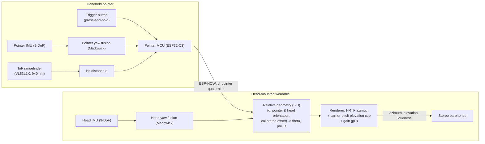

		# Cane

> **Formerly Auris.** The former concept, plan, and thesis notes were
> cleared on 2026-09-07; this file is now the canonical **concept and
> development plan** for Cane — a head-mounted, audio-only navigation aid
> driven by a laser pointer, for visually impaired users. Repo paths still
> use the old name (`docs/auris-thesis/`); a physical rename is not
> planned.

## 1. Concept

### 1.1 User and task

The user is visually impaired — or a blindfolded sighted person replicating one — inside a room containing obstacles (tables, walls, chairs). The task: travel from any point in the room to another point, perceiving and avoiding obstacles along the way.

### 1.2 Equipment

1. **Head-mounted wearable** (3D-printed, worn on the user's head):
- extracts the user's **head position and orientation**;
- carries the **audio apparatus** (stereo earphones) that broadcasts spatialized sound to the user's ears.
2. **Handheld pointer** (its own device): shoots an **invisible laser** toward obstacles and measures **where the shot lands** (hit distance, via time-of-flight ranging). A **press-and-hold button** gates the laser: it fires — and ranging runs — only while the button is held, and stops the moment it is released.

### 1.3 Interaction rule

The sound is projected — **in real time** — according to where the laser lands **relative to the user's head**, not relative to the room or the user's body:

- **Direction** — the landing point's bearing in the head's egocentric frame, given the head's *current* orientation. If the user faces straight ahead and the shot lands on their left, they hear it on the left. If they aim to the right while still facing ahead, the shot lands on their right and they hear it on the right. If they then turn their head (e.g., to their left) so that the same landing point ends up behind the head, the sound moves to behind them. The head defines the listener — its position *and* orientation matter; the user's body position does not.
- **Loudness** — the distance from the **head** to the landing point. A landing far from the head is faint; the nearer it lands, the louder it is projected. (Computed head-relative in real time — mechanism in [§2.3](#23-coordinate-frames-and-sound-placement).)
- **Elevation** — whether the landing point is above, at, or below the head's level is also conveyed (a hit on a staircase step below sounds different from a wall sign at eye height). The pointer may be aimed up or down freely; the sound follows the hit in 3-D.
- **Trigger** — the aid sounds only while the pointer's **button is held**. The laser fires — and ranging runs — only then; releasing the button stops the laser and silences the sound. The aid is therefore an **active, on-demand** scanner, in line with the active-sensing rationale of the EyeCane lineage (Maidenbaum et al. 2014, [§2 lit](docs/auris-thesis/literature/02-electronic-travel-aids.md)).

Worked examples (clarified 2026-09-08):

| Scenario | Head facing | Perceived sound |
|---|---|---|
| shot lands left of the user | straight ahead | left side |
| pointer aimed right — shot lands right | straight ahead | right side |
| head turns past the shot's landing point | turned away from the landing point | behind the head |

In all rows the loudness follows the head-to-landing distance (far → faint, near → loud) in real time.

## 2. System overview

### 2.1 Devices

| Device | Roles | Core parts |
|---|---|---|
| **Pointer** (handheld) | ranging + its own orientation; press-and-hold trigger | ESP32-C3-class MCU, 9-DoF IMU, VL53L1X ToF (invisible 940 nm, up to ~4 m), trigger button, battery, 3D-printed shell |
| **Wearable** (head) | head pose + audio output | ESP32-class MCU, 9-DoF IMU, stereo earphones, battery, 3D-printed shell |
| **Link** | pointer → wearable data | ESP-NOW (connectionless WiFi peer-to-peer), payload = hit distance + pointer orientation (quaternion) |

Audio is rendered **on the wearable**; the ESP-NOW link carries data, never audio (Bluetooth audio would add 150–300 ms by protocol design — wired earphones only), so the motion-to-sound latency stays inside the budget (§4.2). The button state gates everything: with the button up the pointer does not range and sends nothing, and the renderer is silent.

### 2.2 Data flow

### 2.3 Coordinate frames and sound placement

- **Head frame H**: origin at the head (relative position, IMU dead reckoning — [§2.4](#24-positioning-relative-pose-only)); the head IMU (Madgwick fusion) senses the **full orientation** — yaw $\mathrm{yaw}_H$ (heading, rotation about the vertical axis), pitch $\mathrm{pitch}_H$ (nodding up/down), and roll (ear-to-shoulder tilt) — and **all three are used**: the landing point is transformed with the full head rotation $R_H$, because the listener's frame — the ears — rotates with the head; a hit level with the eyes when upright is no longer level with the ear axis when the head tilts. The perceived sound position is expressed in this frame — that is what makes the sound move correctly when the user turns, nods, or tilts their head.
- **Pointer frame P**: the pointer IMU likewise senses and fuses full orientation; its aim axis is the unit vector $\hat{u}_P$ extracted from the fused quaternion (roll about the beam axis does not steer the beam, but the complete orientation is fused, shipped, and used in the exact transform; the first-order forms below read it as yaw $\mathrm{yaw}_P$ and pitch $\mathrm{pitch}_P$). The pointer is *not* confined to chest height — it may be aimed up or down freely (walls, signs, staircases) — and the ToF reading $d$ ranges along that aim.
- **Landing point relative to the head** (full 3-D):

  $$
  r \;=\; R_H^{-1}\!\left[\left(p_P + d\,\hat{u}_P\right) - p_H\right]
  \;=\; o + d\,R_H^{-1}\,\hat{u}_P
  $$

  where $R_H$ is the head's full rotation and $o = R_H^{-1}(p_P - p_H)$ is the pointer's offset from the head expressed in the head frame — handled as a **calibrated 3-D constant** (nominal handheld position: forward, lateral, and below the head) rather than tracked, since rigid-body hand tracking is out of scope for an IMU-only build ([§2.4](#24-positioning-relative-pose-only)). Note that two IMUs alone cannot measure their separation: inertial position is double-integrated acceleration whose bias error grows quadratically, and the *difference* of two drifting estimates drifts faster still (Harle 2013; Foxlin 2005, [§5 lit](docs/auris-thesis/literature/05-head-pose-sensing.md)). IMUs give reliable relative **orientation** — yaw *and* pitch — not distance; so the fixed offset is calibrated once.

The placement quantities follow from three live measurements — the ToF range $d$ and both devices' full orientation — plus the one calibrated constant $o$. The exact computation runs on the full rotation matrices ($R_H$ and the pointer's fused orientation); the yaw- and pitch-difference forms quoted below are first-order intuition only. Because $o$ is known, the placement is exact for the calibrated pose; the residual error is only grip/pose variation ([§7](#7-risks-and-limitations)). The renderer recomputes all three on every update, so the sound moves continuously as the user turns, nods, tilts, walks, or re-aims the pointer:

- **Azimuth** —

  $$
  \theta = \operatorname{atan2}\!\left(r_y,\, r_x\right)
  $$

  (to first order $\theta \approx \mathrm{yaw}_P - \mathrm{yaw}_H$, wrapped to $[-180°, 180°)$) — rendered with a generic HRTF.
- **Elevation** —

  $$
  \phi = \operatorname{atan2}\!\left(r_z,\, \sqrt{r_x^2 + r_y^2}\right)
  $$

  (to first order $\phi \approx \mathrm{pitch}_P - \mathrm{pitch}_H$ plus the vertical-offset geometry term) — **rendered explicitly**: the obstacle signal's carrier pitch sits *below* the reference when the hit is below head level and *above* it when the hit is above, with level hits at the reference. This follows the elevation→pitch precedent of the vOICe (Meijer 1992, [§3 lit](docs/auris-thesis/literature/03-audio-ssd-sonification.md)) and 3-D scene sonification (Bujacz et al. 2011, same file). Spectral HRTF elevation is deliberately *not* relied upon: it is the channel that degrades with non-individualized HRTFs (Planinec et al. 2023, [§4 lit](docs/auris-thesis/literature/04-spatial-audio-hrtf.md)), whereas a carrier-pitch cue is robust on any earphones and needs no per-user calibration. Staircases are the motivating case: aiming down a flight of steps must sound distinctly *lower* than a wall at eye height.
- **Loudness distance** —

  $$
  D = \lVert r \rVert,
  $$

  the head-to-landing distance. Note what each symbol is: $d$ is the ToF reading — *pointer*-to-hit — but the gain keys to $D = \lVert r \rVert$, the *head*-to-hit distance obtained from $d$ through the calibrated offset $o$ and the relative aim direction $R_H^{-1}\hat{u}_P$. Keying the gain to $d$ raw would treat the pointer as the listener and overstate loudness by up to $\lVert o \rVert \approx 0.5\,\mathrm{m}$ — negligible at meters of range but several dB at close range (inverse-square: halving the distance is $+6\,\mathrm{dB}$), exactly the collision-warning regime. The distance still never involves the head's *room* position: as the user walks toward the obstacle with the button held, the ToF range $d$ shrinks and $D$ follows in real time — proximity is carried by the ranging, not by dead-reckoned position.

The head's position matters only **relative to the pointer** — body geometry, captured by the calibrated offset $o$. The user's body position never enters the placement ([§1.3](#13-interaction-rule)), and neither does the head's dead-reckoned room position, which exists for telemetry only ([§2.4](#24-positioning-relative-pose-only)).

Placement rules:

1. **Azimuth** — render the sound at azimuth $\theta$ with a generic HRTF. Full-azimuth rendering makes the "behind" cases automatic (no hand-coded sectors needed).
2. **Elevation** — render the above/at/below relation with the carrier-pitch cue ($\phi$ below/at/above head level → lower/ reference/higher pitch); tune the pitch spread in P4 so a stairs-versus-wall difference is obvious without sounding alien.
3. **Loudness** — gain $g(D)$ monotonic decreasing in the head-to-landing distance $D$, calibrated on the prototype (perceived loudness is not linear in dB, so the curve is tuned in P4). Near hits saturate at maximum; far hits floor at a faint but audible minimum.
4. **No-hit edge case** — while the button is held, a missing return ($d$ beyond the ToF range, or lost on glass/black surfaces) renders silence or a low "no contact" tick. With the button up the aid is silent by design — "not scanning" is the default state.

### 2.4 Positioning: relative pose only

The wearable's head **position** comes from IMU dead reckoning only — no room infrastructure. Literature shows unaided inertial position drifts far too fast for absolute room-scale tracking (Harle 2013; Foxlin 2005, see [§7](#7-risks-and-limitations)), so:

- position is treated as **relative**, valid for short traverses from a known start point;
- the point-to-point room task is judged by **observed behavior** plus an external reference, not by the device's own position estimate;
- the position channel is for **telemetry only** (user went A→B): sound placement never consumes it — $D$, $\theta$, and $\phi$ come from the ToF range, both orientations, and the calibrated head-to-pointer offset ([§2.3](#23-coordinate-frames-and-sound-placement)).

**Self-containment audit** — every runtime placement input and its onboard source:

| Placement input | Source | External dependency |
|---|---|---|
| Head orientation ($R_H$, full 3-D) | head-worn 9-DoF IMU, Madgwick fusion | none — gravity and the magnetic field are passive physical references, not infrastructure |
| Pointer orientation (quaternion) | pointer's own 9-DoF IMU, fused onboard | none |
| ToF range $d$ | VL53L1X on the pointer | none — active ranging |
| Head-to-pointer offset $o$ | one-time calibration (body geometry) | none |
| Head room position | head-IMU dead reckoning | none — telemetry only, never used for placement |

Placement is therefore fully self-contained: no beacons, cameras, motion capture, UWB anchors, or room instrumentation participate in it. The remaining accuracy threats (magnetometer disturbance, grip/pose variation) are internal and are mitigated onboard — see [§7](#7-risks-and-limitations); they never motivate external aiding.

## 3. Hardware

Everything required to **build and run** Cane — not only the electronics: the two devices' electronics, the 3D-printed structures that house them, one-time assembly/bench tools, and the evaluation hardware. Prices surveyed **2026-09-08** from Philippine retailers, in Philippine pesos (₱); revised **2026-09-10** (wearable MCU → ESP32-S3, re-zero button, TF-Luna alternate). Prices with a store link were verified against the listing on their survey date; items marked *(est)* are typical Philippine-market prices to pin down at purchase time.

### 3.1 Pointer — electronics

| # | Component | Qty | Unit ₱ | Subtotal ₱ | Source |
|---|---|---|---|---|---|
| 1 | ESP32-C3 SuperMini (BLE MCU) | 1 | 355 | 355 | [Circuitrocks](https://circuit.rocks/products/esp32-c3-super-mini-development-board); ₱151 on [Lazada PH](https://h5.lazada.com.ph/products/esp32-c3-development-board-esp32-c3-supermini-wifi-bluetooth-for-arduino-i4393598793.html) |
| 2 | VL53L1X ToF rangefinder (940 nm, ~4 m; alternate: TF-Luna, §3.7) | 1 | 525 | 525 | [Shopee PH](https://shopee.ph/COD-VL53L1X-laser-sensor-module-TOF-time-of-flight-4-meter-ranging-i.1804393363.53909554436) |
| 3 | GY-9250 (MPU-9250, 9-DoF IMU) | 1 | 400 | 400 | [Lazada PH](https://www.lazada.com.ph/products/mpu9250-mpu6500-9-9-dof-16-bit-gyroscope-acceleration-magnetic-sensor-accelerator-module-iicspi-i15524063344.html) |
| 4 | Tactile trigger button (6×6 mm) | 1 | 10 *(est)* | 10 | Lazada/Shopee PH (assortment kits) |
| 5 | TP4056 USB-C charge board (w/ protection) | 1 | 30 | 30 | [Makerlab PH](https://makerlab.ph/products/type-c-micro-usb-5v-1a-18650-tp4056-lithium-battery-charger-module-charging-board-with-protection) |
| 6 | 18650 Li-ion 2600 mAh cell (Kaizen 2-pc pack ₱369) | 1 | 185 | 185 | [Kaizen PH](https://kaizenphilippines.com/products/kaizen-3-7v-18650-2600mah-15a-rechargeable-battery-2pc-lithium-ion-battery) |
| 7 | Misc: perfboard, dupont/hookup wire, slide switch | — | 120 *(est)* | 120 | Lazada/Shopee PH |
| | **Pointer subtotal** | | | **1,625** | |

### 3.2 Wearable — electronics

| # | Component | Qty | Unit ₱ | Subtotal ₱ | Source |
|---|---|---|---|---|---|
| 1 | Seeed XIAO ESP32-S3 (S3 MCU: SIMD DSP + per-core FPU, I²S out, BLE 5) | 1 | 499 | 499 | [Makerlab PH](https://makerlab.ph/products/seeed-xiao-esp32-s3-113991114) |
| 2 | GY-9250 (MPU-9250, 9-DoF IMU) — same part as pointer | 1 | 400 | 400 | [Lazada PH](https://www.lazada.com.ph/products/mpu9250-mpu6500-9-9-dof-16-bit-gyroscope-acceleration-magnetic-sensor-accelerator-module-iicspi-i15524063344.html) |
| 3 | MAX98357A I²S 3 W Class-D amp — **qty 2 required** (mono amp; one per ear, SD-pin strapped L/R) | 2 | 499 | 998 | [Circuitrocks (Adafruit breakout)](https://circuit.rocks/products/i2s-3w-class-d-amplifier-breakout-max98357a-adafruit); generic clones cheaper on Lazada/Shopee |
| 4 | Stereo wired earphones, 3.5 mm (BAVIN HX820) — wired is mandatory (BT audio latency, §2.1) | 1 | 118 | 118 | [Lazada PH](https://www.lazada.com.ph/products/pdp-i3057481002.html) |
| 5 | TP4056 USB-C charge board (w/ protection) | 1 | 30 | 30 | [Makerlab PH](https://makerlab.ph/products/type-c-micro-usb-5v-1a-18650-tp4056-lithium-battery-charger-module-charging-board-with-protection) |
| 6 | 18650 Li-ion 2600 mAh cell | 1 | 185 | 185 | [Kaizen PH](https://kaizenphilippines.com/products/kaizen-3-7v-18650-2600mah-15a-rechargeable-battery-2pc-lithium-ion-battery) |
| 7 | Misc: perfboard, wires, 3.5 mm jack breakout | — | 120 *(est)* | 120 | Lazada/Shopee PH |
| 8 | Tactile re-zero button (6×6 mm; shares assortment kit) | 1 | 10 *(est)* | 10 | Lazada/Shopee PH |
| | **Wearable subtotal** | | | **2,360** | |

### 3.3 Structural & mechanical

| # | Component | Qty | Unit ₱ | Subtotal ₱ | Source |
|---|---|---|---|---|---|
| 1 | FDM 3D printer — Creality Ender 3 V3 SE (one-time capital) | 1 | 11,199 | 11,199 | [Makerlab PH](https://www.makerlab.ph/products/ender-3-v3-se-3d-printer) — official Creality PH distributor, 1-yr warranty, free-filament promo. Alternative: print service such as [Flarelab](https://flarelab.com) (quote-based) |
| 2 | PLA filament 1.75 mm, 1 kg (Creality Ender PLA) | 1 | 700 *(est)* | 700 | [Lazada PH](https://www.lazada.com.ph/products/creality-ender-pla-filament-1kg-175mm-i4337055224.html) / Shopee PH — pin exact price at purchase |
| 3 | Elastic headband + adjustment fasteners | — | 75 *(est)* | 75 | Lazada/Shopee PH |
| 4 | 18650 battery holders | 2 | 15 *(est)* | 30 | Lazada/Shopee PH |
| 5 | M2/M3 screws, nuts, velcro, zip ties | — | 100 *(est)* | 100 | Lazada/Shopee PH |
| 6 | Adhesive: hot glue/epoxy, double-sided tape | — | 100 *(est)* | 100 | Lazada/Shopee PH |
| | **Structural subtotal (excl. printer)** | | | **1,005** | |

### 3.4 Assembly & bench tools (one-time)

| # | Tool | Qty | Unit ₱ | Subtotal ₱ | Source |
|---|---|---|---|---|---|
| 1 | 60 W adjustable soldering iron kit | 1 | 300 *(est)* | 300 | Lazada/Shopee PH kits; premium Hakko 60 W ≈ ₱1,561 ([ToolsPH price list](https://toolsph.com/soldering-iron-price)) |
| 2 | Digital multimeter (DT830 class) | 1 | 250 *(est)* | 250 | [Lazada PH](https://www.lazada.com.ph/products/dt830-digital-multimeter-multi-tester-holdpeak-manual-ranging-multi-tester-i4454326879.html) |
| 3 | Wire strippers, cutters, pliers | — | 200 *(est)* | 200 | Lazada/Shopee PH |
| 4 | Helping-hands / PCB holder | 1 | 150 *(est)* | 150 | Lazada/Shopee PH |
| 5 | USB cables for flashing (USB-C + Micro-USB) | 2 | 35 | 70 | [Circuitrocks](https://circuit.rocks/products/circuitrocks-usb-cable-type-c-type-b-to-type-a-male-for-arduino-uno-mega) |
| 6 | Desoldering wick + flux | — | 100 *(est)* | 100 | Lazada/Shopee PH |
| | **Tools subtotal** | | | **1,070** | |

### 3.5 Evaluation hardware (one-time)

| # | Item | Qty | Unit ₱ | Subtotal ₱ | Source |
|---|---|---|---|---|---|
| 1 | Blindfold / sleep mask (for sighted participants) | 2 | 50 *(est)* | 100 | Lazada/Shopee PH |
| 2 | Floor marking tape + 5 m measuring tape (course layout; ToF ground truth) | — | 200 *(est)* | 200 | Lazada/Shopee PH |
| 3 | Obstacle props (cardboard boxes, foam blocks) | — | 200 *(est)* | 200 | Often sourced free; budgeted as new |
| 4 | Timing — phone/smartwatch | — | 0 | 0 | On hand |
| | **Evaluation subtotal** | | | **500** | |

### 3.6 Totals

| Block | ₱ |
|---|---|
| Pointer electronics | 1,625 |
| Wearable electronics | 2,360 |
| Structural & mechanical (excl. printer) | 1,005 |
| Assembly & bench tools | 1,070 |
| Evaluation hardware | 500 |
| **Subtotal (excl. printer)** | **6,560** |
| Contingency 20% (spares, shipping, promo drift) | 1,312 |
| **Total — print-service path** (housings quoted, ~₱1,000 *(est)*) | **≈ 9,100** |
| + own printer: Creality Ender 3 V3 SE | 11,199 |
| **Total — own-printer path** | **≈ 21,300** |

The two totals differ only in how the housings are produced: quote the two small housings to a print service such as Flarelab (service fee assumed ₱1,000 *(est)*, pending quote), or buy the printer outright (Makerlab, with free-filament promo and 1-yr local warranty). A purchase decision gate — see [§9](#9-open-items).

### 3.7 Component notes

- **IMU (both devices)** — GY-9250/MPU-9250 is one part number across both devices to simplify fusion. Upgrade path if P2 magnetometer fusion proves noisy in the actual room: BNO055/BNO085 (factory-fused, ~₱1,200–2,000 each) — a budget-relevant decision gate at P2.
- **MCU alternates** — the ESP32-C3 SuperMini also lists at ₱151 on Lazada PH; the Seeed XIAO ESP32-S3 (₱499, Makerlab PH; SIMD vector DSP + per-core FPU for the renderer, onboard LiPo charging) is the wearable reference, with ESP32-S3 SuperMini/DevKit clones (≈₱300–700 on Lazada/Shopee) as drop-in alternates.
- **Pre-soldered ordering constraint** — P2 permits no soldering, so order every module (both MCUs, the IMUs, the ToF) with headers **pre-soldered**; verify "pre-soldered / headers attached" on the listing before checkout. Unsoldered arrivals are set aside for the P3 build.
- **Amplifier** — the MAX98357A is a **mono** amp: binaural placement needs independent left/right channels, so **two units are required** (one per ear; each amp's SD pin is strapped to select its channel per the datasheet — verify strapping on the purchased breakout). The ₱499 line is the Adafruit breakout; generic modules on Lazada/Shopee are substantially cheaper — a third unit as spare is optional.
- **Ranging** — VL53L0X (2 m) is cheaper but undershoots the ~4 m room-scale task; the VL53L1X (4 m, 940 nm invisible VCSEL) is kept, with the receive ROI narrowed to the central zone in firmware to tighten the hit spot at range. If P2 shows the 4 m ceiling or the default beam width limiting the course, the TF-Luna (0.2–8 m, ±6 cm < 3 m, 100 Hz default, 2° FoV, UART/I²C, 850 nm, ≈₱800–1,000 *(est)*) is the single-part alternate — verify its beam width on the datasheet at purchase.
- **Re-zero button** — one-press yaw re-anchor at rest (pitch/roll are gravity-anchored and drift-free); turns magnetometer disturbance from a silent heading bias into a bounded user action ([§7](#7-risks-and-limitations) risk 2), and doubles as the P4 offset-calibration trigger.
- **Audio** — air-conduction stereo earphones preserve localization quality (Ferrand 2019; Planinec et al. 2023, see [§4 lit](docs/auris-thesis/literature/04-spatial-audio-hrtf.md)); **wired output is mandatory** — Bluetooth audio adds 150–300 ms by protocol design and would break the placement latency budget ([§2.1](#21-devices)); if the faint-far floor turns hissy, a 32 Ω pair is the cheap remedy.
- **3D printer** — the Ender 3 V3 SE (₱11,199, Makerlab PH) is listed as the reference because the concept requires the wearables to be 3D printed in-house; university/lab printer access would remove this line entirely — confirm before purchase approval.

## 4. Software

### 4.1 Firmware modules

| Module | Device | Responsibility |
|---|---|---|
| `fusion` (Madgwick) | both | full quaternion (yaw/pitch/roll) from IMU at ~100 Hz |
| `tof` driver | pointer | ranged readings at 20–50 Hz **while the button is held**, no-hit handling; idle otherwise |
| `link` (ESP-NOW) | both | connectionless WiFi peer-to-peer; ship `d` + pointer quaternion → wearable at 10–30 Hz |
| `geometry` | wearable | $\theta$, $\phi$ (3-D direction) and $D$ (head-to-landing distance) from $d$, both orientations, and the calibrated offset; edge-case classification |
| `renderer` | wearable | generic-HRTF azimuth + carrier-pitch elevation cue, $g(D)$ gain curve |
| `telemetry` | wearable | relative-pose dead reckoning for logging |

### 4.2 Latency budget (motion-to-sound, target ≤ 100 ms)

| Stage | Target |
|---|---|
| IMU fusion update (100 Hz) | ≤ 10 ms |
| ToF ranging cadence (≥ 20 Hz) | ≤ 50 ms |
| ESP-NOW link hop (≥ 10 Hz) | ≤ 10 ms |
| HRTF render per buffer (48 kHz / 128 samples) | ≤ 5 ms |
| Total | **≤ 100 ms** |

Bench tests for each stage are P2 exit criteria (§6).

## 5. Evaluation plan

Paradigm justified by the consolidated literature ([`docs/auris-thesis/literature/07-evaluation-methodology.md`](docs/auris-thesis/literature/07-evaluation-methodology.md)):

- **Participants**: blindfolded sighted users (primary), replicating VI per the concept; validity support: dos Santos et al. 2021 (blindfolded users are slower → conservative results), Giudice et al. 2020 (sighted controls as best-case bound).
- **Course**: obstacle room course in the style of Roentgen et al. 2012b (standardized layouts, pre-randomized order).
- **Conditions**: aid-off baseline vs. aid-on; multiple layouts.
- **Metrics**:
- objective — collisions, completion time, Percentage Preferred Walking Speed (PPWS), localization accuracy (point-to-sound direction test, azimuth and elevation);
- subjective — SUS (after Kilian et al. 2022) and NASA-TLX (after Pittet et al. 2026).

## 6. Development phases

| Phase | Focus | Exit criteria | Thesis mapping |
|---|---|---|---|
| **P1 — Architecture freeze** *(complete 2026-09-08)* | this document; component selection | parts chosen and ordered; interfaces fixed | §3.1, §3.5, §3.7 (block diagram) |
| **P2 — Bench tests** | non-permanent breadboard assembly of both devices, **zero soldering** (pre-soldered modules only); module bench tests; full-pipeline functionality on breadboards (protocol + wiring maps: [`docs/bench-tests.md`](docs/bench-tests.md)) | every §4.2 stage meets budget; end-to-end sound placement works on breadboards; drift curves recorded | §3.4 (experiments), §4 (partial results) |
| **P3 — Prototype build** | 3D-print housings; solder the validated breadboard design into permanent assemblies; battery/switch/jack integration | both devices run end-to-end in the soldered builds with breadboard parity (§4.2) | §3.6 (details of the components) |
| **P4 — Integration & calibration** | full pipeline walking; $g(D)$ + pointer-offset calibration; elevation-cue tuning; magnetometer disturbance checks | calibrated sound placement works on the course | §3.5, §3.8 (flowcharts) |
| **P5 — Pilot evaluation** | blindfolded-sighted study on the room course | metrics + questionnaires collected | §4 (results and discussions) |
| **P6 — Thesis drafting** | write-up from literature notes and P2–P5 artifacts | `paper.md` + `ieee.md` in lockstep, per [`manuscript.md`](docs/auris-thesis/manuscript.md) | §2–§5, all sections |

## 7. Risks and limitations

1. **Position drift (IMU-only)** — unaided inertial position is unusable for absolute room-scale tracking over long sessions (Harle 2013; Foxlin 2005). Mitigation: relative pose only, bounded sessions, known start point; drift degrades telemetry only — sound placement never uses it (§2.3, §2.4).
2. **Heading error near ferromagnetic material** — tables, appliances, and fixtures disturb the magnetometer; Roetenberg et al. 2005 shows heading error rotates the perceived sound direction directly. Mitigation: disturbance compensation, P4 checks on the actual room.
3. **Generic HRTF quality** — azimuth is robust to non-individualized HRTFs; elevation is precisely the channel that degrades (Mendonça 2014; Planinec et al. 2023). Mitigation: elevation is carried by the explicit carrier-pitch cue, not spectral HRTF elevation (§2.3); short familiarization period built into P5.
4. **Audio-only guidance overshoot** — audio cues can cause users to turn past a target heading (Slade et al. 2021). Mitigation: Cane's sound is a **positional report**, not a steering command; the user owns navigation.
5. **ToF surface behaviors** — glass, dark, or highly reflective targets and strong ambient IR degrade returns (VL53L1X datasheet, vendor footnote). Mitigation: P2 surface matrix before committing to the course props.
6. **Loudness ≠ linear distance** — perceived loudness is nonlinear; the $g(D)$ head-to-landing curve is calibrated empirically in P4 rather than assumed.
7. **Handheld offset is not truly constant** — the calibrated head-to-pointer constant assumes a nominal pose; extending or tucking the arm, and raising/lowering it to aim up or down at stairs, shifts the offset (±15 cm horizontal, up to ~±0.3 m vertical), perturbing $D$, $\theta$, and $\phi$ ([§2.3](#23-coordinate-frames-and-sound-placement)). Mitigation: calibrate at a natural grip in P4; keep $g(D)$ and the elevation pitch spread gradual so offset variation is a small perceptual change; observe real-pose variation in P5.

## 8. Where things live

- **P2 bench protocol** — [`docs/bench-tests.md`](docs/bench-tests.md): wiring maps for both devices, power bring-up rules, and the T0–T6 test matrix with acceptance thresholds; parity re-run at P3.
- **Literature consolidation** — [`docs/auris-thesis/literature/README.md`](docs/auris-thesis/literature/README.md): 44 verified annotated entries across 7 themes; feeds thesis §2.
- **Thesis skeleton** — [`docs/auris-thesis/paper.md`](docs/auris-thesis/paper.md) (APA twin) and [`docs/auris-thesis/ieee.md`](docs/auris-thesis/ieee.md) (IEEE twin); conventions in [`docs/auris-thesis/manuscript.md`](docs/auris-thesis/manuscript.md).
- **Session context** — [`.opencode/concept.md`](.opencode/concept.md) and [`.opencode/plan.md`](.opencode/plan.md) point here as the canonical source; raw requirements in [`.opencode/new.md`](.opencode/new.md); standing rules in [`.opencode/instruction.md`](.opencode/instruction.md).

## 9. Open items

- **Budget & purchase approval** — full hardware requirements with Philippine-market pricing are complete in [§3](#3-hardware) (researched 2026-09-08); the remaining open items are the own-printer vs. print-service decision and the purchase-approval sign-off itself.
- **Thesis writing schedule** — section→phase drafting schedule to be rebuilt in [`docs/auris-thesis/README.md`](docs/auris-thesis/README.md) once P1 is frozen.
