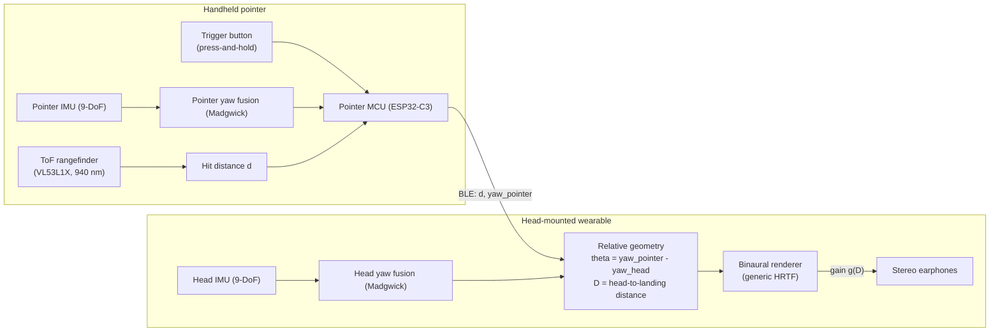

		# Cane

> **Formerly Auris.** The former concept, plan, and thesis notes were
> cleared on 2026-09-07; this file is now the canonical **concept and
> development plan** for Cane — a head-mounted, audio-only navigation aid
> driven by a laser pointer, for visually impaired users. Repo paths still
> use the old name (`docs/auris-thesis/`); a physical rename is not
> planned.

## 1. Concept

### 1.1 User and task

The user is visually impaired — or a blindfolded sighted person replicating
one — inside a room containing obstacles (tables, walls, chairs). The task:
travel from any point in the room to another point, perceiving and avoiding
obstacles along the way.

### 1.2 Equipment

1. **Head-mounted wearable** (3D-printed, worn on the user's head):
   - extracts the user's **head position and orientation**;
   - carries the **audio apparatus** (stereo earphones) that broadcasts
     spatialized sound to the user's ears.
2. **Handheld pointer** (its own device): shoots an **invisible laser** toward
   obstacles and measures **where the shot lands** (hit distance, via
   time-of-flight ranging). A **press-and-hold button** gates the laser:
   it fires — and ranging runs — only while the button is held, and stops
   the moment it is released.

### 1.3 Interaction rule

The sound is projected — **in real time** — according to where the laser
lands **relative to the user's head**, not relative to the room or the
user's body:

- **Direction** — the landing point's bearing in the head's egocentric
  frame, given the head's *current* orientation. If the user faces straight
  ahead and the shot lands on their left, they hear it on the left. If they
  aim to the right while still facing ahead, the shot lands on their right
  and they hear it on the right. If they then turn their head (e.g., to
  their left) so that the same landing point ends up behind the head, the
  sound moves to behind them. The head defines the listener — its position
  *and* orientation matter; the user's body position does not.
- **Loudness** — the distance from the **head** to the landing point. A
  landing far from the head is faint; the nearer it lands, the louder it is
  projected. (This is why the wearable tracks head position, not just
  orientation.)
- **Trigger** — the aid sounds only while the pointer's **button is held**.
  The laser fires — and ranging runs — only then; releasing the button
  stops the laser and silences the sound. The aid is therefore an
  **active, on-demand** scanner, in line with the active-sensing rationale
  of the EyeCane lineage (Maidenbaum et al. 2014,
  [§2 lit](docs/auris-thesis/literature/02-electronic-travel-aids.md)).

Worked examples (clarified 2026-09-08):

| Scenario | Head facing | Perceived sound |
|---|---|---|
| shot lands left of the user | straight ahead | left side |
| pointer aimed right — shot lands right | straight ahead | right side |
| head turns past the shot's landing point | turned away from the landing point | behind the head |

In all rows the loudness follows the head-to-landing distance (far →
faint, near → loud) in real time.

## 2. System overview

### 2.1 Devices

| Device | Roles | Core parts |
|---|---|---|
| **Pointer** (handheld) | ranging + its own orientation; press-and-hold trigger | ESP32-C3-class MCU, 9-DoF IMU, VL53L1X ToF (invisible 940 nm, up to ~4 m), trigger button, battery, 3D-printed shell |
| **Wearable** (head) | head pose + audio output | ESP32-class MCU, 9-DoF IMU, stereo earphones, battery, 3D-printed shell |
| **Link** | pointer → wearable data | BLE, payload = hit distance + pointer yaw |

Audio is rendered **on the wearable**; the BLE link carries data, never
audio, so the motion-to-sound latency stays inside the budget (§4.2).
The button state gates everything: with the button up the pointer does not
range and sends nothing, and the renderer is silent.

### 2.2 Data flow

### 2.3 Coordinate frames and sound placement

- **Head frame H**: origin at the head (relative position, IMU dead
  reckoning — [§2.4](#24-positioning-relative-pose-only)); yaw `yaw_H` from
  the head IMU (Madgwick fusion). The perceived sound position is expressed
  in this frame — that is what makes the sound move correctly when the user
  turns their head.
- **Pointer frame P**: yaw `yaw_P` from the pointer IMU; ToF reading `d`
  along the aim.
- **Landing point relative to the head**:
  `r = (p_P − p_H) + d·û(yaw_P)`, rotated by `−yaw_H` into the head frame,
  where `p_P − p_H` is the pointer's offset from the head — handled as a
  **calibrated constant** (nominal handheld position) rather than tracked,
  since rigid-body hand tracking is out of scope for an IMU-only build
  ([§2.4](#24-positioning-relative-pose-only)).

The user's body position never enters the placement
([§1.3](#13-interaction-rule)); the **head's position does** — it sets the
head-to-landing distance `D = |r|` that drives loudness (and only a
second-order parallax term in `θ`; to first order `θ = yaw_P − yaw_H`,
wrapped to [−180°, 180°)). The renderer recomputes `θ` and `g(D)` on every
update, so the sound moves continuously as the user turns their head,
walks, or re-aims the pointer.

Placement rules:

1. **Azimuth** — render the sound at azimuth `θ` with a generic HRTF.
   Full-azimuth rendering makes the "behind" cases automatic (no
   hand-coded sectors needed).
2. **Loudness** — gain `g(D)` monotonic decreasing in the head-to-landing
   distance `D`, calibrated on the prototype (perceived loudness is not
   linear in dB, so the curve is tuned in P4). Near hits saturate at
   maximum; far hits floor at a faint but audible minimum.
3. **No-hit edge case** — while the button is held, a missing return (`d`
   beyond the ToF range, or lost on glass/black surfaces) renders silence
   or a low "no contact" tick. With the button up the aid is silent by
   design — "not scanning" is the default state.

### 2.4 Positioning: relative pose only

The wearable's head **position** comes from IMU dead reckoning only — no
room infrastructure. Literature shows unaided inertial position drifts far
too fast for absolute room-scale tracking (Harle 2013; Foxlin 2005, see
[§7](#7-risks-and-limitations)), so:

- position is treated as **relative**, valid for short traverses from a
  known start point;
- the point-to-point room task is judged by **observed behavior** plus an
  external reference, not by the device's own position estimate;
- the position channel exists for the head-to-landing distance `D` that
  drives loudness ([§2.3](#23-coordinate-frames-and-sound-placement)) and
  for telemetry (user went A→B); it is **relative only** and is never
  treated as an absolute room position.

This keeps the device self-contained: no beacons, cameras, or room
instrumentation are required.

## 3. Hardware (component-level)

Prices surveyed **2026-09-08** from Philippine retailers, in Philippine
pesos (₱). Quantities are for **one complete build** — 1 pointer + 1
wearable — plus consumables; the 20% contingency covers spares, shipping,
and promo drift. Prices with a store link were verified against the
listing this date; items marked *(est)* are typical Philippine-market
prices to pin down at purchase time.

### 3.1 Pointer — bill of materials

| # | Component | Qty | Unit ₱ | Subtotal ₱ | Source |
|---|---|---|---|---|---|
| 1 | ESP32-C3 SuperMini (BLE MCU) | 1 | 355 | 355 | [Circuitrocks](https://circuit.rocks/products/esp32-c3-super-mini-development-board); ₱151 on [Lazada PH](https://h5.lazada.com.ph/products/esp32-c3-development-board-esp32-c3-supermini-wifi-bluetooth-for-arduino-i4393598793.html) |
| 2 | VL53L1X ToF rangefinder (940 nm, ~4 m) | 1 | 525 | 525 | [Shopee PH](https://shopee.ph/COD-VL53L1X-laser-sensor-module-TOF-time-of-flight-4-meter-ranging-i.1804393363.53909554436) |
| 3 | GY-9250 (MPU-9250, 9-DoF IMU) | 1 | 400 | 400 | [Lazada PH](https://www.lazada.com.ph/products/mpu9250-mpu6500-9-9-dof-16-bit-gyroscope-acceleration-magnetic-sensor-accelerator-module-iicspi-i15524063344.html) |
| 4 | Tactile trigger button (6×6 mm) | 1 | 10 *(est)* | 10 | Lazada/Shopee PH (assortment kits) |
| 5 | TP4056 USB-C charge board (w/ protection) | 1 | 30 | 30 | [Makerlab PH](https://makerlab.ph/products/type-c-micro-usb-5v-1a-18650-tp4056-lithium-battery-charger-module-charging-board-with-protection) |
| 6 | 18650 Li-ion 2600 mAh cell (Kaizen 2-pc pack ₱369) | 1 | 185 | 185 | [Kaizen PH](https://kaizenphilippines.com/products/kaizen-3-7v-18650-2600mah-15a-rechargeable-battery-2pc-lithium-ion-battery) |
| 7 | Misc: perfboard, dupont/hookup wire, slide switch | — | 120 *(est)* | 120 | Lazada/Shopee PH |
| | **Pointer subtotal** | | | **1,625** | |

### 3.2 Wearable — bill of materials

| # | Component | Qty | Unit ₱ | Subtotal ₱ | Source |
|---|---|---|---|---|---|
| 1 | ESP32 DevKit 38-pin (WROOM-32, I²S out) | 1 | 187 | 187 | [Lazada PH](https://s.lazada.com.ph/s.N28i1); ₱355 [Circuitrocks 30-pin CH9102](https://circuit.rocks/products/esp32-dev-board-ch9102-30-pin-micro-usb) |
| 2 | GY-9250 (MPU-9250, 9-DoF IMU) — same part as pointer | 1 | 400 | 400 | [Lazada PH](https://www.lazada.com.ph/products/mpu9250-mpu6500-9-9-dof-16-bit-gyroscope-acceleration-magnetic-sensor-accelerator-module-iicspi-i15524063344.html) |
| 3 | MAX98357A I²S 3 W Class-D amp | 1 | 499 | 499 | [Circuitrocks (Adafruit breakout)](https://circuit.rocks/products/i2s-3w-class-d-amplifier-breakout-max98357a-adafruit); generic clones cheaper on Lazada/Shopee |
| 4 | Stereo wired earphones, 3.5 mm (BAVIN HX820) | 1 | 118 | 118 | [Lazada PH](https://www.lazada.com.ph/products/pdp-i3057481002.html) |
| 5 | TP4056 USB-C charge board (w/ protection) | 1 | 30 | 30 | [Makerlab PH](https://makerlab.ph/products/type-c-micro-usb-5v-1a-18650-tp4056-lithium-battery-charger-module-charging-board-with-protection) |
| 6 | 18650 Li-ion 2600 mAh cell | 1 | 185 | 185 | [Kaizen PH](https://kaizenphilippines.com/products/kaizen-3-7v-18650-2600mah-15a-rechargeable-battery-2pc-lithium-ion-battery) |
| 7 | Elastic headband + fasteners | — | 75 *(est)* | 75 | Lazada/Shopee PH |
| 8 | Misc: perfboard, wires, 3.5 mm jack breakout | — | 120 *(est)* | 120 | Lazada/Shopee PH |
| | **Wearable subtotal** | | | **1,614** | |

### 3.3 Shared consumables

| # | Component | Qty | Unit ₱ | Subtotal ₱ | Source |
|---|---|---|---|---|---|
| 1 | PLA filament 1.75 mm, 1 kg (Creality Ender PLA) | 1 | 700 *(est)* | 700 | [Lazada PH](https://www.lazada.com.ph/products/creality-ender-pla-filament-1kg-175mm-i4337055224.html) / Shopee PH — pin exact price at purchase |
| 2 | Consumables: solder, heatshrink, zip ties | — | 100 *(est)* | 100 | Lazada/Shopee PH |
| | **Shared subtotal** | | | **800** | |

### 3.4 Total

| Block | ₱ |
|---|---|
| Pointer | 1,625 |
| Wearable | 1,614 |
| Shared | 800 |
| **Build subtotal** | **4,039** |
| Contingency 20% (spares, shipping, promo drift) | 808 |
| **Grand total (one full build)** | **≈ 4,850** |

### 3.5 Component notes

- **IMU (both devices)** — GY-9250/MPU-9250 is one part number across both
  devices to simplify fusion. Upgrade path if P2 magnetometer fusion proves
  noisy in the actual room: BNO055/BNO085 (factory-fused, ~₱1,200–2,000
  each) — a budget-relevant decision gate at P2.
- **MCU alternates** — the ESP32-C3 SuperMini also lists at ₱151 on Lazada
  PH; wearable ESP32 DevKits have many equivalent listings in the
  ₱180–360 range.
- **Amplifier** — the ₱499 line is the Adafruit breakout; generic MAX98357A
  modules on Lazada/Shopee are substantially cheaper — buy two, keep a
  spare.
- **Ranging** — VL53L0X (2 m) is cheaper but undershoots the ~4 m
  room-scale task; the VL53L1X (4 m, 940 nm invisible VCSEL) is kept.
- **Audio** — air-conduction stereo earphones preserve localization
  quality (Ferrand 2019; Planinec et al. 2023, see
  [§4 lit](docs/auris-thesis/literature/04-spatial-audio-hrtf.md)).

## 4. Software

### 4.1 Firmware modules

| Module | Device | Responsibility |
|---|---|---|
| `fusion` (Madgwick) | both | yaw/pitch from IMU at ~100 Hz |
| `tof` driver | pointer | ranged readings at 20–50 Hz **while the button is held**, no-hit handling; idle otherwise |
| `link` (BLE) | both | ship `d`, `yaw_P` → wearable at 10–30 Hz |
| `geometry` | wearable | `θ` (direction) and `D` (head-to-landing distance), edge-case classification |
| `renderer` | wearable | generic-HRTF binaural output, `g(D)` gain curve |
| `telemetry` | wearable | relative-pose dead reckoning for logging |

### 4.2 Latency budget (motion-to-sound, target ≤ 100 ms)

| Stage | Target |
|---|---|
| IMU fusion update (100 Hz) | ≤ 10 ms |
| ToF ranging cadence (≥ 20 Hz) | ≤ 50 ms |
| BLE link hop (≥ 10 Hz) | ≤ 10 ms |
| HRTF render per buffer (48 kHz / 128 samples) | ≤ 5 ms |
| Total | **≤ 100 ms** |

Bench tests for each stage are P2 exit criteria (§6).

## 5. Evaluation plan

Paradigm justified by the consolidated literature
([`docs/auris-thesis/literature/07-evaluation-methodology.md`](docs/auris-thesis/literature/07-evaluation-methodology.md)):

- **Participants**: blindfolded sighted users (primary), replicating VI per
  the concept; validity support: dos Santos et al. 2021 (blindfolded users
  are slower → conservative results), Giudice et al. 2020 (sighted controls
  as best-case bound).
- **Course**: obstacle room course in the style of Roentgen et al. 2012b
  (standardized layouts, pre-randomized order).
- **Conditions**: aid-off baseline vs. aid-on; multiple layouts.
- **Metrics**:
  - objective — collisions, completion time, Percentage Preferred Walking
    Speed (PPWS), localization accuracy (point-to-sound direction test);
  - subjective — SUS (after Kilian et al. 2022) and NASA-TLX (after
    Pittet et al. 2026).

## 6. Development phases

| Phase | Focus | Exit criteria | Thesis mapping |
|---|---|---|---|
| **P1 — Architecture freeze** | this document; component selection | parts chosen and ordered; interfaces fixed | §3.1, §3.5, §3.7 (block diagram) |
| **P2 — Bench tests** | ToF accuracy over distance/surface; IMU yaw accuracy vs. reference; BLE rate/latency; render latency | each §4.2 stage meets budget; drift curves recorded | §3.4 (experiments), §4 (partial results) |
| **P3 — Prototype build** | 3D print housings; integrate pointer + wearable | both devices run end-to-end in bench mode | §3.6 (details of the components) |
| **P4 — Integration & calibration** | full pipeline walking; `g(D)` calibration; magnetometer disturbance checks | calibrated sound placement works on the course | §3.5, §3.8 (flowcharts) |
| **P5 — Pilot evaluation** | blindfolded-sighted study on the room course | metrics + questionnaires collected | §4 (results and discussions) |
| **P6 — Thesis drafting** | write-up from literature notes and P2–P5 artifacts | `paper.md` + `ieee.md` in lockstep, per [`manuscript.md`](docs/auris-thesis/manuscript.md) | §2–§5, all sections |

## 7. Risks and limitations

1. **Position drift (IMU-only)** — unaided inertial position is unusable for
   absolute room-scale tracking over long sessions (Harle 2013;
   Foxlin 2005). Mitigation: relative pose only, bounded sessions,
   known start point (§2.4).
2. **Heading error near ferromagnetic material** — tables, appliances, and
   fixtures disturb the magnetometer; Roetenberg et al. 2005 shows heading
   error rotates the perceived sound direction directly. Mitigation:
   disturbance compensation, P4 checks on the actual room.
3. **Generic HRTF quality** — azimuth is robust to non-individualized
   HRTFs, but elevation/externalization suffer (Mendonça 2014; Planinec et
   al. 2023). Mitigation: azimuthal mapping is what Cane needs; short
   familiarization period built into P5.
4. **Audio-only guidance overshoot** — audio cues can cause users to turn
   past a target heading (Slade et al. 2021). Mitigation: Cane's sound is a
   **positional report**, not a steering command; the user owns navigation.
5. **ToF surface behaviors** — glass, dark, or highly reflective targets and
   strong ambient IR degrade returns (VL53L1X datasheet, vendor footnote).
   Mitigation: P2 surface matrix before committing to the course props.
6. **Loudness ≠ linear distance** — perceived loudness is nonlinear; the
   `g(D)` head-to-landing curve is calibrated empirically in P4 rather
   than assumed.

## 8. Where things live

- **Literature consolidation** —
  [`docs/auris-thesis/literature/README.md`](docs/auris-thesis/literature/README.md):
  44 verified annotated entries across 7 themes; feeds thesis §2.
- **Thesis skeleton** — [`docs/auris-thesis/paper.md`](docs/auris-thesis/paper.md)
  (APA twin) and [`docs/auris-thesis/ieee.md`](docs/auris-thesis/ieee.md)
  (IEEE twin); conventions in
  [`docs/auris-thesis/manuscript.md`](docs/auris-thesis/manuscript.md).
- **Session context** — [`.opencode/concept.md`](.opencode/concept.md) and
  [`.opencode/plan.md`](.opencode/plan.md) point here as the canonical
  source; raw requirements in [`.opencode/new.md`](.opencode/new.md);
  standing rules in [`.opencode/instruction.md`](.opencode/instruction.md).

## 9. Open items

- **Budget & purchase approval** — component-level cost breakdown with
  Philippine-market pricing is complete in
  [§3](#3-hardware-component-level) (researched 2026-09-08); the remaining
  open item is the purchase-approval sign-off itself.
- **Thesis writing schedule** — section→phase drafting schedule to be
  rebuilt in [`docs/auris-thesis/README.md`](docs/auris-thesis/README.md)
  once P1 is frozen.
