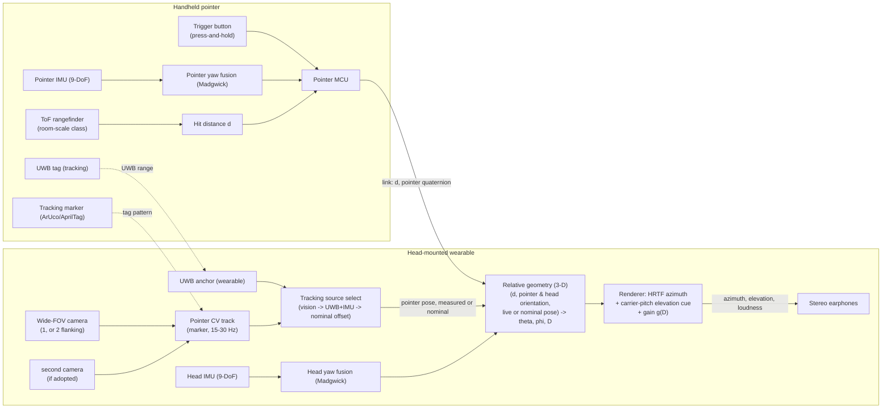

# Cane

> **Formerly Auris.** The former concept, plan, and thesis notes were cleared on 2026-09-07; this file is now the canonical **concept and development plan** for Cane — a head-mounted, audio-only navigation aid driven by a laser pointer, for visually impaired users. Repo paths still use the old name (`thesis/`); a physical rename is not planned. The wearable's board class and the component selection are **decided (2026-10-01), and the board is purchased (2026-10-03): Raspberry Pi 5, 8 GB, ₱6,000** — the class is closed and no alternative is carried ([§3](#3-hardware), [§7](#7-risks-and-limitations) risk 12). The concrete picks and PH-local costs are itemized in [`docs/hardware.md`](docs/hardware.md); the cart with its spent-vs-to-buy split is in [`docs/purchase-list.md`](docs/purchase-list.md), where only the purchase-approval sign-off for the **remaining** rows precedes checkout ([§9](#9-open-items)). **Verification is also decided (2026-10-01): no hardware bench phase** — the T0–T8 thresholds are retained as the acceptance specification, and every gate is discharged by software or datasheet evidence (simulation, cycle budgets, error propagation, citation), with the physical device's own telemetry as the in-study measurement ([§3](#3-hardware), [§6](#6-development-phases)).

## 1. Concept

### 1.1 User and task

The user is visually impaired — or a blindfolded sighted person replicating one — inside a room containing obstacles (tables, walls, chairs). The task: travel from any point in the room to another point, perceiving and avoiding obstacles along the way.

### 1.2 Equipment

1. **Head-mounted wearable** (worn on an adjustable single head strap; 3D-printed mounts hold the components together — [§3.3](#33-structural--mechanical)):
- extracts the user's **head position and orientation**;
- carries the **audio apparatus** (stereo earphones over a 3.5 mm audio jack — any wired earbuds or headset plugs in) that broadcasts spatialized sound to the user's ears;
- carries the **pointer-tracking stack** (added 2026-09-15): **one or two** wide-FOV RGB cameras on the strap — the count is decided at P2 from the FOV-geometry and co-residence analysis (confirmed at P4), two being left/right flanking stations for occlusion redundancy — with onboard computer vision, plus an ultra-wideband (UWB) radio; the pointer's pose is measured live and feeds the placement ([§2.5](#25-pointer-tracking-stack-vision-uwb-imu)).
2. **Handheld pointer** (its own device): shoots an **invisible laser** toward obstacles and measures **where the shot lands** (hit distance, via time-of-flight ranging). A **press-and-hold button** gates the laser: it fires — and ranging runs — only while the button is held, and stops the moment it is released. A **UWB tag** on the pointer completes the tracking pair ([§2.5](#25-pointer-tracking-stack-vision-uwb-imu)).

### 1.3 Interaction rule

The sound is projected — **in real time** — according to where the laser lands **relative to the user's head**, not relative to the room or the user's body:

- **Direction** — the landing point's bearing in the head's egocentric frame, given the head's *current* orientation. If the user faces straight ahead and the shot lands on their left, they hear it on the left. If they aim to the right while still facing ahead, the shot lands on their right and they hear it on the right. If they then turn their head (e.g., to their left) so that the same landing point ends up behind the head, the sound moves to behind them. The head defines the listener — its position *and* orientation matter; the user's body position does not.
- **Loudness** — the distance from the **head** to the landing point. A landing far from the head is faint; the nearer it lands, the louder it is projected. (Computed head-relative in real time — mechanism in [§2.3](#23-coordinate-frames-and-sound-placement).)
- **Elevation** — whether the landing point is above, at, or below the head's level is also conveyed (a hit on a staircase step below sounds different from a wall sign at eye height). The pointer may be aimed up or down freely; the sound follows the hit in 3-D.
- **Trigger** — the aid sounds only while the pointer's **button is held**. The laser fires — and ranging runs — only then; releasing the button stops the laser and silences the sound. The aid is therefore an **active, on-demand** scanner, in line with the active-sensing rationale of the EyeCane lineage (Maidenbaum et al. 2014, [§2 lit](thesis/literature/02-electronic-travel-aids.md)).

Worked examples (clarified 2026-09-08):

| Scenario | Head facing | Perceived sound |
|---|---|---|
| shot lands left of the user | straight ahead | left side |
| pointer aimed right — shot lands right | straight ahead | right side |
| head turns past the shot's landing point | turned away from the landing point | behind the head |

In all rows the loudness follows the head-to-landing distance (far → faint, near → loud) in real time.

## 2. System overview

### 2.1 Devices

| Device                 | Roles                                                 | Core parts                                                                                                                                                                                                                                                                                                                                                                                                                                                         |
| ---------------------- | ----------------------------------------------------- | ------------------------------------------------------------------------------------------------------------------------------------------------------------------------------------------------------------------------------------------------------------------------------------------------------------------------------------------------------------------------------------------------------------------------------------------------------------------ |
| **Pointer** (handheld) | ranging + its own orientation; press-and-hold trigger | MCU, 9-DoF IMU, ToF rangefinder (room-scale class, ~4 m), trigger button, battery, 3D-printed shell, UWB tag + printed tracking marker (ArUco/AprilTag) (tracking, [§2.5](#25-pointer-tracking-stack-vision-uwb-imu))                                                                                                                                                                                                                                              |
| **Wearable** (head)    | head pose + audio output + pointer tracking           | MCU, 9-DoF IMU, stereo earphones (3.5 mm audio jack), battery, adjustable head strap + 3D-printed mounts ([§3.3](#33-structural--mechanical)), wide-FOV RGB cameras ×2 + UWB anchor (pointer-tracking stack, [§2.5](#25-pointer-tracking-stack-vision-uwb-imu))                                                                                                                                                                                                    |
| **Link**               | pointer → wearable data                               | Device-to-device data link — **IP over 2.4 GHz Wi-Fi (UDP), the recorded lane** ([§3](#3-hardware); the Pi 5 hosts the access point) — payload = hit distance + pointer orientation (quaternion); UWB ranging pair (tracking, [§2.5](#25-pointer-tracking-stack-vision-uwb-imu)) |

Audio is rendered **on the wearable**; the link carries data, never audio (Bluetooth audio would add 150–300 ms by protocol design — wired earphones only), so the motion-to-sound latency stays inside the budget (§4.2). The button state gates everything: with the button up the pointer does not range and sends nothing, and the renderer is silent. The pointer-tracking stack ([§2.5](#25-pointer-tracking-stack-vision-uwb-imu)) adds a second, fully on-body sensing path — cameras plus UWB — that refines the pointer's pose; it changes no audio path.

### 2.2 Data flow

```mermaid
flowchart LR
    subgraph pointer["Handheld pointer"]
        pimu["Pointer IMU (9-DoF)"] --> pfus["Pointer yaw fusion (Madgwick)"]
        tof["ToF rangefinder<br/>(room-scale class)"] --> dist["Hit distance d"]
        btn["Trigger button<br/>(press-and-hold)"] --> mcu1["Pointer MCU"]
        uwbt["UWB tag (tracking)"]
        marker["Tracking marker (ArUco/AprilTag)"]
        pfus --> mcu1
        dist --> mcu1
    end
    subgraph wearable["Head-mounted wearable"]
        himu["Head IMU (9-DoF)"] --> hfus["Head yaw fusion (Madgwick)"]
        camL["Wide-FOV camera<br/>(1, or 2 flanking)"] -->         cv["Pointer CV track<br/>(marker, 15-30 Hz)"]
        camR["second camera<br/>(if adopted)"] --> cv
        uwbw["UWB anchor (wearable)"] --> src["Tracking source select<br/>(vision -> UWB+IMU -> nominal offset)"]
        cv --> src
        mcu1 -- "link: d, pointer quaternion" --> geo["Relative geometry (3-D)<br/>(d, pointer & head orientation,<br/>live or nominal pose) -> theta, phi, D"]
        src -- "pointer pose, measured or nominal" --> geo
        hfus --> geo
        geo --> ren["Renderer: HRTF azimuth<br/>+ carrier-pitch elevation cue<br/>+ gain g(D)"]
        ren -- "azimuth, elevation, loudness" --> spk["Stereo earphones"]
        uwbt -. "UWB range" .-> uwbw
        marker -. "tag pattern" .-> cv
    end
```

### 2.3 Coordinate frames and sound placement

- **Head frame H**: origin at the head (relative position, IMU dead reckoning — [§2.4](#24-positioning-relative-pose-only)); the head IMU (Madgwick fusion) senses the **full orientation** — yaw $\mathrm{yaw}_H$ (heading, rotation about the vertical axis), pitch $\mathrm{pitch}_H$ (nodding up/down), and roll (ear-to-shoulder tilt) — and **all three are used**: the landing point is transformed with the full head rotation $R_H$, because the listener's frame — the ears — rotates with the head; a hit level with the eyes when upright is no longer level with the ear axis when the head tilts. The perceived sound position is expressed in this frame — that is what makes the sound move correctly when the user turns, nods, or tilts their head.
- **Pointer frame P**: the pointer IMU likewise senses and fuses full orientation; its aim axis is the unit vector $\hat{u}_P$ extracted from the fused quaternion (roll about the beam axis does not steer the beam, but the complete orientation is fused, shipped, and used in the exact transform; the first-order forms below read it as yaw $\mathrm{yaw}_P$ and pitch $\mathrm{pitch}_P$). The pointer is *not* confined to chest height — it may be aimed up or down freely (walls, signs, staircases) — and the ToF reading $d$ ranges along that aim.
- **Landing point relative to the head** (full 3-D):

  $$
  r \;=\; R_H^{-1}\!\left[\left(p_P + d\,\hat{u}_P\right) - p_H\right]
  \;=\; o + d\,R_H^{-1}\,\hat{u}_P
  $$

  where $R_H$ is the head's full rotation and $o = R_H^{-1}(p_P - p_H)$ is the pointer's offset from the head expressed in the head frame — handled as a **calibrated 3-D constant** (nominal handheld position: forward, lateral, and below the head) rather than tracked, since rigid-body hand tracking is out of scope for an IMU-only build ([§2.4](#24-positioning-relative-pose-only)). Note that two IMUs alone cannot measure their separation: inertial position is double-integrated acceleration whose bias error grows quadratically, and the *difference* of two drifting estimates drifts faster still (Harle 2013; Foxlin 2005, [§5 lit](thesis/literature/05-head-pose-sensing.md)). IMUs give reliable relative **orientation** — yaw *and* pitch — not distance; so the fixed offset is calibrated once. The pointer-tracking stack ([§2.5](#25-pointer-tracking-stack-vision-uwb-imu)) lifts exactly this restriction in the extended build: with the pointer in camera view, $p_P$ — and with it the offset — is **measured live**, and the calibrated constant remains the fallback tier.

The placement quantities follow from three live measurements — the ToF range $d$ and both devices' full orientation — plus the one calibrated constant $o$. The exact computation runs on the full rotation matrices ($R_H$ and the pointer's fused orientation); the yaw- and pitch-difference forms quoted below are first-order intuition only. Because $o$ is known, the placement is exact for the calibrated pose; the residual error is only grip/pose variation ([§7](#7-risks-and-limitations)). The renderer recomputes all three on every update, so the sound moves continuously as the user turns, nods, tilts, walks, or re-aims the pointer:

- **Azimuth** —

  $$
  \theta = \operatorname{atan2}\!\left(r_y,\, r_x\right)
  $$

  (to first order $\theta \approx \mathrm{yaw}_P - \mathrm{yaw}_H$, wrapped to $[-180°, 180°)$) — rendered with a generic HRTF.
- **Elevation** —

  $$
  \phi = \operatorname{atan2}\!\left(r_z,\, \sqrt{r_x^2 + r_y^2}\right)
  $$

  (to first order $\phi \approx \mathrm{pitch}_P - \mathrm{pitch}_H$ plus the vertical-offset geometry term) — **rendered explicitly**: the obstacle signal's carrier pitch sits *below* the reference when the hit is below head level and *above* it when the hit is above, with level hits at the reference. This follows the elevation→pitch precedent of the vOICe (Meijer 1992, [§3 lit](thesis/literature/03-audio-ssd-sonification.md)) and 3-D scene sonification (Bujacz et al. 2011, same file). Spectral HRTF elevation is deliberately *not* relied upon: it is the channel that degrades with non-individualized HRTFs (Planinec et al. 2023, [§4 lit](thesis/literature/04-spatial-audio-hrtf.md)), whereas a carrier-pitch cue is robust on any earphones and needs no per-user calibration. Staircases are the motivating case: aiming down a flight of steps must sound distinctly *lower* than a wall at eye height.
- **Loudness distance** —

  $$
  D = \lVert r \rVert,
  $$

  the head-to-landing distance. Note what each symbol is: $d$ is the ToF reading — *pointer*-to-hit — but the gain keys to $D = \lVert r \rVert$, the *head*-to-hit distance obtained from $d$ through the calibrated offset $o$ and the relative aim direction $R_H^{-1}\hat{u}_P$. Keying the gain to $d$ raw would treat the pointer as the listener and overstate loudness by up to $\lVert o \rVert \approx 0.5\,\mathrm{m}$ — negligible at meters of range but several dB at close range (inverse-square: halving the distance is $+6\,\mathrm{dB}$), exactly the collision-warning regime. The distance still never involves the head's *room* position: as the user walks toward the obstacle with the button held, the ToF range $d$ shrinks and $D$ follows in real time — proximity is carried by the ranging, not by dead-reckoned position.

The head's position matters only **relative to the pointer** — body geometry, captured by the calibrated offset $o$. The user's body position never enters the placement ([§1.3](#13-interaction-rule)), and neither does the head's dead-reckoned room position, which exists for telemetry only ([§2.4](#24-positioning-relative-pose-only)).

Placement rules:

1. **Azimuth** — render the sound at azimuth $\theta$ with a generic HRTF. Full-azimuth rendering makes the "behind" cases automatic (no hand-coded sectors needed).
2. **Elevation** — render the above/at/below relation with the carrier-pitch cue ($\phi$ below/at/above head level → lower/ reference/higher pitch); tune the pitch spread in P4 so a stairs-versus-wall difference is obvious without sounding alien.
3. **Loudness** — gain $g(D)$ monotonic decreasing in the head-to-landing distance $D$, calibrated on the prototype (perceived loudness is not linear in dB, so the curve is tuned in P4). Near hits saturate at maximum; far hits floor at a faint but audible minimum.
4. **No-hit edge case** — while the button is held, a missing return ($d$ beyond the ToF range, or lost on glass/black surfaces) renders silence or a low "no contact" tick. With the button up the aid is silent by design — "not scanning" is the default state.

### 2.4 Positioning: relative pose only

The wearable's head **position** comes from IMU dead reckoning only — no room infrastructure. Literature shows unaided inertial position drifts far too fast for absolute room-scale tracking (Harle 2013; Foxlin 2005, see [§7](#7-risks-and-limitations)), so:

- position is treated as **relative**, valid for short traverses from a known start point;
- the point-to-point room task is judged by **observed behavior** plus an external reference, not by the device's own position estimate;
- the position channel is for **telemetry only** (user went A→B): sound placement never consumes it — $D$, $\theta$, and $\phi$ come from the ToF range, both orientations, and the calibrated head-to-pointer offset ([§2.3](#23-coordinate-frames-and-sound-placement)).

**Self-containment audit** — every runtime placement input and its onboard source:

| Placement input | Source | External dependency |
|---|---|---|
| Head orientation ($R_H$, full 3-D) | head-worn 9-DoF IMU, Madgwick fusion | none — gravity and the magnetic field are passive physical references, not infrastructure |
| Pointer orientation (quaternion) | pointer's own 9-DoF IMU, fused onboard | none |
| ToF range $d$ | the ToF rangefinder on the pointer | none — active ranging |
| Head-to-pointer offset $o$ | one-time calibration (body geometry) | none |
| Pointer pose $p_P$ (tracking tier, [§2.5](#25-pointer-tracking-stack-vision-uwb-imu)) | left/right wide-FOV cameras (ArUco/AprilTag detection) + UWB ranging pair | none — on-body sensors |
| Head room position | head-IMU dead reckoning | none — telemetry only, never used for placement |

Placement is therefore fully self-contained: no beacons, room cameras, motion capture, UWB anchors, or room instrumentation participate in it — the pointer-tracking stack's cameras and UWB pair are carried by the two devices themselves ([§2.5](#25-pointer-tracking-stack-vision-uwb-imu)), so nothing external is introduced. The remaining accuracy threats (magnetometer disturbance, grip/pose variation) are internal and are mitigated onboard — see [§7](#7-risks-and-limitations); they never motivate external aiding.

### 2.5 Pointer tracking stack (vision, UWB, IMU)

The placement ([§2.3](#23-coordinate-frames-and-sound-placement)) treats the pointer's position as a calibrated constant — exact at the calibrated grip, perturbed by grip and pose variation (±15 cm horizontal, up to ~±0.3 m vertical; [§7](#7-risks-and-limitations) risk 7). The pointer-tracking stack strengthens the **life realism of the sound projection**: when the pointer's pose is measured live, the sound lands exactly where the laser hit, not where the calibration assumed the hand was. Everything stays on the two devices — wide-FOV RGB cameras and a UWB radio on the wearable, a UWB tag on the pointer — so nothing external is introduced and the self-containment audit above still holds. The pointer's **orientation** keeps coming from its own IMU over the device-to-device link; the cameras and UWB refine its **position**, which is precisely the input the constant $o$ stood in for.

Three tiers feed the placement — only the source of $p_P$ (and with it the live offset $o = R_H^{-1}(p_P - p_H)$) changes between them:

1. **Vision (primary)** — **one or two** wide-FOV RGB cameras sit on the strap in rigid printed brackets (stable extrinsics; the power rail counterweights at the rear strap station — [§3.3](#33-structural--mechanical)); with two, the pair flanks the head left and right, with one, a single station must cover the forward hemisphere; onboard computer vision localizes the pointer at 15–30 Hz whenever it is inside their field of view, and **only while the button is held** — the cameras follow the aid's trigger gating ([§1.3](#13-interaction-rule)), so the camera draw is duty-cycled like everything else. The marker is a **printed ArUco/AprilTag** on the pointer shell (decision 2026-09-21, reversing the 2026-09-15 beacon decision): a single high-contrast square tag of known physical size — quad detection followed by a pose solve gives bearing **and range** from one camera in one step (dictionary and tag size pinned at P2; the second camera, when adopted, is redundancy and occlusion coverage — the **count is decided at P2** from the FOV-geometry and co-residence analysis and confirmed at P4, and a single camera raises the per-camera FOV requirement and hands more updates to tier 2, with the per-update active tier in telemetry so the split is quantified rather than assumed). The vision tier overwrites the pointer's **position only**: the tag's PnP orientation estimate is **ignored**, because the pointer's IMU over the device-to-device link is the better orientation source — 100 Hz and gravity/magnetic-anchored, where a 15–30 Hz flat-tag pose solve is noisiest about the camera-facing axis. The tag is **passive — zero power draw**; what it costs instead is detection compute ([§4.1](#41-firmware-modules), [§7](#7-risks-and-limitations) risk 8) and ambient-light dependence — it needs scene illumination to be visible, so a low-light/contrast check runs in the P2 evidence program and is observed at P4. If full-rate detection strains the render co-residence budget, the fallback is the two-level **detect-then-track** scheme (detect every Nth frame, track between) ([§3.8](#38-pointer-tracking-hardware--notes--contingencies)). The adopted set must cover the forward hemisphere: with two, the flanking pair does it between them; with one, it is that camera's wider envelope alone. A pointer behind the user is out of view by construction — which is exactly when the next tier takes over.
2. **UWB + IMU (fallback)** — when the pointer leaves the cameras' field of view, the wearable–pointer UWB ranging pair supplies the head-to-pointer distance which, combined with the pointer's IMU orientation and the nominal offset direction, re-anchors $p_P$ far better than the constant alone.
3. **Nominal offset (last resort)** — if UWB is also unavailable (body blockage, NLOS), the calibrated-constant scheme runs unchanged: calibrated constant $o$, both IMU orientations, ToF range $d$ ([§2.3](#23-coordinate-frames-and-sound-placement)).

Tier selection is explicit: every sound update's telemetry records which tier produced the pose that drove it, so the study can quantify how often each tier served and how placement error varies per tier — the realism gain is measured, not assumed. Tier switching must be transparent (no perceptible placement jump at a switch — P4/P5 validation, [§7](#7-risks-and-limitations) risk 9). The motion-to-sound budget ([§4.2](#42-latency-budget-motion-to-sound-target--100-ms)) is unchanged: the ToF → link → render path is untouched, and tracking latency degrades placement accuracy, never sound freshness. Integration: the tiers are **evidenced at P2** — the camera count, the FOV envelope per camera, the detection cadence, the co-residence margin, and the tier-switch continuity are settled by simulation, cycle budgets, and datasheet carry ([`docs/bench-tests.md`](docs/bench-tests.md) S7–S8) — and then **tuned with the placement and observed on the real device at P4**, before the human study. With no breadboard phase the cheap pre-solder safety net is gone, so the P2 evidence carries more of the design weight and P4 observation becomes the first empirical check of the tracking tier ([§9](#9-open-items)); the tracking hardware is part of the final design and is priced in the device BOMs ([§3.1](#31-pointer--electronics), [§3.2](#32-wearable--electronics)), with contingencies in [§3.8](#38-pointer-tracking-hardware--notes--contingencies).

## 3. Hardware

> **Board class and selection decided 2026-10-01; purchased and finalised 2026-10-03 (co-researcher): the wearable is a Raspberry Pi 5, 8 GB, and the board is bought.** The concrete component picks, quantities, and PH-local costs are itemized in [`docs/hardware.md`](docs/hardware.md), and the cart form is [`docs/purchase-list.md`](docs/purchase-list.md).
>
> **What was bought, and what it means for the plan.** **Purchase 2026-10-03: the Raspberry Pi 5, 8 GB board — ₱6,000.** Every other cart row is still **to buy** ([§9](#9-open-items)), so the board class is now permanent purchased hardware and **no alternative board class is carried** ([`docs/hardware.md`](docs/hardware.md) §4).
>
> **Why 8 GB is safe to state without re-deriving anything.** The purchased SKU is 8 GB. The operative reason was availability at purchase; the engineering justification is that the resident workload — one or two QVGA CV streams, the renderer, the Wi-Fi access point, and batch-written logs — was already shown to fit **4 GB** with room to spare (~1 GB), so **8 GB is a strict superset**. Consequently **no budget, threshold, risk, or evidence class in this plan changes**: the §4.2 stage budgets, the ≤ 2 ms/buffer render gate, and the S4/S7 cycle arguments against the A76 cores all carry over exactly as written. No swap is configured either way (flash endurance on the log card).
>
> The wearable-side roster keeps two labels, now descriptive rather than contingency-driven: **board-agnostic rows** — the I²C/SPI/GPIO/USB parts whose interface choice is class-independent by design — and the **selected class rows** (raspi-5, 8 GB, below). The vision tier's **camera count is 1 or 2, still undecided**; it is settled at P2 from the FOV-geometry analysis and confirmed by observation at P4 ([§2.5](#25-pointer-tracking-stack-vision-uwb-imu)), and since **neither module has been purchased yet, dropping to one costs ₱0** rather than stranding a bought part. The pointer keeps its own Wi-Fi-capable MCU class — an esp32-s3-class devkit — because it is a **different device under different constraints** (battery-powered, hand-held, ~100 Hz fusion on a shared I²C bus), not because the wearable's class is reversible; it joins the Pi 5's access point over IP ([§3.1](#31-pointer--electronics)).
>
> **No hardware bench phase (decided 2026-10-01).** The T0–T8 thresholds stay on the books as the **acceptance specification** — the numbers the design must meet, unchanged — but they are **not measured on breadboards**; the matrix is retained as the specification and the acceptance ledger, and every gate is discharged by software or datasheet evidence in this order: **`[SIM]`** simulated (the real `geometry`/`renderer`/tiering code on a desktop PC driven by synthetic streams; SPICE on the power rails), **`[BUD]`** budgeted (compiled-code instruction counts scaled to the Pi 5's A76 cores), **`[PROP]`** propagated (the selected parts' datasheet figures seeded through the placement math into θ/φ/D distributions), **`[CITE]`** cited (datasheet/literature carry, for claims with no simulation available). Where no software method exists for a claim, **the component datasheet is the evidence** and the claim is labelled as citation-class rather than quietly upgraded. The physical device still measures itself **in use**: the `bench-log` module and the per-update active-tier telemetry stay in the firmware ([§4.1](#41-firmware-modules)), so P4 calibration and the P5 study yield real latency and tier-distribution numbers on the worn device — the measurement the breadboard phase would have produced, taken on the evaluated hardware instead. Protocol and evidence ledger: [`docs/bench-tests.md`](docs/bench-tests.md).

**The device-to-device link — recorded lane.** The selected wearable settles the link lane: **IP over 2.4 GHz Wi-Fi (UDP)** is the recorded device-to-device data lane, pending the co-researcher's sign-off — the Pi 5 hosts the access point and the pointer's Wi-Fi MCU joins it, with the payload unchanged: hit distance + pointer orientation (quaternion) at 10–30 Hz ([§2.1](#21-devices), [§4.1](#41-firmware-modules)). Bluetooth is excluded: connection intervals and write round-trips break the ≤ 10 ms link-hop stage ([§4.2](#42-latency-budget-motion-to-sound-target--100-ms)); Bluetooth *audio* is categorically excluded at [§2.1](#21-devices) level. A wired serial tether is technically reachable over the 3.3 V UART pins of either class but is excluded ergonomically — a hand-to-head cable during room traversals defeats the task. The lane's one-way latency and loss are bounded analytically at P2 and observed on the worn device at P4 ([`docs/bench-tests.md`](docs/bench-tests.md) S3).

**Purchasing constraints** (they bind the selection; they do not pick parts):

1. **Tracking hardware is mandatory** — the pointer-tracking stack ([§2.5](#25-pointer-tracking-stack-vision-uwb-imu): 1–2 wide-FOV cameras + UWB pair on the wearable; UWB tag + printed marker on the pointer) is part of the final design of both devices; the P2 evidence gates pin its implementation (camera count, detection cadence, UWB bus wiring), never its inclusion.
2. **Connector-ready rule (pre-soldered, adapted)** — no phase attaches components to a breadboard, so the rule now serves the **P3 service build** instead of a bench: every module is ordered with headers/connectors pre-fitted (or consumer-ready where no header applies), extending the hand-solderability binding ([§3.9](#39-assembly--outsourcing-p3)); fine-pitch bare ICs and unsoldered header boards are excluded outright — nothing has to be made solderable out of necessity.
3. **Buy-once rule (spent on 2026-10-03)** — the rule's purpose was *"the selection is made before the purchase, never corrected by a re-buy afterwards,"* and for the compute board that is now **executed**: the Raspberry Pi 5, 8 GB is bought and the class is closed. What remains unbought (cameras, cooler, DAC, PD bank, pointer kit, tools, prints, study hardware) is still bought once, on the same evidence-first basis. **Two consequences are recorded rather than assumed away:** (a) any *further* electronics spend is a re-buy by definition and needs an explicit exception, not a same-lane order; (b) with only the board purchased, the buy-once rule no longer protects the remaining rows from a late substitution — so a part swapped after purchase is a logged deviation, and the [§7](#7-risks-and-limitations) risk 12 lane covers the board itself.
4. **Board class closed (decided 2026-10-01, purchased 2026-10-03)** — the wearable is a **Raspberry Pi 5, 8 GB**; the selected class rows are pinned to it and it is bought hardware, so **no alternative class is carried** ([`docs/hardware.md`](docs/hardware.md) §4). The comparison matrix of [`docs/hw-comparison.md`](docs/hw-comparison.md) is the dated research basis behind the decision (screened per-interface pre-purchase) and is kept as that record, not as a live option. The pointer keeps its own esp32-s3-class MCU ([§3.1](#31-pointer--electronics)) as a design consequence of the two devices differing, not as a reversibility mechanism.
5. **Evidence-labelling rule** — no quality claim is presented as measured unless it was. Every §4.2 stage and every T0–T8 threshold carries an evidence class in the fixed order **`[SIM]` simulated → `[BUD]` budgeted → `[PROP]` propagated → `[CITE]` cited**, and where no software method exists **the component datasheet carries the claim** — labelled, not silently upgraded. The thresholds themselves never move ([`docs/bench-tests.md`](docs/bench-tests.md) §2), and the device's own telemetry supplies what simulation cannot, in P4/P5.

### 3.1 Pointer — electronics

The handheld device's electronics — each row is a selection constraint a part must satisfy ([§4.1](#41-firmware-modules)):

| Component | Function | Selection constraints |
|---|---|---|
| Pointer MCU | fuses the pointer's orientation, drives the ToF ranging, and sends $d$ + the quaternion over the link | a **2.4 GHz Wi-Fi-capable** MCU so the UDP lane reaches the Pi 5's access point — the radio is what makes the pointer a self-contained handheld rather than a second Linux board; one shared I²C bus serving the IMU and the ToF sensor at distinct fixed addresses; SPI + IRQ/reset for the UWB tag; FPU-class headroom at ~100 Hz fusion; a native USB CDC port for the bench-log stream ([`docs/bench-tests.md`](docs/bench-tests.md)); a compact battery-powered board suited to the printed shell ([§3.3](#33-structural--mechanical)) |
| 9-DoF IMU | the pointer's full orientation, fused onboard | I²C on the shared bus; the **same part as the wearable's**, to simplify the fusion software ([§3.2](#32-wearable--electronics)) |
| ToF rangefinder | the hit distance $d$, ranged **while the trigger is held** | room-scale class (~4 m, [§2.1](#21-devices)), I²C on the shared bus; readings at 20–50 Hz with no-hit handling; the surface-behavior ceiling and beam figures are selection criteria ([§7](#7-risks-and-limitations) risk 5) |
| Trigger button | press-and-hold gating of the laser, the ranging, and everything downstream ([§1.3](#13-interaction-rule)) | momentary, GPIO input |
| UWB tag module | the tracking pair's tag side — the distance re-anchor when the pointer leaves camera view ([§2.5](#25-pointer-tracking-stack-vision-uwb-imu)) | SPI + IRQ/reset; the **same module family as the wearable's anchor**; the SPI driver is confirmed against the selected board class at first power-up before any ranging is trusted |
| Printed tracking marker | the vision tier's passive target ([§3.8](#38-pointer-tracking-hardware--notes--contingencies)) | printed ArUco/AprilTag — zero power draw, no driver electronics |
| Power path | battery operation sized to the pointer's duty cycle | protected USB-C charge board + Li-ion cell; no dual-class requirement on any pointer-side row |

### 3.2 Wearable — electronics

The head-mounted device's electronics in two tables — the **board-agnostic rows** (the I²C/SPI/GPIO/USB parts, class-independent by design) and the **selected class rows** (the purchased Raspberry Pi 5, 8 GB wearable). The vision tier's camera count (**1 or 2**) is **still undecided**: it is settled at P2 from the FOV-geometry and co-residence analysis and confirmed at P4, and because neither module has been purchased yet, adopting one camera instead of two costs ₱0 rather than stranding a bought part.

**Board-agnostic rows — one part serves the wearable whichever board class it carries:**

| Component | Function | Shared interface | Notes |
|---|---|---|---|
| 9-DoF IMU | the head's full orientation for the Madgwick fusion ([§2.3](#23-coordinate-frames-and-sound-placement)) | I²C at 3.3 V | the **same part as the pointer's** ([§3.1](#31-pointer--electronics)), to simplify the fusion software |
| UWB anchor module | the tracking stack's fallback tier — the head-to-pointer distance re-anchor ([§2.5](#25-pointer-tracking-stack-vision-uwb-imu)) | SPI + IRQ/reset | the **same module family as the pointer's tag**; the SPI driver is confirmed against the selected board class at first power-up |
| Re-zero button | the per-doning yaw re-anchor ([§3.3](#33-structural--mechanical), [§7](#7-risks-and-limitations) risk 10) | momentary GPIO at 3.3 V | a plain input pin on either class; nothing about it changes with the board |
| 3.5 mm audio jack | the wired-only earphone terminus ([§2.1](#21-devices)) | passive | class-independent by construction; every audio-path variant ends in it |
| Stereo I²S DAC module (PCM5102A-class) | the spatial-audio output path | I²S | the **same module** on either class — only the wiring and the driver side differ (the selected class row below); headphone-appropriate output stage; its native two-channel output satisfies the two-independent-per-ear-channels constraint ([`docs/achievability.md`](docs/achievability.md), C7) |
| Wired stereo earphones (3.5 mm plug) | the user's audio apparatus | 3.5 mm | wired-only is mandatory ([§2.1](#21-devices)) — any wired earbuds or headset |

**Selected class rows — the purchased Raspberry Pi 5, 8 GB wearable:**

| Component | Function | Selected class row (raspi-5, 8 GB) | Notes |
|---|---|---|---|
| Wearable compute board | renders the audio; runs the CV tracking co-resident; hosts the 2.4 GHz access point; provides I²C/SPI/USB to the agnostic rows above | a **Raspberry Pi 5, 8 GB** — **purchased 2026-10-03, ₱6,000** | the resident workload was already shown to fit 4 GB, so 8 GB is a strict superset and **no budget, threshold, or evidence class changes** ([§3](#3-hardware) preamble); the renderer/CV co-residence is evidenced at P2 and observed at P4 ([§7](#7-risks-and-limitations) risk 8); **two native CSI-2 capture lanes**; I²S on its GPIO pins; a 5 V/5 A (27 W-class) rail; the I²C/SPI/I²S overlays share one GPIO budget (planned as a coordinated set, [`docs/bench-tests.md`](docs/bench-tests.md) wiring maps); Linux audio-path jitter is the exposure (risk 8) |
| 1 or 2 × wide-FOV RGB cameras | the vision tier — pointer localization at 15–30 Hz ([§2.5](#25-pointer-tracking-stack-vision-uwb-imu)) | **CSI-2 camera modules** (≥ 120°-class field of view), two in the cart, on the Pi 5's **mini 22-pin** CSI connectors — **not yet purchased** | the **count is decided at P2** from the FOV-geometry and co-residence analysis (one camera widens the FOV requirement and hands more updates to the UWB tier — the per-update active tier is in telemetry, so the split is quantified) and confirmed at P4; dropping to one before ordering saves ₱1,700–2,400 and one printed bracket at no sunk cost; the two native lanes close the mux question in hardware; the sensor family is chosen **first**; third-party modules may ship the wrong (15-pin) cable — the Standard-Mini cable is confirmed on receipt ([`docs/purchase-list.md`](docs/purchase-list.md) §10) |
| Stereo audio output | spatialized audio to the wired 3.5 mm jack ([§2.1](#21-devices)) | the **stereo I²S DAC (PCM5102A-class)** connects to the I²S-capable GPIO pins behind a HiFiBerry-class sound-card overlay | overlay support is cited at P2 and **confirmed at first power-up** before the audio path is committed ([`docs/bench-tests.md`](docs/bench-tests.md) S4); the **USB-audio-dongle lane** is the fallback |
| Worn power rail | runs the head-worn stack between charges | a **5 V/5 A (25 W+) rail** — the ≥ 20 Ah USB-C PD power bank, 27 W class | the Pi 5's recommended supply is 27 W / 5 A; a 3 A rail is minimum-only, restricts downstream USB to 600 mA, and flags the current limit at boot — inadequate for the camera + UWB + Wi-Fi tracking load. Few ≥ 20 Ah banks reach 5 A; the recorded fallback is a protected-cell (18650-class) rail with a 5 V/5 A buck stage. Mass vs runtime traded explicitly ([§3.3](#33-structural--mechanical), [§7](#7-risks-and-limitations) risk 11) |
| Camera mounts and wiring | stable extrinsics plus the CSI cables | brackets and cabling per the **CSI-2 module shape** | printed after P2 pins the module shape **and the adopted camera count** ([§3.3](#33-structural--mechanical)) |

### 3.3 Structural & mechanical

The 3D-printed pointer shell and wearable strap mounts, the elastic head strap, the rail cradle, fasteners, and adhesive. The wearable is **strap-mounted, not a helmet**: a single elastic goggle-style band carries the components in 3D-printed mounts — rigid brackets for the cameras (stable extrinsics for the vision tier, [§2.5](#25-pointer-tracking-stack-vision-uwb-imu)) and the head IMU, the power rail at the rear station as counterweight. Strap slip shifts the assembly relative to the ear axis, so **donning is a ritual**: fit the strap, hold still, press re-zero ([§7](#7-risks-and-limitations) risk 10). *Selection pending the co-researcher.* Three rows follow other hardware rows: the rail cradle and the camera brackets follow the selected class rows ([§3.2](#32-wearable--electronics)) — the PD-bank rail rides the rear counterweight station — and the camera brackets are printed after P2 pins the module shape and the adopted camera count. **Cooler-vs-camera footprint is a structural constraint of the selected class**: the active cooler sits over the board's upper face and its CSI connectors share that area, so the printed station must leave access to both camera connectors (and the cables seated before the cooler goes on) and hold the camera stations clear of the cooler footprint — otherwise the two fight for the same real estate on the strap.

### 3.4 Assembly & bring-up tools (one-time)

One-time tools for first power-up and support of the P3–P5 builds, sized to the assembly decision of [§3.9](#39-assembly--outsourcing-p3): no in-house production soldering remains, so the kit is the minimal rework set defined in [`docs/assembly.md`](docs/assembly.md) — digital multimeter, wire strippers/cutters/pliers, USB data cables, tweezers, one adjustable soldering iron + solder + flux + desoldering wick for trivial fixes on returned assemblies and harness repairs, helping-hands/PCB holder optional. With no hardware bench phase (2026-10-01), the multimeter and the current-limited source carry the **incoming inspection and first power-up** instead of a bench bring-up, and the breadboard/fixture rows are **not bought** ([`docs/bench.md`](docs/bench.md) §3). The telemetry harness adds no logging hardware: the on-hand laptop runs the capture/reduce scripts over the boards' USB data cables. *Selection pending the co-researcher.*

### 3.5 Evaluation hardware (one-time)

The P5 study hardware: blindfolds, floor marking tape + measuring tape (course layout and ranging ground truth), obstacle props, timing (on-hand phone/smartwatch). *Selection pending the co-researcher.*

### 3.6 Totals

Budget totals live with the itemization: [`docs/hardware.md`](docs/hardware.md) §10 (selections with costs) and [`docs/purchase-list.md`](docs/purchase-list.md) §9 (the complete cart, with its **spent-vs-to-buy split**). **Post-purchase baseline (2026-10-03): ₱6,000 spent** on the Raspberry Pi 5, 8 GB, **≈ ₱15,800–31,300 still to buy**; itemized total **≈ ₱21,800–37,300** (≈ ₱25,100–42,900 with 15 % contingency). Remaining rows stay indicative Philippine-local ballparks until ordered ([§9](#9-open-items)).

### 3.7 Component notes

Per-component rationale, constraints, and alternatives live in [`docs/hardware.md`](docs/hardware.md) (one section per roster block) and are extended here at selection time.

### 3.8 Pointer-tracking hardware — notes & contingencies

The tracking hardware is **part of the final design** of both devices ([§2.5](#25-pointer-tracking-stack-vision-uwb-imu)); the P2 evidence gates pin its *implementation* (camera count, detection cadence, UWB bus wiring) — never its inclusion. **Board class closed; the capture question is closed in hardware:** the wearable's cameras are CSI-2 modules on the Pi 5's two native lanes, and the **count (1 or 2) is decided at P2** from the FOV-geometry and co-residence analysis (confirmed by observation at P4). With the class fixed, there is no DVP port pressure, no camera mux, and no alternate-frame strategy to carry — those belonged to board classes with a single capture port and are not part of this build ([§7](#7-risks-and-limitations) risk 12). The P2 gates pin the per-camera FOV envelopes, the detection cadence, the marker dictionary and size, and the UWB bus wiring and tier-switch continuity ([§7](#7-risks-and-limitations) risks 8–9); the carrier-board pin/overlay set is planned with the KiCad designs ([§4.3](#43-eda-toolchain-kicad-and-mcp)).

**UWB placement and consumption policy.** The fallback tier's accuracy is posture-dependent: the ±10 cm-class figures are line-of-sight numbers, and a body between the head-worn anchor and the hand-held tag pushes the reading long (diffracted first path) by tens of centimetres, worst in the deep-behind-body pose — which is exactly where the vision tier has already handed off. Two design consequences are therefore recorded: (i) **placement** — the anchor rides the upper rear/side strap station with a few centimetres of skin clearance, and the tag sits on the pointer's tail with its plane vertical in the natural grip; (ii) **consumption** — ranges are consumed quality-gated and median-filtered (the module reports first-path quality per packet; poor-quality readings are rejected rather than averaged), and a re-anchored position is clamped to a plausible envelope around the nominal offset so a poisoned reading degrades the tier instead of injecting a jump. The honest claim the thesis carries: tier 2 re-anchors well in the intermediate poses (half out of view, arm raised, side holds) and can match the calibrated-constant tier deep-behind — the **ladder**, not UWB alone, provides the robustness ([§7](#7-risks-and-limitations) risk 9).

**Marker scheme (decided 2026-09-21, reversing the 2026-09-15 beacon decision): the vision tier's marker is a printed ArUco/AprilTag** — a single high-contrast square tag of known physical size mounted on the pointer shell. Detection is quad detection → pose solve (PnP): one camera yields bearing **and range** from the tag's known size in a single step — and it overwrites **position only**: the tag's PnP orientation is deliberately ignored, since the pointer's IMU over the device-to-device link is the better orientation source (100 Hz, gravity- and magnetic-anchored; the pose solve is noisiest about the camera-facing axis). The tag is passive — zero power draw, no driver electronics — and costs only printing and rigid mounting. The cost moved from hardware to compute: square-tag detection is heavier than the beacon's two-centroid thresholding, so P2 budgets full-rate detection against the render co-residence margin; if the margin does not hold, the fallback is the two-level **detect-then-track** scheme (detect every Nth frame, track between) and/or a cheaper dictionary (ArUco 4×4 vs 5×5; AprilTag 36h11 as the accuracy-favored alternate — the dictionary and tag size are pinned at P2 and become config parameters, not a re-buy). Lighting strategy: the tag is passive and needs scene illumination — the **low-light/contrast check** (minimum room light for reliable detection, exposure/motion-blur at 15–30 Hz) is carried by camera-datasheet analysis at P2 and observed at P4; there is no emission, so no flash-sync rejection exists to manage.

### 3.9 Assembly & outsourcing (P3)

**Decision 2026-09-26: the soldered build is designed here, soldered externally.** The P3 soldered build of both devices is executed by an **external local hand-solder service** — not in-house — while everything that **decides how it is soldered** is produced in this project: the schematics, the per-device KiCad carrier boards ([§4.3](#43-eda-toolchain-kicad-and-mcp)), the harness/wiring design (connector selection and keying, wire gauge/color/length schedule, strain relief, labeling), and the service-facing assembly drawings. Two procurement lanes follow, both folded into the co-researcher's purchase-approval sign-off ([§9](#9-open-items)) like every other purchase: the bare carrier PCBs come from a PCB **fab** house — ordered **with spares** (≥ 2 extra boards per device, so a dead board costs a re-solder, never a re-fab) — and the soldering/assembly labor comes from the local service, quoted per build and booked before P3 entry.

The design consequence is binding: the service is a hand-solder shop, not an SMT line, so **the carrier boards are hand-solderable by design** — through-hole-dominant (module header rows, wiring points, keyed through-hole connectors), generous clearances, single-sided placement preferred, and **no fine-pitch SMT designed onto our boards**: all fine-pitch electronics stays on the pre-assembled modules, extending the connector-ready rule ([§3](#3-hardware) purchasing constraints) to our own boards. Everything that returns from the service passes **incoming inspection in-house before any power-up** — visual solder-joint check against the assembly drawings, per-net continuity, current-limited first power-up — and only then the **functional smoke check** ([`docs/bench-tests.md`](docs/bench-tests.md), [§ P3 smoke check](docs/bench-tests.md#p3-functional-smoke-check-the-build-acceptance-gate)). The P3 window is unchanged ([§6](#6-development-phases)); the operational protocol — handoff-package checklist, service-selection criteria, order lanes, inspection steps, rework-kit scope — owns [`docs/assembly.md`](docs/assembly.md), and [§3.4](#34-assembly--bring-up-tools-one-time) carries the tooling consequence (minimal rework kit in place of the full soldering kit). Because the soldered builds are the units the P5 study participants wear ([§5](#5-evaluation-plan)), the handoff package and the incoming inspection are **gates, not courtesies**.

## 4. Software

### 4.1 Firmware modules

| Module | Device | Responsibility |
|---|---|---|
| `fusion` (Madgwick) | both | full quaternion (yaw/pitch/roll) from IMU at ~100 Hz |
| `tof` driver | pointer | ranged readings at 20–50 Hz **while the button is held**, no-hit handling; idle otherwise |
| `link` | both | device-to-device transport meeting the link-hop budget ([§4.2](#42-latency-budget-motion-to-sound-target--100-ms)); ship `d` + pointer quaternion → wearable at 10–30 Hz |
| `geometry` | wearable | $\theta$, $\phi$ (3-D direction) and $D$ (head-to-landing distance) from $d$, both orientations, and the calibrated offset; edge-case classification |
| `renderer` | wearable | generic-HRTF azimuth + carrier-pitch elevation cue, $g(D)$ gain curve |
| `telemetry` | wearable | relative-pose dead reckoning for logging |
| `bench-log` | both | the **in-study measurement instrumentation** (renamed role under the no-bench decision): structured event stream (sensor frames, render timings via the device's monotonic timer — `esp_timer_get_time()` on the pointer's esp-class firmware, `clock_gettime(CLOCK_MONOTONIC)` under Linux on the wearable; link `seq`/tx–rx stamps, button state, reset reasons) over USB (native CDC on the pointer; SSH/tethered-USB on the wearable), flash-buffered when untethered (LittleFS on the esp-class side, batched file writes on the A2 card on the raspi side), `start`/`mark`/`set` command capture of operator entries — all below-audio priority so timing metrics are not perturbed. This module is what makes the worn device self-measuring at P4/P5 ([`docs/bench-tests.md`](docs/bench-tests.md) §2.6), and it costs no extra hardware |
| `pointer-track` (CV) | wearable | localizes the pointer from the left/right wide-FOV cameras at 15–30 Hz while in view: **ArUco/AprilTag detection** → quad → PnP pose from the known physical tag size → bearing + range (position only — the tag's PnP orientation is discarded; orientation always comes from the pointer IMU, [§2.5](#25-pointer-tracking-stack-vision-uwb-imu)); detection cost is evidenced at P2 — full detection every frame if it fits the co-residence budget, otherwise the two-level detect-then-track scheme (detect every Nth frame, track between; for scale, the ESP-WHO-class CNN benchmark runs only ~10 fps at QVGA, and square-tag detection is far cheaper than a CNN), and observed on the device at P4; yields a measured $p_P$ for [§2.3](#23-coordinate-frames-and-sound-placement) |
| `uwb-range` | both | wearable–pointer UWB ranging for the fallback tier |
| `track-source` | wearable | tier selection (vision → UWB + IMU → nominal offset, [§2.5](#25-pointer-tracking-stack-vision-uwb-imu)); records the active tier in every sound-update telemetry record |

The tracking modules belong to the pointer-tracking stack — part of the final pipeline; their implementation choices (camera count, cadence, bus wiring) are evidenced at P2 ([`docs/bench-tests.md`](docs/bench-tests.md) S7–S8) and tuned and observed at P4 — the placement pipeline is unchanged.

### 4.2 Latency budget (motion-to-sound, target ≤ 100 ms)

| Stage | Target |
|---|---|
| IMU fusion update (100 Hz) | ≤ 10 ms |
| ToF ranging cadence (≥ 20 Hz) | ≤ 50 ms |
| Device-to-device link hop (≥ 10 Hz) | ≤ 10 ms |
| HRTF render per buffer (48 kHz / 128 samples — a 2.67 ms period, so the gate sits under it) | ≤ 2 ms |
| Total | **≤ 100 ms** |

Each stage's row is a **P2 exit criterion** (§6), discharged by software or datasheet evidence rather than a hardware measurement — the threshold stands, its provenance is labelled ([`docs/bench-tests.md`](docs/bench-tests.md)); the render row is the core number of the co-residence case ([§7](#7-risks-and-limitations) risk 8), and the end-to-end total is checked against the built device's own telemetry at P4/P5.

### 4.3 EDA toolchain (KiCad and MCP)

The electronics of both devices are designed in **KiCad** (`kicad-cli` 10.0.6 on the build machine; toolchain decision 2026-09-15), one project per device under [`electronics/`](electronics/):

- [`electronics/cane-wearable/`](electronics/cane-wearable/) — the cane-concept **head-mounted wearable** board ([§3.2](#32-wearable--electronics): MCU, 9-DoF IMU, stereo I²S out, power)
- [`electronics/cane-pointer/`](electronics/cane-pointer/) — the cane-concept **handheld pointer** board ([§3.1](#31-pointer--electronics): MCU, 9-DoF IMU, ToF rangefinder, trigger button, power); the UWB tag circuit joins this schematic once the P2 gate pins it ([§3.8](#38-pointer-tracking-hardware--notes--contingencies)) — the tracking marker is printed on the shell and adds no circuit

AI-assisted design runs through the **[mcp-server-kicad](https://github.com/ProductOfAmerica/mcp-server-kicad)** MCP server (109 tools, MIT; wired 2026-09-27 into this repo's opencode config as `mcp.kicad` — a local stdio server launched through a `$HOME`-expanding `bash -c` wrapper, so the tracked config carries no machine-specific path and stays portable across machines; tool calls pass explicit project paths since the `.kicad_pro` files live in the per-device subdirectories below, not the repo root): schematic capture, PCB layout, ERC/DRC via `kicad-cli`, and manufacturing exports. Ground rules: the AI drafts and checks, but every design is **reviewed by a human in the KiCad GUI before anything is fabricated** — ERC/DRC reports are generated artifacts, not review substitutes. Schematic and layout figures for the thesis ([`thesis/README.md` §3](thesis/README.md)) are exported from these projects.

## 5. Evaluation plan

Paradigm justified by the consolidated literature ([`thesis/literature/07-evaluation-methodology.md`](thesis/literature/07-evaluation-methodology.md), [`thesis/literature/08-vi-participant-research-methodology.md`](thesis/literature/08-vi-participant-research-methodology.md)). The participant model is the **third revision (2026-09-16, panel constraints applied; thesis plan decision 2)** — participants must be **actual VI persons**: the earlier blindfolded-sighted fallback and the longitudinal single-case primary are both **struck** (canonical wording in [`thesis/README.md` §1](thesis/README.md)):

- **Design**: **within-subject aid-off vs aid-on**, **one visit per participant** (~1.5–2 h: accessible consent → device briefing/practice → point-to-sound localization test → 5–6 draggable-layout traversals, one condition per layout, assignment randomized per participant and counterbalanced across participants → SUS + NASA-TLX).
- **Participants**: **N = 6–8 actual VI participants** (recruit 8–10; floor 6 — field precedent 8–13: dos Santos et al. 2021, Pittet et al. 2026, Kilian et al. 2022, Fiannaca et al. 2014; participant-level Wilcoxon reaches `p < .05` from n = 6).
- **Statistics**: Shapiro–Wilk, paired *t* or Wilcoxon signed-rank, α = .05, effect sizes, with trial-level (participant × layout) descriptive support.
- **Gates**: adviser confirmation of the revised design, and **recruitment — the sole hard gate (no fallback exists)**; outreach starts immediately via VI organizations/schools (Resources for the Blind Inc., ATRIEV, NCDA network); ≥ 6 confirmed participants by Jan 3, 2027 or the study start slips ([`docs/schedule.md`](docs/schedule.md) contingency 6).
- **Course**: obstacle room course in the style of Roentgen et al. 2012b — 5–6 draggable standardized layouts, one condition per traversal.
- **Conditions**: aid-off vs aid-on, within-subject, counterbalanced across participants; multiple layouts.
- **Safety/ethics**: unchanged — accessible consent incl. the recorded-audio option (Saleh 2004), O&M-specialist consult, spotter, stopping rules.
- **Metrics**:
- objective — collisions, completion time, Percentage Preferred Walking Speed (PPWS), localization accuracy (point-to-sound direction test, azimuth and elevation);
- subjective — SUS (after Kilian et al. 2022) and NASA-TLX (after Pittet et al. 2026).
- **Future work**: a longitudinal single-case extension is the study's recorded recommendation (thesis plan §5).

## 6. Development phases

| Phase | Focus | Exit criteria | Thesis mapping |
|---|---|---|---|
| **P1 — Architecture & component selection** *(complete 2026-10-01; the board purchased 2026-10-03: the wearable is a Raspberry Pi 5, 8 GB, bought at ₱6,000, with the picks and costs itemized in [`docs/hardware.md`](docs/hardware.md) and the remaining cart still to buy in [`docs/purchase-list.md`](docs/purchase-list.md) — [§3](#3-hardware))* | this document; component selection | compute board **ordered and received (2026-10-03)**; interfaces fixed; remaining rows ordered at the P2 exit | §3.1.1, §3.1.4, §3.1.6 (block diagrams) |
| **P2 — Verification by software & datasheet** *(no hardware bench — decision 2026-10-01)* | every §4.2 stage and every T0–T8 threshold is discharged by evidence, not measurement ([§3](#3-hardware)): **SPICE** on the power rails (`bench/t0/t0-power-rails.kicad_sch`) for the rail set-points, inrush, and PDN impedance; a **desktop pipeline simulator** running the real `geometry`/`renderer`/tiering code on synthetic sensor streams (functional end-to-end, placement sanity, tier-switch continuity); **cycle/MAD budgets** for the render and the vision tier scaled to the Pi 5's A76 cores (co-residence margin, camera count); **Monte-Carlo error propagation** from the selected parts' datasheet figures through the placement math into θ/φ/D distributions; and a **citation ledger** carrying the claims with no simulation available (UWB accuracy and NLOS behavior, ToF accuracy by surface, link latency bound). Protocol, evidence classes, and the acceptance ledger: [`docs/bench-tests.md`](docs/bench-tests.md) | each §4.2 stage and each T0–T8 threshold has a labelled evidence entry meeting it (`[SIM]`/`[BUD]`/`[PROP]`/`[CITE]`), with the unmeasured residuals named and carried to P4/P5; the **camera count (1 or 2) and the marker dictionary/size are pinned here** — the count is still free to change at this point, since no camera module has been purchased — and the carrier-board pin/overlay set is planned against the **purchased** Raspberry Pi 5, 8 GB and reviewed against the Raspberry Pi overlay documentation before the fab order, with its confirmation on hardware landing at P4 first power-up (the ordering exposure is named in risk 8 and risk 12) | §3.1.3 (verification methodology), §4.1 (partial results) |
| **P3 — Prototype build** | 3D-print housings; the design is packaged for assembly (handoff package, [§3.9](#39-assembly--outsourcing-p3)) and soldered into permanent assemblies by the **external local hand-solder service**; incoming inspection on return, battery/switch/jack integration | **functional smoke check** — after the in-house incoming inspection (visual, per-net continuity, no-short rails) both devices run end-to-end once: current-limited first power-up, firmware flash, the `bench-log` stream live, the full pipeline audible, and one scripted placement run end to end ([`docs/bench-tests.md`](docs/bench-tests.md) § P3 smoke check). This is a build-acceptance gate, not a measurement pass — it answers "does the soldered unit work", not "does it meet a threshold"; the threshold claims stay P2 evidence until P4/P5 observation | §3.1.5 (details of the components) |
| **P3 — Prototype build** | 3D-print housings; the P2-evidenced design is packaged for assembly (handoff package, [§3.9](#39-assembly--outsourcing-p3)) and soldered into permanent assemblies by the **external local hand-solder service**; incoming inspection on return, battery/switch/jack integration | the **functional smoke check** (§4.2, [`docs/bench-tests.md`](docs/bench-tests.md)) — inspection, current-limited first power-up, firmware flash, and one end-to-end audible placement run on both devices; build acceptance, not threshold evidence | §3.1.5 (details of the components) |
| **P4 — Integration & calibration** | full pipeline walking; $g(D)$ + pointer-offset calibration; elevation-cue tuning; magnetometer disturbance checks | calibrated sound placement works on the course | §3.1.4, §3.1.7 (flowcharts) |
| **P5 — Pilot evaluation** | human study on the room course — within-subject aid-off vs aid-on, one visit per participant, **N = 6–8 actual VI participants** (third revision, 2026-09-16; recruitment is the sole hard gate — no fallback; ≥ 6 confirmed by Jan 3, 2027) | metrics + questionnaires collected; within-subject comparison per the spine (paired *t* / Wilcoxon) | §4 (results and discussions) |
| **P6 — Thesis drafting** | write-up from literature notes and P2–P5 artifacts | `paper.md` + `ieee.md` in lockstep, per [`manuscript.md`](thesis/manuscript.md) | §2–§5, all sections |

Two defense milestones bracket the schedule (decided 2026-09-16): the **pre-oral defense on Fri Dec 11, 2026** — the full paper (front matter through Curriculum Vitae, both twins) drafted per what is complete on the date, with the **system-verification results (§4.1 — simulated, budgeted, propagated, or cited, each row labelled) and the calibration results (§4.2 — measured on the built device)** real and the human-study results (§4.3–§4.5) in-progress. *Scope note for the panel: with the hardware bench phase dropped (2026-10-01), §4.1 is modelled-and-cited evidence rather than bench measurements, and the adviser is to be told so directly rather than discovering it at the defense.* — and the **final defense on Tue Apr 20, 2027** — system and paper 100%. The combined calendar (development + thesis writing on one Gantt, with the slippage ladder) is [`docs/schedule.md`](docs/schedule.md).

## 7. Risks and limitations

1. **Position drift (IMU-only)** — unaided inertial position is unusable for absolute room-scale tracking over long sessions (Harle 2013; Foxlin 2005). Mitigation: relative pose only, bounded sessions, known start point; drift degrades telemetry only — sound placement never uses it (§2.3, §2.4).
2. **Heading error near ferromagnetic material** — tables, appliances, and fixtures disturb the magnetometer; Roetenberg et al. 2005 shows heading error rotates the perceived sound direction directly. Mitigation: disturbance compensation; P2 carries the disturbance magnitude as a literature-carried claim, and **P4 measures it on the actual room** — the first empirical check of the fusion path, since there is no breadboard pass.
3. **Generic HRTF quality** — azimuth is robust to non-individualized HRTFs; elevation is precisely the channel that degrades (Mendonça 2014; Planinec et al. 2023). Mitigation: elevation is carried by the explicit carrier-pitch cue, not spectral HRTF elevation (§2.3); short familiarization period built into P5.
4. **Audio-only guidance overshoot** — audio cues can cause users to turn past a target heading (Slade et al. 2021). Mitigation: Cane's sound is a **positional report**, not a steering command; the user owns navigation.
5. **ToF surface behaviors** — glass, dark, or highly reflective targets and strong ambient IR degrade returns (inherent ToF-sensor physics, per the selected part's datasheet). Mitigation: P2 carries the per-surface accuracy as a **datasheet + family-literature** claim (no simulation can produce it, and no bench measures it), and P4 checks the actual course props before the study.
6. **Loudness ≠ linear distance** — perceived loudness is nonlinear; the $g(D)$ head-to-landing curve is calibrated empirically in P4 rather than assumed.
7. **Handheld offset is not truly constant** — the calibrated head-to-pointer constant assumes a nominal pose; extending or tucking the arm, and raising/lowering it to aim up or down at stairs, shifts the offset (±15 cm horizontal, up to ~±0.3 m vertical), perturbing $D$, $\theta$, and $\phi$ ([§2.3](#23-coordinate-frames-and-sound-placement)). Mitigation: calibrate at a natural grip in P4; keep $g(D)$ and the elevation pitch spread gradual so offset variation is a small perceptual change; observe real-pose variation in P5.
8. **CV tracking compute on the wearable** — the pointer-tracking stack ([§2.5](#25-pointer-tracking-stack-vision-uwb-imu)) adds the camera stream(s) and square-tag detection to the same Linux board that renders audio; contention or audio-path jitter could push render buffers past the ≤ 2 ms/buffer gate into underruns. Mitigation: the printed ArUco/AprilTag marker keeps detection to quad detection + PnP (no learned detector needed; if full-rate detection strains the budget, the two-level detect-then-track scheme detects every Nth frame and tracks between), QVGA mono frames, the detection process at priority below the audio path, and the 4-core A76's headroom; tracking latency degrades placement accuracy, never sound freshness; the P2 evidence gates decide the detection cadence and the **camera count (1 or 2)** from the cycle budget and FOV geometry, and **P4 observes the real render-vs-detection behaviour on the device** — which, without a breadboard phase, is the first empirical check of co-residence ([§6](#6-development-phases)). **Ordering exposure:** the carrier PCBs are fabricated at the P2 exit while the I²C/SPI/I²S overlay set is only *reviewed* there and confirmed at P4 first power-up — so an overlay conflict costs a re-fab, absorbed by the ≥ 2 spare carrier PCBs and the schedule's contingency 7 ([risk 12](#7-risks-and-limitations)).
9. **Tracking tiers must degrade gracefully** — the cameras cover the forward hemisphere only (fast head swings and behind-body aiming are out of view by construction; with a single adopted camera the coverage is tighter still, and more updates fall to the fallback tier), and UWB ranges degrade when body-blocked (NLOS). This is the largest evidence loss in the no-bench decision: **how often tier 2 actually hands off, and the real NLOS error distribution, cannot be simulated** — only the logic (tier-switch continuity, the clamp policy, the fallback ordering) is P2-evidenced. Mitigation: the explicit three-tier fallback ([§2.5](#25-pointer-tracking-stack-vision-uwb-imu)) with the active tier in every sound-update telemetry record — so P4/P5 **measure the tier split and placement continuity on the worn device**, which is what converts this from a cited claim into an observed one; the per-camera FOV envelopes are decided at P2 from geometry; and P4/P5 validate that a switch is never audible as a placement jump.
10. **Strap slip misaligns the device frame with the head frame** — on the strap-mounted wearable ([§3.3](#33-structural--mechanical)), strap slip or tilt rotates the head IMU and the cameras relative to the ear axis: a yaw offset biases every rendered azimuth directly, a tilt biases elevation. Mitigation: rigid printed stations keep the cameras and IMU fixed relative to the strap; a per-doning re-zero at rest re-anchors yaw (the re-zero button, [§3.2](#32-wearable--electronics)); fit discipline covers pitch/roll (gravity anchors them to the device only); P4 adds a fit check to the calibration ritual and P5 observes real slippage over a session.
11. **Head-worn mass & heat** — the selected class puts a board, a 27 W-class ≥ 20 Ah power bank, and one or two cameras on the strap: a head-worn load in the few-hundred-gram class ([§3.2](#32-wearable--electronics)), running warm against the head, and heavier still with two cameras. It risks discomfort, strap fatigue, and a heat rejection problem a hearing aid wearer notices. The 8 GB SKU does not change this burden's class — same board outline, same cooler requirement, same rail. Mitigation: the rear-station counterweight design already in [§3.3](#33-structural--mechanical) balances the load; the active cooler carries the Pi 5's sustained draw (and the cooler/camera footprint is a printed-station constraint — [§3.3](#33-structural--mechanical)); the camera count (1 or 2) is an open lever decided at P2 and confirmed at P4; the 5 A rail fix (risk-adjacent) buys headroom that lets the cooler run the board cooler; P4 records worn mass and a session-length comfort check, and P5 observes fit. **The lighter alternative build (no cooler, a smaller rail, one camera) is no longer available as a board-class option** — the class is purchased ([§3](#3-hardware) constraint 4) — so the remaining levers inside this class are the camera count, the cooler, and the rail size, all of which are now costed and committed rather than held in reserve.
12. **No board-class escape (consequence of the 2026-10-03 purchase)** — the wearable's compute class is now **purchased hardware**, and no alternative class is carried ([§3](#3-hardware) constraint 4; [`docs/hardware.md`](docs/hardware.md) §4). The flip path that previously absorbed a late compute or audio-path failure is retired, so **this risk replaces it**: a failure that would once have been answered by changing board class must now be answered inside the chosen class. Mitigations, in order of cost: (i) **architectural margin** — the A76's headroom against the ≤ 2 ms/buffer gate is a property of the silicon rather than a tuning result, and the 8 GB SKU widens the memory side of it at no interface cost; (ii) **feature-level re-scoping** — drop to **one camera** with a wider per-camera FOV requirement and more updates falling to the UWB tier, adopt the **detect-then-track** cadence, or switch the audio path to the **USB-audio-dongle fallback** if the I²S overlay cannot be made to coexist — all design changes requiring no purchase, and the camera change costs ₱0 while neither module is bought; (iii) **hardware margin** — ≥ 2 spare carrier PCBs per device plus the schedule's contingency 7 absorb a re-fab inside the P3 window; (iv) the *buy-once* rule no longer shields the board, so a **dead-on-arrival board is a logged deviation and a local replacement purchase**, not an RMA claim (see also risk 8's ordering exposure).

## 8. Where things live

- **Achievability statement** — [`docs/achievability.md`](docs/achievability.md): the standing justification that hit-sound placement is exact, head-relative, and fully self-contained; the perceptual-cue evidence base, the error budget, and the C1–C11 caveat ledger with falsifiability gates.
- **Verification protocol & evidence ledger** — [`docs/bench-tests.md`](docs/bench-tests.md): the T0–T8 acceptance thresholds (retained as the specification, not executed as measurements) and the software/datasheet evidence program that discharges them — SPICE, the desktop pipeline simulator, cycle/MAD budgets, Monte-Carlo error propagation, and the citation ledger — with the P3 functional smoke check and the residual-evidence handoff to P4/P5. The automated logging pipeline (event stream → capture → reduce → per-session CSV) stays, now serving in-study telemetry rather than bench sessions.
- **Assembly & outsourcing** — [`docs/assembly.md`](docs/assembly.md): the P3 assembly protocol for the service-built soldered builds ([§3.9](#39-assembly--outsourcing-p3)) — division of labor, hand-solderability binding on the KiCad designs, handoff-package checklist, service-selection criteria, order lanes with spares, incoming inspection, rework-kit scope. (Decision 2026-09-26, unchanged by this clearing.)
- **Purchase list** — [`docs/purchase-list.md`](docs/purchase-list.md): the complete project cart — every component, material, tool, and fixture, itemized on the purchasing constraints (buy-once, connector-ready, same-part, PH-local lanes), each row marked **supplied or to buy**, with the raspi-5 8 GB class **purchased and closed**; totals, the spent-vs-to-buy split, and the received-goods inspection (§10) live there.
- **Hardware selections & costs** — [`docs/hardware.md`](docs/hardware.md): the concrete component picks for the pointer and the wearable with the PH-local cost breakdown, split board-agnostic vs the selected raspi-5 class rows, the closed board class (§4, no alternative carried), and the lane/order notes behind the cart.
- **Bench materials** — [`docs/bench.md`](docs/bench.md): reduced under the no-bench decision to the **first-power-up bring-up and incoming-inspection checklist** (multimeter, data cables, current-limited source — all shared with the main cart); the breadboard infrastructure, fixtures, and surface props are no longer bought.
- **Board-class comparison** — [`docs/hw-comparison.md`](docs/hw-comparison.md): the 27-variable scoring across the four board classes (`esp32-s3`, `esp32-p4`, `raspi-5`, `raspi-4`) — the research basis **behind** the decision (the wearable is a purchased Raspberry Pi 5, 8 GB, [§3](#3-hardware) constraint 4): every row was screened per-interface (agnostic vs class-pinned) before purchase. Read the matrix as a **dated artifact** carrying three later decisions: the bench-gate rows it scored (2, 5, 6, 7, 15) are no longer executed as measurements, but the Pi 5's compute-margin advantage there is **architectural**, which is why dropping the bench was affordable on this class; the matrix scored a **4 GB** SKU while an **8 GB** board was bought, so its cost rows (1, 3) slightly understate the executed spend; and **no alternative class is carried** — the esp32-s3 columns are the decision record, not a live option ([`docs/hw-comparison.md`](docs/hw-comparison.md) header).
- **Electronics designs** — [`electronics/`](electronics/): one KiCad project per device ([cane-wearable](electronics/cane-wearable/), [cane-pointer](electronics/cane-pointer/)), AI-assisted through the toolchain in [§4.3](#43-eda-toolchain-kicad-and-mcp).
- **Literature consolidation** — [`thesis/literature/README.md`](thesis/literature/README.md): 55 verified annotated entries across 8 themes; feeds thesis §2 (incl. §2.8 VI-participant methodology).
- **Thesis writing plan** — [`thesis/README.md`](thesis/README.md): the section→content→phase drafting plan for the thesis twins, with the measurable-outcomes spine (built 2026-09-11; conventions in [`thesis/manuscript.md`](thesis/manuscript.md)).
- **Thesis skeleton** — [`thesis/paper.md`](thesis/paper.md) (APA twin) and [`thesis/ieee.md`](thesis/ieee.md) (IEEE twin); conventions in [`thesis/manuscript.md`](thesis/manuscript.md).
- **Combined schedule (Gantt)** — [`docs/schedule.md`](docs/schedule.md): the calendar spanning both tracks — the development phases (software/datasheet verification → soldered build → calibration → human study) and the thesis drafting stages (§2 through final front matter) — against the two defense milestones (pre-oral 2026-12-11, final 2027-04-20), with the slippage ladder.
- **Session context** — [`.opencode/concept.md`](.opencode/concept.md) and [`.opencode/plan.md`](.opencode/plan.md) point here as the canonical source; raw requirements in [`.opencode/new.md`](.opencode/new.md); standing rules in [`.opencode/instruction.md`](.opencode/instruction.md).

## 9. Open items

- **Wearable form factor** — resolved 2026-09-16: the wearable is **strap-mounted** — a single elastic head strap (goggle-style) with 3D-printed component mounts (rigid camera/IMU brackets; the battery rides the rear station as counterweight) instead of a printed helmet shell ([§1.2](#12-equipment), [§3.3](#33-structural--mechanical)); the 3.5 mm audio jack keeps earphones interoperable (any wired earbuds or headset). The pointer keeps its 3D-printed shell ([§2.1](#21-devices)).
- **Component selection — complete; compute board purchased, remainder to buy** — the selection of every component and material is **done and itemized** ([`docs/hardware.md`](docs/hardware.md) selections with rationale; [`docs/purchase-list.md`](docs/purchase-list.md) the cart with its spent-vs-to-buy split). **Purchased 2026-10-03: the Raspberry Pi 5, 8 GB — ₱6,000** (recorded against the bare board; if the purchase later proves to have included the PSU or case, that value is re-split across those rows). **Still to buy:** pointer electronics, the wearable's board-agnostic rows, and the rest of the selected class rows (active cooler, microSD, **1–2 CSI wide-angle modules on the 22-pin connectors — count undecided, neither bought**, 5 V/5 A PD-bank rail, DAC module, wired earphones), plus tools, structural materials, and evaluation hardware. Outstanding before the remaining checkout: the **purchase-approval sign-off**, under the purchasing constraints in [§3](#3-hardware) (tracking hardware mandatory, connector-ready, buy-once spent on the board, board class closed, evidence-labelling), then the received-goods inspection in [`purchase-list.md`](purchase-list.md) §10. The 2026-09-26 outsourcing decision ([§3.9](#39-assembly--outsourcing-p3), [`docs/assembly.md`](docs/assembly.md)) folds into the same sign-off lane.
- **Board class — closed and purchased (2026-10-03)** — the wearable is a **Raspberry Pi 5, 8 GB**, bought at ₱6,000; the class question is closed and **no alternative board class is carried** ([`docs/hardware.md`](docs/hardware.md) §4). The 8 GB SKU is safe to adopt without re-deriving anything because the resident workload was already shown to fit 4 GB — 8 GB is a strict superset, so every §4.2 budget, threshold, risk, and evidence class stands unchanged ([§3](#3-hardware) preamble). Because the board is bought and only the board is bought, the remaining Pi-5-pinned rows (cooler, cameras + Standard-Mini cables) are still substitutable at zero sunk cost until they are ordered. What replaces the retired flip path as a mitigation is [§7](#7-risks-and-limitations) **risk 12** (no board-class escape). The comparison matrix in [`docs/hw-comparison.md`](docs/hw-comparison.md) is the decision's dated research basis.
- **Hardware bench phase — dropped (2026-10-01)** — there is no breadboard test phase; the T0–T8 thresholds survive as the acceptance specification and every gate is discharged by software or datasheet evidence, with the built device measuring itself in use at P4/P5 ([§3](#3-hardware), [§6](#6-development-phases), [`docs/bench-tests.md`](docs/bench-tests.md)). Consequences tracked: the T-matrix is unexecuted as measurement (every threshold keeps a labelled evidence class); the P3 exit becomes a functional smoke check after incoming inspection ([`docs/assembly.md`](docs/assembly.md)); `bench.md` shrinks to the bring-up checklist and the breadboard/fixture spend is dropped; and **the largest residual is the tier-handoff distribution (risk 9)**, which only P4/P5 telemetry can supply. Adviser informed of the scope change — it is a reduction in the defended scope of chapter 4, not a silent one.
- **Assembly-service selection & PCB-fab ordering (added 2026-09-26)** — the P3 soldered build is executed by an external **local hand-solder service** from the in-house design package, and the bare carrier PCBs are fab-ordered **with spares** ([§3.9](#39-assembly--outsourcing-p3), [`docs/assembly.md`](docs/assembly.md)); pending: the service quotes + capability vetting + booking inside the P2 window, the completed handoff package, and the fab order — all three folded into the co-researcher's purchase-approval sign-off lane above, with the P3 window (Nov 2–21) and its smoke-check exit unchanged ([§6](#6-development-phases), [`docs/schedule.md`](docs/schedule.md)).
- **Thesis writing schedule** — resolved 2026-09-11: the section→phase drafting plan is in [`thesis/README.md`](thesis/README.md), integrated with the phase exits above; re-based 2026-09-16 onto the two defense milestones (pre-oral Fri Dec 11, 2026; final Tue Apr 20, 2027) in [`docs/schedule.md`](docs/schedule.md).
- **Participant model — third revision (2026-09-16)** — the thesis study's design is within-subject aid-off vs aid-on, one visit per participant, **N = 6–8 actual VI participants** (recruit 8–10, floor 6); the longitudinal single-case primary and the blindfolded-sighted fallback are both struck (thesis plan decision 2; canonical wording in [`thesis/README.md`](thesis/README.md)). Gates: adviser confirmation of the revised design (immediate action) and **recruitment — the sole hard gate, no fallback** (outreach via VI organizations/schools — Resources for the Blind Inc., ATRIEV, NCDA network; ethics/consent in accessible formats); ≥ 6 confirmed participants by Jan 3, 2027 or the study start slips ([§5](#5-evaluation-plan), [`docs/schedule.md`](docs/schedule.md) contingency 6).
- **Pointer-tracking stack** — integration point decided: the tiers are **evidenced at P2** (S7–S8, [`docs/bench-tests.md`](docs/bench-tests.md)) and tuned and observed on the device at P4 with the placement. The tracking hardware is **part of the final design** — the gates pin its implementation, never its inclusion. **Decided**: the marker scheme — **printed ArUco/AprilTag** (decided 2026-09-21, reversing the 2026-09-15 beacon decision; position-only overwrite — the tag's PnP orientation is ignored; dictionary and tag size pinned at P2, with a low-light/contrast check evidenced there and observed at P4 — [§3.8](#38-pointer-tracking-hardware--notes--contingencies)). Pending: nothing on the board, camera, or UWB selection — all itemized (1–2 CSI-2 wide-angle modules, the DWM3000-class pair, the **purchased Pi 5 8 GB wearable**, the esp32-s3-class pointer; [§3.2](#32-wearable--electronics)). The P2 evidence gates pin **implementation only**: the **camera count (1 or 2)** with the per-camera FOV envelopes, the detection cadence, the low-light/contrast check, and the marker dictionary + size, plus the UWB bus wiring and the tier-switch continuity — [§7](#7-risks-and-limitations) risks 8–9, [`docs/bench-tests.md`](docs/bench-tests.md) S7–S8.
