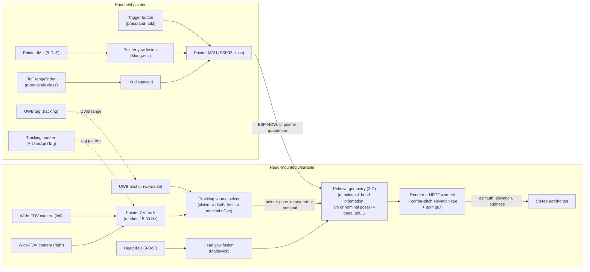

		# Cane

> **Formerly Auris.** The former concept, plan, and thesis notes were
> cleared on 2026-09-07; this file is now the canonical **concept and
> development plan** for Cane — a head-mounted, audio-only navigation aid
> driven by a laser pointer, for visually impaired users. Repo paths still
> use the old name (`thesis/`); a physical rename is not
> planned.

## 1. Concept

### 1.1 User and task

The user is visually impaired — or a blindfolded sighted person replicating one — inside a room containing obstacles (tables, walls, chairs). The task: travel from any point in the room to another point, perceiving and avoiding obstacles along the way.

### 1.2 Equipment

1. **Head-mounted wearable** (worn on an adjustable single head strap; 3D-printed mounts hold the components together — [§3.3](#33-structural--mechanical)):
- extracts the user's **head position and orientation**;
- carries the **audio apparatus** (stereo earphones over a 3.5 mm audio jack — any wired earbuds or headset plugs in) that broadcasts spatialized sound to the user's ears;
- carries the **pointer-tracking stack** (added 2026-09-15): wide-FOV RGB cameras left and right of the head with onboard computer vision, plus an ultra-wideband (UWB) radio — the pointer's pose is measured live and feeds the placement ([§2.5](#25-pointer-tracking-stack-vision-uwb-imu)).
2. **Handheld pointer** (its own device): shoots an **invisible laser** toward obstacles and measures **where the shot lands** (hit distance, via time-of-flight ranging). A **press-and-hold button** gates the laser: it fires — and ranging runs — only while the button is held, and stops the moment it is released. A **UWB tag** on the pointer completes the tracking pair ([§2.5](#25-pointer-tracking-stack-vision-uwb-imu)).

### 1.3 Interaction rule

The sound is projected — **in real time** — according to where the laser lands **relative to the user's head**, not relative to the room or the user's body:

- **Direction** — the landing point's bearing in the head's egocentric frame, given the head's *current* orientation. If the user faces straight ahead and the shot lands on their left, they hear it on the left. If they aim to the right while still facing ahead, the shot lands on their right and they hear it on the right. If they then turn their head (e.g., to their left) so that the same landing point ends up behind the head, the sound moves to behind them. The head defines the listener — its position *and* orientation matter; the user's body position does not.
- **Loudness** — the distance from the **head** to the landing point. A landing far from the head is faint; the nearer it lands, the louder it is projected. (Computed head-relative in real time — mechanism in [§2.3](#23-coordinate-frames-and-sound-placement).)
- **Elevation** — whether the landing point is above, at, or below the head's level is also conveyed (a hit on a staircase step below sounds different from a wall sign at eye height). The pointer may be aimed up or down freely; the sound follows the hit in 3-D.
- **Trigger** — the aid sounds only while the pointer's **button is held**. The laser fires — and ranging runs — only then; releasing the button stops the laser and silences the sound. The aid is therefore an **active, on-demand** scanner, in line with the active-sensing rationale of the EyeCane lineage (Maidenbaum et al. 2014, [§2 lit](thesis/literature/02-electronic-travel-aids.md)).

Worked examples (clarified 2026-09-08):

| Scenario | Head facing | Perceived sound |
|---|---|---|
| shot lands left of the user | straight ahead | left side |
| pointer aimed right — shot lands right | straight ahead | right side |
| head turns past the shot's landing point | turned away from the landing point | behind the head |

In all rows the loudness follows the head-to-landing distance (far → faint, near → loud) in real time.

## 2. System overview

### 2.1 Devices

| Device | Roles | Core parts |
|---|---|---|
| **Pointer** (handheld) | ranging + its own orientation; press-and-hold trigger | ESP32-class MCU, 9-DoF IMU, ToF rangefinder (room-scale class, ~4 m), trigger button, battery, 3D-printed shell, UWB tag + printed tracking marker (ArUco/AprilTag) (tracking, [§2.5](#25-pointer-tracking-stack-vision-uwb-imu)) |
| **Wearable** (head) | head pose + audio output + pointer tracking | ESP32-class MCU, 9-DoF IMU, stereo earphones (3.5 mm audio jack), battery, adjustable head strap + 3D-printed mounts ([§3.3](#33-structural--mechanical)), wide-FOV RGB cameras ×2 + UWB anchor (pointer-tracking stack, [§2.5](#25-pointer-tracking-stack-vision-uwb-imu)) |
| **Link** | pointer → wearable data | ESP-NOW (connectionless WiFi peer-to-peer), payload = hit distance + pointer orientation (quaternion); UWB ranging pair (tracking, [§2.5](#25-pointer-tracking-stack-vision-uwb-imu)) |

Audio is rendered **on the wearable**; the ESP-NOW link carries data, never audio (Bluetooth audio would add 150–300 ms by protocol design — wired earphones only), so the motion-to-sound latency stays inside the budget (§4.2). The button state gates everything: with the button up the pointer does not range and sends nothing, and the renderer is silent. The pointer-tracking stack ([§2.5](#25-pointer-tracking-stack-vision-uwb-imu)) adds a second, fully on-body sensing path — cameras plus UWB — that refines the pointer's pose; it changes no audio path.

### 2.2 Data flow

```mermaid
flowchart LR
    subgraph pointer["Handheld pointer"]
        pimu["Pointer IMU (9-DoF)"] --> pfus["Pointer yaw fusion (Madgwick)"]
        tof["ToF rangefinder<br/>(room-scale class)"] --> dist["Hit distance d"]
        btn["Trigger button<br/>(press-and-hold)"] --> mcu1["Pointer MCU (ESP32-class)"]
        uwbt["UWB tag (tracking)"]
        marker["Tracking marker (ArUco/AprilTag)"]
        pfus --> mcu1
        dist --> mcu1
    end
    subgraph wearable["Head-mounted wearable"]
        himu["Head IMU (9-DoF)"] --> hfus["Head yaw fusion (Madgwick)"]
        camL["Wide-FOV camera (left)"] -->         cv["Pointer CV track<br/>(marker, 15-30 Hz)"]
        camR["Wide-FOV camera (right)"] --> cv
        uwbw["UWB anchor (wearable)"] --> src["Tracking source select<br/>(vision -> UWB+IMU -> nominal offset)"]
        cv --> src
        mcu1 -- "ESP-NOW: d, pointer quaternion" --> geo["Relative geometry (3-D)<br/>(d, pointer & head orientation,<br/>live or nominal pose) -> theta, phi, D"]
        src -- "pointer pose, measured or nominal" --> geo
        hfus --> geo
        geo --> ren["Renderer: HRTF azimuth<br/>+ carrier-pitch elevation cue<br/>+ gain g(D)"]
        ren -- "azimuth, elevation, loudness" --> spk["Stereo earphones"]
        uwbt -. "UWB range" .-> uwbw
        marker -. "tag pattern" .-> cv
    end
```

### 2.3 Coordinate frames and sound placement

- **Head frame H**: origin at the head (relative position, IMU dead reckoning — [§2.4](#24-positioning-relative-pose-only)); the head IMU (Madgwick fusion) senses the **full orientation** — yaw $\mathrm{yaw}_H$ (heading, rotation about the vertical axis), pitch $\mathrm{pitch}_H$ (nodding up/down), and roll (ear-to-shoulder tilt) — and **all three are used**: the landing point is transformed with the full head rotation $R_H$, because the listener's frame — the ears — rotates with the head; a hit level with the eyes when upright is no longer level with the ear axis when the head tilts. The perceived sound position is expressed in this frame — that is what makes the sound move correctly when the user turns, nods, or tilts their head.
- **Pointer frame P**: the pointer IMU likewise senses and fuses full orientation; its aim axis is the unit vector $\hat{u}_P$ extracted from the fused quaternion (roll about the beam axis does not steer the beam, but the complete orientation is fused, shipped, and used in the exact transform; the first-order forms below read it as yaw $\mathrm{yaw}_P$ and pitch $\mathrm{pitch}_P$). The pointer is *not* confined to chest height — it may be aimed up or down freely (walls, signs, staircases) — and the ToF reading $d$ ranges along that aim.
- **Landing point relative to the head** (full 3-D):

  $$
  r \;=\; R_H^{-1}\!\left[\left(p_P + d\,\hat{u}_P\right) - p_H\right]
  \;=\; o + d\,R_H^{-1}\,\hat{u}_P
  $$

  where $R_H$ is the head's full rotation and $o = R_H^{-1}(p_P - p_H)$ is the pointer's offset from the head expressed in the head frame — handled as a **calibrated 3-D constant** (nominal handheld position: forward, lateral, and below the head) rather than tracked, since rigid-body hand tracking is out of scope for an IMU-only build ([§2.4](#24-positioning-relative-pose-only)). Note that two IMUs alone cannot measure their separation: inertial position is double-integrated acceleration whose bias error grows quadratically, and the *difference* of two drifting estimates drifts faster still (Harle 2013; Foxlin 2005, [§5 lit](thesis/literature/05-head-pose-sensing.md)). IMUs give reliable relative **orientation** — yaw *and* pitch — not distance; so the fixed offset is calibrated once. The pointer-tracking stack ([§2.5](#25-pointer-tracking-stack-vision-uwb-imu)) lifts exactly this restriction in the extended build: with the pointer in camera view, $p_P$ — and with it the offset — is **measured live**, and the calibrated constant remains the fallback tier.

The placement quantities follow from three live measurements — the ToF range $d$ and both devices' full orientation — plus the one calibrated constant $o$. The exact computation runs on the full rotation matrices ($R_H$ and the pointer's fused orientation); the yaw- and pitch-difference forms quoted below are first-order intuition only. Because $o$ is known, the placement is exact for the calibrated pose; the residual error is only grip/pose variation ([§7](#7-risks-and-limitations)). The renderer recomputes all three on every update, so the sound moves continuously as the user turns, nods, tilts, walks, or re-aims the pointer:

- **Azimuth** —

  $$
  \theta = \operatorname{atan2}\!\left(r_y,\, r_x\right)
  $$

  (to first order $\theta \approx \mathrm{yaw}_P - \mathrm{yaw}_H$, wrapped to $[-180°, 180°)$) — rendered with a generic HRTF.
- **Elevation** —

  $$
  \phi = \operatorname{atan2}\!\left(r_z,\, \sqrt{r_x^2 + r_y^2}\right)
  $$

  (to first order $\phi \approx \mathrm{pitch}_P - \mathrm{pitch}_H$ plus the vertical-offset geometry term) — **rendered explicitly**: the obstacle signal's carrier pitch sits *below* the reference when the hit is below head level and *above* it when the hit is above, with level hits at the reference. This follows the elevation→pitch precedent of the vOICe (Meijer 1992, [§3 lit](thesis/literature/03-audio-ssd-sonification.md)) and 3-D scene sonification (Bujacz et al. 2011, same file). Spectral HRTF elevation is deliberately *not* relied upon: it is the channel that degrades with non-individualized HRTFs (Planinec et al. 2023, [§4 lit](thesis/literature/04-spatial-audio-hrtf.md)), whereas a carrier-pitch cue is robust on any earphones and needs no per-user calibration. Staircases are the motivating case: aiming down a flight of steps must sound distinctly *lower* than a wall at eye height.
- **Loudness distance** —

  $$
  D = \lVert r \rVert,
  $$

  the head-to-landing distance. Note what each symbol is: $d$ is the ToF reading — *pointer*-to-hit — but the gain keys to $D = \lVert r \rVert$, the *head*-to-hit distance obtained from $d$ through the calibrated offset $o$ and the relative aim direction $R_H^{-1}\hat{u}_P$. Keying the gain to $d$ raw would treat the pointer as the listener and overstate loudness by up to $\lVert o \rVert \approx 0.5\,\mathrm{m}$ — negligible at meters of range but several dB at close range (inverse-square: halving the distance is $+6\,\mathrm{dB}$), exactly the collision-warning regime. The distance still never involves the head's *room* position: as the user walks toward the obstacle with the button held, the ToF range $d$ shrinks and $D$ follows in real time — proximity is carried by the ranging, not by dead-reckoned position.

The head's position matters only **relative to the pointer** — body geometry, captured by the calibrated offset $o$. The user's body position never enters the placement ([§1.3](#13-interaction-rule)), and neither does the head's dead-reckoned room position, which exists for telemetry only ([§2.4](#24-positioning-relative-pose-only)).

Placement rules:

1. **Azimuth** — render the sound at azimuth $\theta$ with a generic HRTF. Full-azimuth rendering makes the "behind" cases automatic (no hand-coded sectors needed).
2. **Elevation** — render the above/at/below relation with the carrier-pitch cue ($\phi$ below/at/above head level → lower/ reference/higher pitch); tune the pitch spread in P4 so a stairs-versus-wall difference is obvious without sounding alien.
3. **Loudness** — gain $g(D)$ monotonic decreasing in the head-to-landing distance $D$, calibrated on the prototype (perceived loudness is not linear in dB, so the curve is tuned in P4). Near hits saturate at maximum; far hits floor at a faint but audible minimum.
4. **No-hit edge case** — while the button is held, a missing return ($d$ beyond the ToF range, or lost on glass/black surfaces) renders silence or a low "no contact" tick. With the button up the aid is silent by design — "not scanning" is the default state.

### 2.4 Positioning: relative pose only

The wearable's head **position** comes from IMU dead reckoning only — no room infrastructure. Literature shows unaided inertial position drifts far too fast for absolute room-scale tracking (Harle 2013; Foxlin 2005, see [§7](#7-risks-and-limitations)), so:

- position is treated as **relative**, valid for short traverses from a known start point;
- the point-to-point room task is judged by **observed behavior** plus an external reference, not by the device's own position estimate;
- the position channel is for **telemetry only** (user went A→B): sound placement never consumes it — $D$, $\theta$, and $\phi$ come from the ToF range, both orientations, and the calibrated head-to-pointer offset ([§2.3](#23-coordinate-frames-and-sound-placement)).

**Self-containment audit** — every runtime placement input and its onboard source:

| Placement input | Source | External dependency |
|---|---|---|
| Head orientation ($R_H$, full 3-D) | head-worn 9-DoF IMU, Madgwick fusion | none — gravity and the magnetic field are passive physical references, not infrastructure |
| Pointer orientation (quaternion) | pointer's own 9-DoF IMU, fused onboard | none |
| ToF range $d$ | the ToF rangefinder on the pointer | none — active ranging |
| Head-to-pointer offset $o$ | one-time calibration (body geometry) | none |
| Pointer pose $p_P$ (tracking tier, [§2.5](#25-pointer-tracking-stack-vision-uwb-imu)) | left/right wide-FOV cameras (ArUco/AprilTag detection) + UWB ranging pair | none — on-body sensors |
| Head room position | head-IMU dead reckoning | none — telemetry only, never used for placement |

Placement is therefore fully self-contained: no beacons, room cameras, motion capture, UWB anchors, or room instrumentation participate in it — the pointer-tracking stack's cameras and UWB pair are carried by the two devices themselves ([§2.5](#25-pointer-tracking-stack-vision-uwb-imu)), so nothing external is introduced. The remaining accuracy threats (magnetometer disturbance, grip/pose variation) are internal and are mitigated onboard — see [§7](#7-risks-and-limitations); they never motivate external aiding.

### 2.5 Pointer tracking stack (vision, UWB, IMU)

The placement ([§2.3](#23-coordinate-frames-and-sound-placement)) treats the pointer's position as a calibrated constant — exact at the calibrated grip, perturbed by grip and pose variation (±15 cm horizontal, up to ~±0.3 m vertical; [§7](#7-risks-and-limitations) risk 7). The pointer-tracking stack strengthens the **life realism of the sound projection**: when the pointer's pose is measured live, the sound lands exactly where the laser hit, not where the calibration assumed the hand was. Everything stays on the two devices — wide-FOV RGB cameras and a UWB radio on the wearable, a UWB tag on the pointer — so nothing external is introduced and the self-containment audit above still holds. The pointer's **orientation** keeps coming from its own IMU over ESP-NOW; the cameras and UWB refine its **position**, which is precisely the input the constant $o$ stood in for.

Three tiers feed the placement — only the source of $p_P$ (and with it the live offset $o = R_H^{-1}(p_P - p_H)$) changes between them:

1. **Vision (primary)** — two wide-FOV RGB cameras sit left and right of the user's head in rigid printed brackets on the head strap (stable extrinsics; the battery counterweights at the rear strap station — [§3.3](#33-structural--mechanical)); onboard computer vision localizes the pointer at 15–30 Hz whenever it is inside their field of view, and **only while the button is held** — the cameras follow the aid's trigger gating ([§1.3](#13-interaction-rule)), so the camera draw is duty-cycled like everything else. The marker is a **printed ArUco/AprilTag** on the pointer shell (decision 2026-09-21, reversing the 2026-09-15 beacon decision): a single high-contrast square tag of known physical size — quad detection followed by a pose solve gives bearing **and range** from one camera in one step (dictionary and tag size pinned at T7; the second camera is redundancy and occlusion coverage). The vision tier overwrites the pointer's **position only**: the tag's PnP orientation estimate is **ignored**, because the pointer's IMU over ESP-NOW is the better orientation source — 100 Hz and gravity/magnetic-anchored, where a 15–30 Hz flat-tag pose solve is noisiest about the camera-facing axis. The tag is **passive — zero power draw**; what it costs instead is detection compute ([§4.1](#41-firmware-modules), [§7](#7-risks-and-limitations) risk 8) and ambient-light dependence — it needs scene illumination to be visible, so T7 carries a low-light/contrast check. If full-rate detection strains the render co-residence budget, the fallback is the two-level **detect-then-track** scheme (detect every Nth frame, track between) ([§3.8](#38-pointer-tracking-hardware--notes--contingencies)). The head-flanking pair covers the forward hemisphere; a pointer behind the user is out of view by construction — which is exactly when the next tier takes over.
2. **UWB + IMU (fallback)** — when the pointer leaves the cameras' field of view, the wearable–pointer UWB ranging pair supplies the head-to-pointer distance which, combined with the pointer's IMU orientation and the nominal offset direction, re-anchors $p_P$ far better than the constant alone.
3. **Nominal offset (last resort)** — if UWB is also unavailable (body blockage, NLOS), the calibrated-constant scheme runs unchanged: calibrated constant $o$, both IMU orientations, ToF range $d$ ([§2.3](#23-coordinate-frames-and-sound-placement)).

Tier selection is explicit: every sound update's telemetry records which tier produced the pose that drove it, so the study can quantify how often each tier served and how placement error varies per tier — the realism gain is measured, not assumed. Tier switching must be transparent (no perceptible placement jump at a switch — P4/P5 validation, [§7](#7-risks-and-limitations) risk 9). The motion-to-sound budget ([§4.2](#42-latency-budget-motion-to-sound-target--100-ms)) is unchanged: the ToF → ESP-NOW → render path is untouched, and tracking latency degrades placement accuracy, never sound freshness. Integration: the tiers are **validated on the breadboards at P2** (T7–T8, [`docs/bench-tests.md`](docs/bench-tests.md)) and **tuned with the placement at P4** — before the soldered build, so a tracking-tier failure forces its design decision cheaply ([§9](#9-open-items)); the tracking hardware is part of the final design and is priced in the device BOMs ([§3.1](#31-pointer--electronics), [§3.2](#32-wearable--electronics)), with contingencies in [§3.8](#38-pointer-tracking-hardware--notes--contingencies).

## 3. Hardware

> **To be finalized by the co-researcher** — the selection of every component and material is pending, for financial reasons. The subsections below describe what each block is **for**; specific parts, quantities, prices, sources, and totals land here once selection and purchase approval are made.

**Purchasing constraints** (they bind the selection; they do not pick parts):

1. **Tracking hardware is mandatory** — the pointer-tracking stack ([§2.5](#25-pointer-tracking-stack-vision-uwb-imu): two wide-FOV cameras + UWB pair on the wearable; UWB tag + printed marker on the pointer) is part of the final design of both devices; T7–T8 pin its implementation, never its inclusion.
2. **Pre-soldered rule** — P2 (breadboard bench) permits no soldering, so every module is ordered with headers pre-soldered; verify the listing before checkout. Unsoldered arrivals wait for the P3 build.
3. **Buy-once rule** — each component category is purchased once: the selection is made *before* the purchase (bench-validated at the P2 gates where relevant), never corrected by a re-buy afterwards.

### 3.1 Pointer — electronics

The handheld device's electronics: an ESP32-class MCU (the ESP-NOW link and the latency architecture ([§4.2](#42-latency-budget-motion-to-sound-target--100-ms)) depend on the family), a 9-DoF IMU, a ToF rangefinder (room-scale class, ~4 m), the press-and-hold trigger button, the power path (protected USB-C charge board + Li-ion cell), the UWB tag module, and the printed tracking marker ([§3.8](#38-pointer-tracking-hardware--notes--contingencies)). *Component selection pending the co-researcher.*

### 3.2 Wearable — electronics

The head-mounted device's electronics: an ESP32-class MCU with DSP/FPU headroom for the renderer, a 9-DoF IMU (same part as the pointer's, to simplify fusion), the stereo audio output — a pair of mono I²S Class-D amplifiers (one per ear, channel-strapped) + wired 3.5 mm earphones (wired is mandatory — [§2.1](#21-devices)) — the re-zero button, the power path (protected USB-C charge board + Li-ion cell), two wide-FOV cameras, the UWB anchor module, and camera mounts/wiring. *Component selection pending the co-researcher.*

### 3.3 Structural & mechanical

The 3D-printed pointer shell and wearable strap mounts, the elastic head strap, battery holders, fasteners, and adhesive. The wearable is **strap-mounted, not a helmet** (resolved 2026-09-16): a single elastic goggle-style band carries the components in 3D-printed mounts — rigid brackets for the cameras (stable extrinsics for the vision tier, [§2.5](#25-pointer-tracking-stack-vision-uwb-imu)) and the head IMU, the battery at the rear station as counterweight. Strap slip shifts the assembly relative to the ear axis, so **donning is a ritual**: fit the strap, hold still, press re-zero ([§7](#7-risks-and-limitations) risk 10). The own-printer vs. print-service decision is also pending the co-researcher.

### 3.4 Assembly & bench tools (one-time)

One-time tools for the P2 bench bring-up and the P3 soldered build: adjustable soldering iron kit, digital multimeter, wire strippers/cutters/pliers, helping-hands/PCB holder, USB data cables, desoldering wick + flux. *Selection pending the co-researcher.*

### 3.5 Evaluation hardware (one-time)

The P5 study hardware: blindfolds, floor marking tape + measuring tape (course layout and ranging ground truth), obstacle props, timing (on-hand phone/smartwatch). *Selection pending the co-researcher.*

### 3.6 Totals

Budget totals are computed from the co-researcher's final component selections and recorded here — nothing is estimated before then.

### 3.7 Component notes

Per-component rationale, constraints, and alternatives are recorded here at selection time.

### 3.8 Pointer-tracking hardware — notes & contingencies

The tracking hardware is **part of the final design** of both devices ([§2.5](#25-pointer-tracking-stack-vision-uwb-imu)); the T7/T8 gates pin its *implementation* (board class, camera capture strategy, UWB bus wiring) — never its inclusion. Selection of the camera, UWB pair, and boards is pending the co-researcher; the wiring maps in [`docs/bench-tests.md`](docs/bench-tests.md) are drawn up once the boards are chosen.

**Marker scheme (decided 2026-09-21, reversing the 2026-09-15 beacon decision): the vision tier's marker is a printed ArUco/AprilTag** — a single high-contrast square tag of known physical size mounted on the pointer shell. Detection is quad detection → pose solve (PnP): one camera yields bearing **and range** from the tag's known size in a single step — and it overwrites **position only**: the tag's PnP orientation is deliberately ignored, since the pointer's IMU over ESP-NOW is the better orientation source (100 Hz, gravity- and magnetic-anchored; the pose solve is noisiest about the camera-facing axis). The tag is passive — zero power draw, no driver electronics — and costs only printing and rigid mounting. The cost moved from hardware to compute: square-tag detection is heavier than the beacon's two-centroid thresholding, so T7 validates full-rate detection inside the render co-residence budget; if it misses, the fallback is the two-level **detect-then-track** scheme (detect every Nth frame, track between) and/or a cheaper dictionary (ArUco 4×4 vs 5×5; AprilTag 36h11 as the accuracy-favored alternate; dictionary and tag size pinned at T7). Lighting strategy: the tag is passive and needs scene illumination — T7 runs a **low-light/contrast check** (minimum room light for reliable detection, exposure/motion-blur at 15–30 Hz); there is no emission, so no flash-sync rejection exists to manage.

## 4. Software

### 4.1 Firmware modules

| Module | Device | Responsibility |
|---|---|---|
| `fusion` (Madgwick) | both | full quaternion (yaw/pitch/roll) from IMU at ~100 Hz |
| `tof` driver | pointer | ranged readings at 20–50 Hz **while the button is held**, no-hit handling; idle otherwise |
| `link` (ESP-NOW) | both | connectionless WiFi peer-to-peer; ship `d` + pointer quaternion → wearable at 10–30 Hz |
| `geometry` | wearable | $\theta$, $\phi$ (3-D direction) and $D$ (head-to-landing distance) from $d$, both orientations, and the calibrated offset; edge-case classification |
| `renderer` | wearable | generic-HRTF azimuth + carrier-pitch elevation cue, $g(D)$ gain curve |
| `telemetry` | wearable | relative-pose dead reckoning for logging |
| `pointer-track` (CV) | wearable | localizes the pointer from the left/right wide-FOV cameras at 15–30 Hz while in view: **ArUco/AprilTag detection** → quad → PnP pose from the known physical tag size → bearing + range (position only — the tag's PnP orientation is discarded; orientation always comes from the pointer IMU, [§2.5](#25-pointer-tracking-stack-vision-uwb-imu)); detection cost is validated at T7 — full detection every frame if it fits the co-residence budget, otherwise the two-level detect-then-track scheme (detect every Nth frame, track between; for scale, ESP-WHO-class CNN detection runs only ~10 fps at QVGA on an ESP32-class MCU, and square-tag detection is far cheaper than a CNN); yields a measured $p_P$ for [§2.3](#23-coordinate-frames-and-sound-placement) |
| `uwb-range` | both | wearable–pointer UWB ranging for the fallback tier |
| `track-source` | wearable | tier selection (vision → UWB + IMU → nominal offset, [§2.5](#25-pointer-tracking-stack-vision-uwb-imu)); records the active tier in every sound-update telemetry record |

The tracking modules belong to the pointer-tracking stack — part of the final pipeline; they are validated at P2 (T7–T8, [`docs/bench-tests.md`](docs/bench-tests.md)) and tuned at P4 — the placement pipeline is unchanged.

### 4.2 Latency budget (motion-to-sound, target ≤ 100 ms)

| Stage | Target |
|---|---|
| IMU fusion update (100 Hz) | ≤ 10 ms |
| ToF ranging cadence (≥ 20 Hz) | ≤ 50 ms |
| ESP-NOW link hop (≥ 10 Hz) | ≤ 10 ms |
| HRTF render per buffer (48 kHz / 128 samples) | ≤ 5 ms |
| Total | **≤ 100 ms** |

Bench tests for each stage are P2 exit criteria (§6).

### 4.3 EDA toolchain (KiCad and MCP)

The electronics of both devices are designed in **KiCad** (`kicad-cli` 10.0.6 on the build machine; toolchain decision 2026-09-15), one project per device under [`electronics/`](electronics/):

- [`electronics/cane-wearable/`](electronics/cane-wearable/) — the cane-concept **head-mounted wearable** board ([§3.2](#32-wearable--electronics): ESP32-class MCU, 9-DoF IMU, stereo I²S out, power)
- [`electronics/cane-pointer/`](electronics/cane-pointer/) — the cane-concept **handheld pointer** board ([§3.1](#31-pointer--electronics): ESP32-class MCU, 9-DoF IMU, ToF rangefinder, trigger button, power); the UWB tag circuit joins this schematic once the P2 gate pins it ([§3.8](#38-pointer-tracking-hardware--notes--contingencies)) — the tracking marker is printed on the shell and adds no circuit

AI-assisted design runs through the **[mcp-server-kicad](https://github.com/ProductOfAmerica/mcp-server-kicad)** MCP server (109 tools, MIT; wired into this repo's opencode config as `mcp.kicad`): schematic capture, PCB layout, ERC/DRC via `kicad-cli`, and manufacturing exports. Ground rules: the AI drafts and checks, but every design is **reviewed by a human in the KiCad GUI before anything is fabricated** — ERC/DRC reports are generated artifacts, not review substitutes. Schematic and layout figures for the thesis ([`thesis/README.md` §3](thesis/README.md)) are exported from these projects.

## 5. Evaluation plan

Paradigm justified by the consolidated literature ([`thesis/literature/07-evaluation-methodology.md`](thesis/literature/07-evaluation-methodology.md), [`thesis/literature/08-vi-participant-research-methodology.md`](thesis/literature/08-vi-participant-research-methodology.md)). The participant model is the **third revision (2026-09-16, panel constraints applied; thesis plan decision 2)** — participants must be **actual VI persons**: the earlier blindfolded-sighted fallback and the longitudinal single-case primary are both **struck** (canonical wording in [`thesis/README.md` §1](thesis/README.md)):

- **Design**: **within-subject aid-off vs aid-on**, **one visit per participant** (~1.5–2 h: accessible consent → device briefing/practice → point-to-sound localization test → 5–6 draggable-layout traversals, one condition per layout, assignment randomized per participant and counterbalanced across participants → SUS + NASA-TLX).
- **Participants**: **N = 6–8 actual VI participants** (recruit 8–10; floor 6 — field precedent 8–13: dos Santos et al. 2021, Pittet et al. 2026, Kilian et al. 2022, Fiannaca et al. 2014; participant-level Wilcoxon reaches `p < .05` from n = 6).
- **Statistics**: Shapiro–Wilk, paired *t* or Wilcoxon signed-rank, α = .05, effect sizes, with trial-level (participant × layout) descriptive support.
- **Gates**: adviser confirmation of the revised design, and **recruitment — the sole hard gate (no fallback exists)**; outreach starts immediately via VI organizations/schools (Resources for the Blind Inc., ATRIEV, NCDA network); ≥ 6 confirmed participants by Jan 3, 2027 or the study start slips ([`docs/schedule.md`](docs/schedule.md) contingency 6).
- **Course**: obstacle room course in the style of Roentgen et al. 2012b — 5–6 draggable standardized layouts, one condition per traversal.
- **Conditions**: aid-off vs aid-on, within-subject, counterbalanced across participants; multiple layouts.
- **Safety/ethics**: unchanged — accessible consent incl. the recorded-audio option (Saleh 2004), O&M-specialist consult, spotter, stopping rules.
- **Metrics**:
- objective — collisions, completion time, Percentage Preferred Walking Speed (PPWS), localization accuracy (point-to-sound direction test, azimuth and elevation);
- subjective — SUS (after Kilian et al. 2022) and NASA-TLX (after Pittet et al. 2026).
- **Future work**: a longitudinal single-case extension is the study's recorded recommendation (thesis plan §5).

## 6. Development phases

| Phase | Focus | Exit criteria | Thesis mapping |
|---|---|---|---|
| **P1 — Architecture & component selection** *(complete 2026-09-08)* | this document; component selection | parts chosen and ordered; interfaces fixed | §3.1.1, §3.1.4, §3.1.6 (block diagrams) |
| **P2 — Bench tests** | non-permanent breadboard assembly of both devices, **zero soldering** (pre-soldered modules only); module bench tests; full-pipeline functionality on breadboards (protocol + wiring maps: [`docs/bench-tests.md`](docs/bench-tests.md)); **plus the pointer-tracking tiers ([§2.5](#25-pointer-tracking-stack-vision-uwb-imu))** — camera/CV and UWB modules on the breadboards under the same pre-soldered rule, T7–T8 gates, module and board-level implementation choices pinned at the gate | every §4.2 stage meets budget; end-to-end sound placement works on breadboards; drift curves recorded; **T7–T8 (tracking implementation) pass** | §3.1.3 (experiments), §4 (partial results) |
| **P3 — Prototype build** | 3D-print housings; solder the validated breadboard design into permanent assemblies; battery/switch/jack integration | both devices run end-to-end in the soldered builds with breadboard parity (§4.2) | §3.1.5 (details of the components) |
| **P4 — Integration & calibration** | full pipeline walking; $g(D)$ + pointer-offset calibration; elevation-cue tuning; magnetometer disturbance checks | calibrated sound placement works on the course | §3.1.4, §3.1.7 (flowcharts) |
| **P5 — Pilot evaluation** | human study on the room course — within-subject aid-off vs aid-on, one visit per participant, **N = 6–8 actual VI participants** (third revision, 2026-09-16; recruitment is the sole hard gate — no fallback; ≥ 6 confirmed by Jan 3, 2027) | metrics + questionnaires collected; within-subject comparison per the spine (paired *t* / Wilcoxon) | §4 (results and discussions) |
| **P6 — Thesis drafting** | write-up from literature notes and P2–P5 artifacts | `paper.md` + `ieee.md` in lockstep, per [`manuscript.md`](thesis/manuscript.md) | §2–§5, all sections |

Two defense milestones bracket the schedule (decided 2026-09-16): the **pre-oral defense on Fri Dec 11, 2026** — the full paper (front matter through Curriculum Vitae, both twins) drafted per what is complete on the date, with the bench-validation and calibration results (§4.1–§4.2) real and the human-study results (§4.3–§4.5) in-progress — and the **final defense on Tue Apr 20, 2027** — system and paper 100%. The combined calendar (development + thesis writing on one Gantt, with the slippage ladder) is [`docs/schedule.md`](docs/schedule.md).

## 7. Risks and limitations

1. **Position drift (IMU-only)** — unaided inertial position is unusable for absolute room-scale tracking over long sessions (Harle 2013; Foxlin 2005). Mitigation: relative pose only, bounded sessions, known start point; drift degrades telemetry only — sound placement never uses it (§2.3, §2.4).
2. **Heading error near ferromagnetic material** — tables, appliances, and fixtures disturb the magnetometer; Roetenberg et al. 2005 shows heading error rotates the perceived sound direction directly. Mitigation: disturbance compensation, P4 checks on the actual room.
3. **Generic HRTF quality** — azimuth is robust to non-individualized HRTFs; elevation is precisely the channel that degrades (Mendonça 2014; Planinec et al. 2023). Mitigation: elevation is carried by the explicit carrier-pitch cue, not spectral HRTF elevation (§2.3); short familiarization period built into P5.
4. **Audio-only guidance overshoot** — audio cues can cause users to turn past a target heading (Slade et al. 2021). Mitigation: Cane's sound is a **positional report**, not a steering command; the user owns navigation.
5. **ToF surface behaviors** — glass, dark, or highly reflective targets and strong ambient IR degrade returns (inherent ToF-sensor physics, per the selected part's datasheet). Mitigation: P2 surface matrix before committing to the course props.
6. **Loudness ≠ linear distance** — perceived loudness is nonlinear; the $g(D)$ head-to-landing curve is calibrated empirically in P4 rather than assumed.
7. **Handheld offset is not truly constant** — the calibrated head-to-pointer constant assumes a nominal pose; extending or tucking the arm, and raising/lowering it to aim up or down at stairs, shifts the offset (±15 cm horizontal, up to ~±0.3 m vertical), perturbing $D$, $\theta$, and $\phi$ ([§2.3](#23-coordinate-frames-and-sound-placement)). Mitigation: calibrate at a natural grip in P4; keep $g(D)$ and the elevation pitch spread gradual so offset variation is a small perceptual change; observe real-pose variation in P5.
8. **CV tracking compute on the wearable** — the pointer-tracking stack ([§2.5](#25-pointer-tracking-stack-vision-uwb-imu)) adds two camera streams and square-tag detection to the same MCU that renders audio; contention could push render buffers past the ≤ 5 ms/buffer gate into underruns. Mitigation: the printed ArUco/AprilTag marker keeps detection to quad detection + PnP (no learned detector needed; if full-rate detection strains the budget, the two-level detect-then-track scheme detects every Nth frame and tracks between), QVGA mono frames, tracking on a task with priority below the audio path, rendering on one core and vision on the other; tracking latency degrades placement accuracy, never sound freshness; the P2 T7 co-residence gate decides the board-level answer (camera mux / alternate-frame capture / a different board class / a camera co-processor) before the soldered build ([§6](#6-development-phases)).
9. **Tracking tiers must degrade gracefully** — the cameras cover the forward hemisphere only (fast head swings and behind-body aiming are out of view by construction), and UWB ranges degrade when body-blocked (NLOS). Mitigation: the explicit three-tier fallback ([§2.5](#25-pointer-tracking-stack-vision-uwb-imu)) with the active tier in every sound-update telemetry record; P2 validates the switch logic on the bench (T8), and P4/P5 validate that a switch is never audible as a placement jump.
10. **Strap slip misaligns the device frame with the head frame** — on the strap-mounted wearable ([§3.3](#33-structural--mechanical)), strap slip or tilt rotates the head IMU and the cameras relative to the ear axis: a yaw offset biases every rendered azimuth directly, a tilt biases elevation. Mitigation: rigid printed stations keep the cameras and IMU fixed relative to the strap; a per-doning re-zero at rest re-anchors yaw (the re-zero button, [§3.2](#32-wearable--electronics)); fit discipline covers pitch/roll (gravity anchors them to the device only); P4 adds a fit check to the calibration ritual and P5 observes real slippage over a session.

## 8. Where things live

- **Achievability statement** — [`docs/achievability.md`](docs/achievability.md): the standing justification that hit-sound placement is exact, head-relative, and fully self-contained; the perceptual-cue evidence base, the error budget, and the C1–C11 caveat ledger with falsifiability gates.
- **P2 bench protocol** — [`docs/bench-tests.md`](docs/bench-tests.md): wiring maps for both devices, power bring-up rules, and the T0–T8 test matrix with acceptance thresholds (T7–T8 = the tracking-tier gates); parity re-run at P3.
- **Purchase list** — [`docs/purchase-list.md`](docs/purchase-list.md): the purchasing constraints (no-solder bench, pre-soldered ordering, buy-once) and the structure of the P2 bench order; the itemized order is built from the co-researcher's final component selections.
- **Electronics designs** — [`electronics/`](electronics/): one KiCad project per device ([cane-wearable](electronics/cane-wearable/), [cane-pointer](electronics/cane-pointer/)), AI-assisted through the toolchain in [§4.3](#43-eda-toolchain-kicad-and-mcp).
- **Literature consolidation** — [`thesis/literature/README.md`](thesis/literature/README.md): 55 verified annotated entries across 8 themes; feeds thesis §2 (incl. §2.8 VI-participant methodology).
- **Thesis writing plan** — [`thesis/README.md`](thesis/README.md): the section→content→phase drafting plan for the thesis twins, with the measurable-outcomes spine (built 2026-09-11; conventions in [`thesis/manuscript.md`](thesis/manuscript.md)).
- **Thesis skeleton** — [`thesis/paper.md`](thesis/paper.md) (APA twin) and [`thesis/ieee.md`](thesis/ieee.md) (IEEE twin); conventions in [`thesis/manuscript.md`](thesis/manuscript.md).
- **Combined schedule (Gantt)** — [`docs/schedule.md`](docs/schedule.md): the calendar spanning both tracks — the development phases (breadboard bench → soldered build → calibration → human study) and the thesis drafting stages (§2 through final front matter) — against the two defense milestones (pre-oral 2026-12-11, final 2027-04-20), with the slippage ladder.
- **Session context** — [`.opencode/concept.md`](.opencode/concept.md) and [`.opencode/plan.md`](.opencode/plan.md) point here as the canonical source; raw requirements in [`.opencode/new.md`](.opencode/new.md); standing rules in [`.opencode/instruction.md`](.opencode/instruction.md).

## 9. Open items

- **Wearable form factor** — resolved 2026-09-16: the wearable is **strap-mounted** — a single elastic head strap (goggle-style) with 3D-printed component mounts (rigid camera/IMU brackets; the battery rides the rear station as counterweight) instead of a printed helmet shell ([§1.2](#12-equipment), [§3.3](#33-structural--mechanical)); the 3.5 mm audio jack keeps earphones interoperable (any wired earbuds or headset). The pointer keeps its 3D-printed shell ([§2.1](#21-devices)).
- **Component selection & purchase approval** — the selection of every component and material is **pending the co-researcher** (financial reasons; [§3](#3-hardware)); the purchase-approval sign-off and the itemized bench order ([`docs/purchase-list.md`](docs/purchase-list.md)) follow that selection, under the purchasing constraints in [§3](#3-hardware) (tracking hardware mandatory, pre-soldered for P2, buy-once). The own-printer vs. print-service decision ([§3.3](#33-structural--mechanical)) is part of the same sign-off.
- **Thesis writing schedule** — resolved 2026-09-11: the section→phase drafting plan is in [`thesis/README.md`](thesis/README.md), integrated with the phase exits above; re-based 2026-09-16 onto the two defense milestones (pre-oral Fri Dec 11, 2026; final Tue Apr 20, 2027) in [`docs/schedule.md`](docs/schedule.md).
- **Participant model — third revision (2026-09-16)** — the thesis study's design is within-subject aid-off vs aid-on, one visit per participant, **N = 6–8 actual VI participants** (recruit 8–10, floor 6); the longitudinal single-case primary and the blindfolded-sighted fallback are both struck (thesis plan decision 2; canonical wording in [`thesis/README.md`](thesis/README.md)). Gates: adviser confirmation of the revised design (immediate action) and **recruitment — the sole hard gate, no fallback** (outreach via VI organizations/schools — Resources for the Blind Inc., ATRIEV, NCDA network; ethics/consent in accessible formats); ≥ 6 confirmed participants by Jan 3, 2027 or the study start slips ([§5](#5-evaluation-plan), [`docs/schedule.md`](docs/schedule.md) contingency 6).
- **Pointer-tracking stack** — integration point decided: the tiers validate on the breadboards at **P2** (T7–T8, [`docs/bench-tests.md`](docs/bench-tests.md)) and are tuned at P4 with the placement. The tracking hardware is **part of the final design** — the gates pin its implementation, never its inclusion. **Decided**: the marker scheme — **printed ArUco/AprilTag** (decided 2026-09-21, reversing the 2026-09-15 beacon decision; position-only overwrite — the tag's PnP orientation is ignored; dictionary and tag size pinned at T7, with a low-light/contrast check there — [§3.8](#38-pointer-tracking-hardware--notes--contingencies)). Pending the co-researcher's selection: the camera (wide-FOV class), the UWB module pair, and the board classes on both devices (the T7/T8 gates settle the capture strategy and UWB bus wiring against the chosen boards — risk 8).
