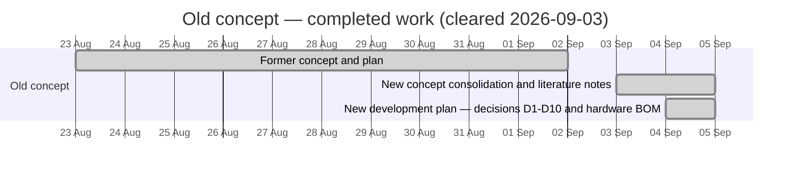
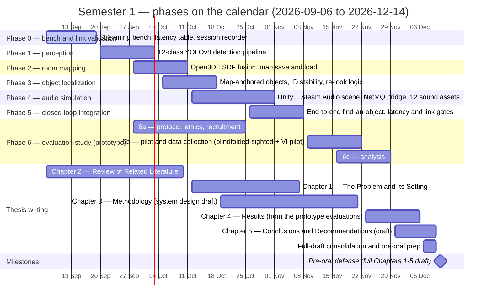
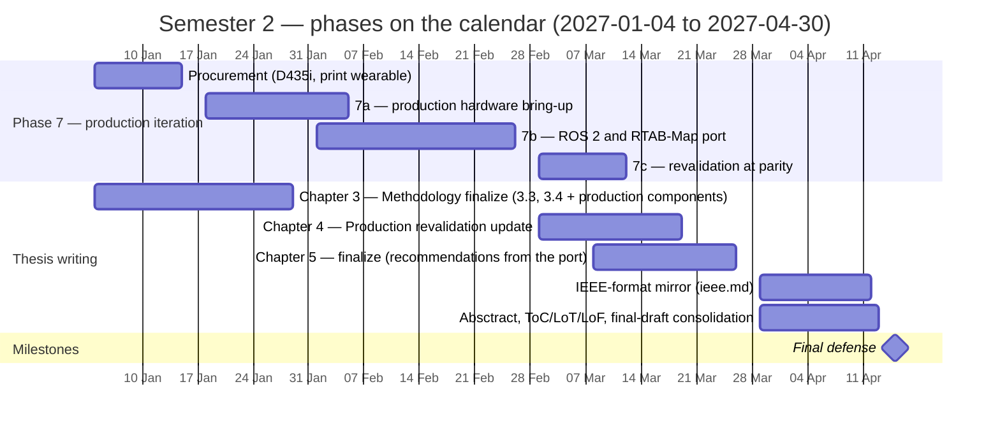

# Auris — Project Gantt

One Gantt chart per semester (plus the completed old-concept work). Within each
chart, the **sections are the project's phases** ([`README.md` §5](../README.md#5-development-phases)),
so each chart reads as a phase axis laid on the calendar.

## Schedule assumptions

- **Development under the new concept starts 2026-09-06** ("tomorrow" at the time of scheduling).
- **Semester 1 ends 2026-12-14** (Monday), per the school calendar — not the
  previously assumed one-week-before-Christmas date.
- **Semester break** → 2026-12-15 to 2027-01-03 (no scheduled work).
- **Semester 2** → 2027-01-04 to **mid-April 2027 (2027-04-15)**.
- **Pre-oral defense ≈ 2026-12-11 (tentative, Friday)** — **before Semester 1
  ends** — on a full Chapters 1–5 draft whose **Chapters 4–5 draw on the
  prototype evaluation**: the evaluation study (Phase 6) runs in Semester 1,
  immediately after the Phase 5 gate. There is **no proposal defense**. The
  **Production iteration (Phase 7) runs entirely in Semester 2**; the **final
  defense 2027-04-15** falls before that semester ends; revisions and final
  submission complete within April 2027 (to 2027-04-30). Thesis-writing
  authority: [`auris-thesis/README.md`](auris-thesis/README.md).
- **Semester 1 is the critical path**: Phases 0–5 are compressed (2–3 weeks
  each, deliberately overlapped) so the evaluation and the Chapters 4–5 draft
  fit before the pre-oral. Phase 6a (protocol, ethics, recruitment) runs in
  parallel from late September and must be ready before the Phase 5 gate
  opens 6b.
- Phase durations are planning estimates; each phase's exit criteria
  ([`README.md` §5](../README.md#5-development-phases)) — not the calendar —
  gate the next phase. Dates shift at the gates, not before.
- Old-concept bars are **approximate** (that work was cleared; only the
  clearing date, 2026-09-03, is exact).
- The Production procurement bar precedes Phase 7a because the D435i (import,
  ≈ ₱24–27k landed, [§6.2](../README.md#62-production-purchases-stage-2)) has lead time.
- Rendering: every chart sets `topAxis: true` (date ticks on **top and
  bottom**) and a red `todayMarker` line via frontmatter config.

## Old concept — completed (before Semester 1)

## Semester 1 — development, prototype evaluation, thesis (2026-09-06 → 2026-12-14)

## Semester 2 — production, thesis, defense (2027-01-04 → 2027-04-30)

## Reading the charts

- **Sections = phases**, so each chart is a phase axis on the calendar; bars
  within a section are that phase's work packages (sub-phase letters 6a–6c,
  7a–7c per [`README.md` §5](../README.md#5-development-phases)).
- **Deliberate overlaps** (Phases 2/3/4/5, 6b/6c, thesis chapters) are
  pipelining — the tail of one task overlaps the head of the next, but each
  gate still applies.
- **Within Semester 1**: Phase 5's gate opens 6b (6a is already complete);
  6c's analysis feeds Chapter 4; the Chapters 4–5 draft and consolidation feed
  the **pre-oral defense, before the semester ends**.
- **Within Semester 2**: procurement feeds 7a; 7b regression-tests replayed
  Prototype **and evaluation** sessions (D8); 7c's parity result feeds the
  Chapter 4 production-revalidation update and the **final defense, before
  the semester ends**.
- If a phase gate slips, the buffer is the 6b/6c overlap and the
  Chapter 4/Chapter 5 tail — protect the pre-oral first, the final defense
  second.
