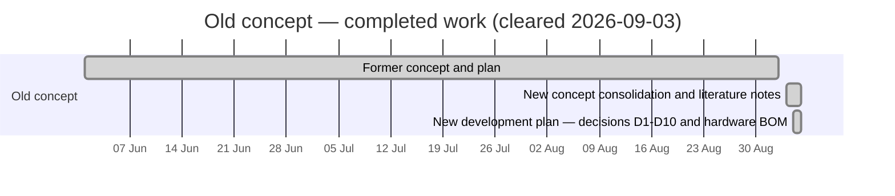
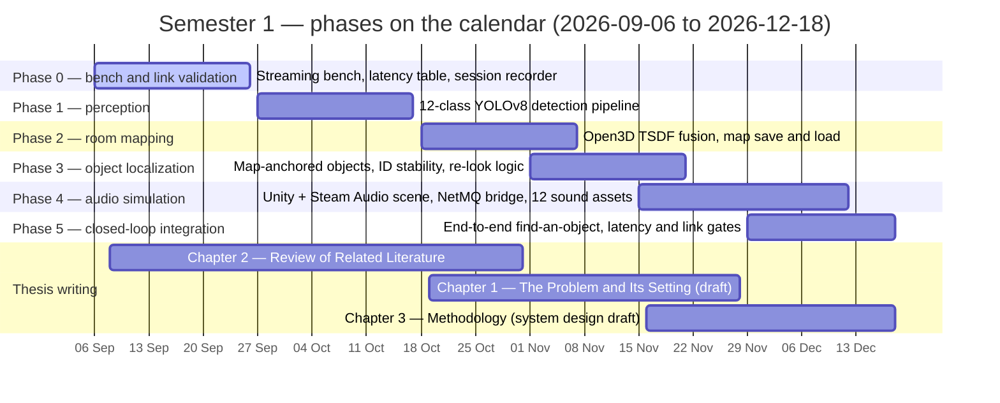
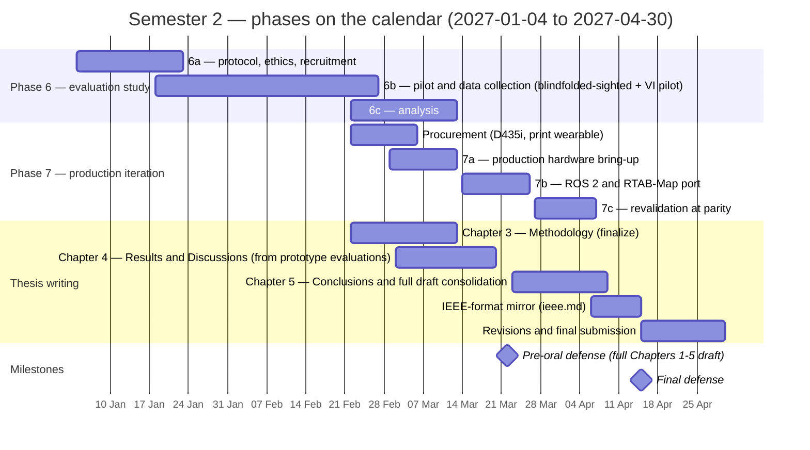

# Auris — Project Gantt

One Gantt chart per semester (plus the completed old-concept work). Within each
chart, the **sections are the project's phases** ([`README.md` §5](../README.md#5-development-phases)),
so each chart reads as a phase axis laid on the calendar.

## Schedule assumptions

- **Development under the new concept starts 2026-09-06** ("tomorrow" at the time of scheduling).
- **Semester 1 ends one week before Christmas** → 2026-12-18 (Friday).
- **Semester break** → 2026-12-19 to 2027-01-03 (no scheduled work).
- **Semester 2** → 2027-01-04 to **mid-April 2027 (2027-04-15)**.
- **Pre-oral defense ≈ 2027-03-22 (tentative)** on a full Chapters 1–5 draft, with Chapter 4 drafted from the prototype evaluations — there is **no proposal defense**. **Final defense** on the last day of Semester 2 (2027-04-15); revisions and final submission complete within April 2027 (to 2027-04-30). Thesis-writing authority: [`auris-thesis/README.md`](auris-thesis/README.md).
- Phase durations are planning estimates; each phase's exit criteria
  ([`README.md` §5](../README.md#5-development-phases)) — not the calendar —
  gate the next phase. Dates shift at the gates, not before.
- Old-concept bars are **approximate** (that work was cleared; only the
  clearing date, 2026-09-03, is exact).
- The Production procurement bar precedes Phase 7a because the D435i (import,
  ≈ ₱24–27k landed, [§6.2](../README.md#62-production-purchases-stage-2)) has lead time.

## Old concept — completed (before Semester 1)

## Semester 1 — development and thesis (2026-09-06 → 2026-12-18)

## Semester 2 — evaluation, production, thesis (2027-01-04 → 2027-04-30)

## Reading the charts

- **Sections = phases**, so each chart is a phase axis on the calendar; bars
  within a section are that phase's work packages (sub-phase letters 6a–6c,
  7a–7c per [`README.md` §5](../README.md#5-development-phases)).
- **Deliberate overlaps** (Phases 3/4/5, 6a/6b/6c, thesis chapters) are
  pipelining — the tail of one task overlaps the head of the next, but each
  gate still applies.
- **Cross-chart dependencies**: Semester 1's Phase 5 gate opens Semester 2's
  Phase 6; Phase 6c's data and the procurement bar feed Phase 7a; Phase 7c's
  parity result and the Chapter 4 draft (from the prototype evaluations) feed
  the **pre-oral defense**; the pre-oral feeds the final defense.
- Phase 7 sits after the evaluation data collection so 7b's regression suite
  can replay **recorded Prototype sessions** (D8).
- If a phase gate slips, the buffer is the January–February overlap and the
  thesis-draft tail of April — protect the two milestones first.
