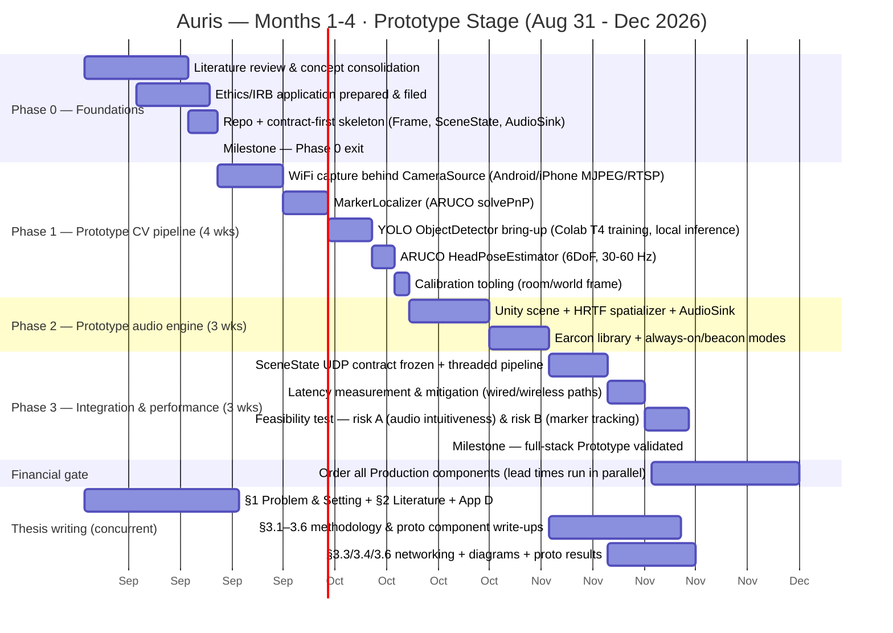

# Auris — Gantt: Months 1–4 · Prototype Stage

Full-time development, Aug 31 – Dec 2026. Companion chart: [`phases-gantt-m5-m8-production.md`](phases-gantt-m5-m8-production.md).

```mermaid
gantt
    title Auris — Months 1-4 · Prototype Stage (Aug 31 - Dec 2026)
    dateFormat YYYY-MM-DD
    axisFormat %b

    section Phase 0 — Foundations
    Literature review & concept consolidation                 :p0, 2026-08-31, 14d
    Ethics/IRB application prepared & filed                   :eth, 2026-09-07, 10d
    Repo + contract-first skeleton (Frame, SceneState, AudioSink) :p0b, after p0, 4d
    Milestone — Phase 0 exit                                  :m0, after p0b, 0d

    section Phase 1 — Prototype CV pipeline (4 wks)
    WiFi capture behind CameraSource (Android/iPhone MJPEG/RTSP) :p1a, after m0, 9d
    MarkerLocalizer (ARUCO solvePnP)                          :p1b, after p1a, 6d
    YOLO ObjectDetector bring-up (Colab T4 training, local inference) :p1c, after p1b, 6d
    ARUCO HeadPoseEstimator (6DoF, 30-60 Hz)                  :p1d, after p1c, 3d
    Calibration tooling (room/world frame)                    :p1e, after p1d, 2d

    section Phase 2 — Prototype audio engine (3 wks)
    Unity scene + HRTF spatializer + AudioSink                :p2a, after p1e, 11d
    Earcon library + always-on/beacon modes                   :p2b, after p2a, 8d

    section Phase 3 — Integration & performance (3 wks)
    SceneState UDP contract frozen + threaded pipeline        :p3a, after p2b, 8d
    Latency measurement & mitigation (wired/wireless paths)   :p3b, after p3a, 5d
    Feasibility test — risk A (audio intuitiveness) & risk B (marker tracking) :p3c, after p3b, 6d
    Milestone — full-stack Prototype validated                :m1, after p3c, 0d

    section Financial gate
    Order all Production components (lead times run in parallel) :gate, 2026-11-16, 20d

    section Thesis writing (concurrent)
    §1 Problem & Setting + §2 Literature + App D      :t0, 2026-08-31, 21d
    §3.1–3.6 methodology & proto component write-ups   :t1, after p2b, 18d
    §3.3/3.4/3.6 networking + diagrams + proto results  :t2, after p3a, 12d
```
