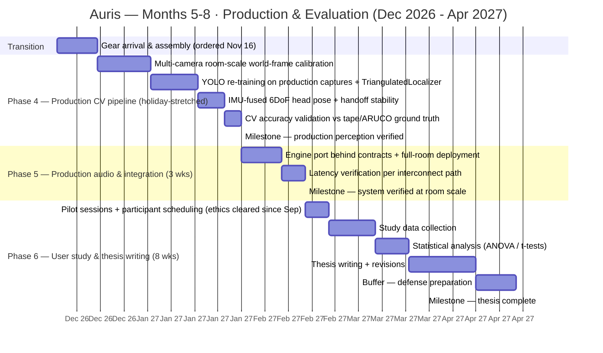

# Auris — Gantt: Months 5–8 · Production Stage & Evaluation

Full-time development, Dec 2026 – Apr 30, 2027. Companion chart: [`phases-gantt-m1-m4-prototype.md`](phases-gantt-m1-m4-prototype.md). Phase 4 is deliberately stretched across the Philippine December holidays; late April is defense-preparation buffer.

