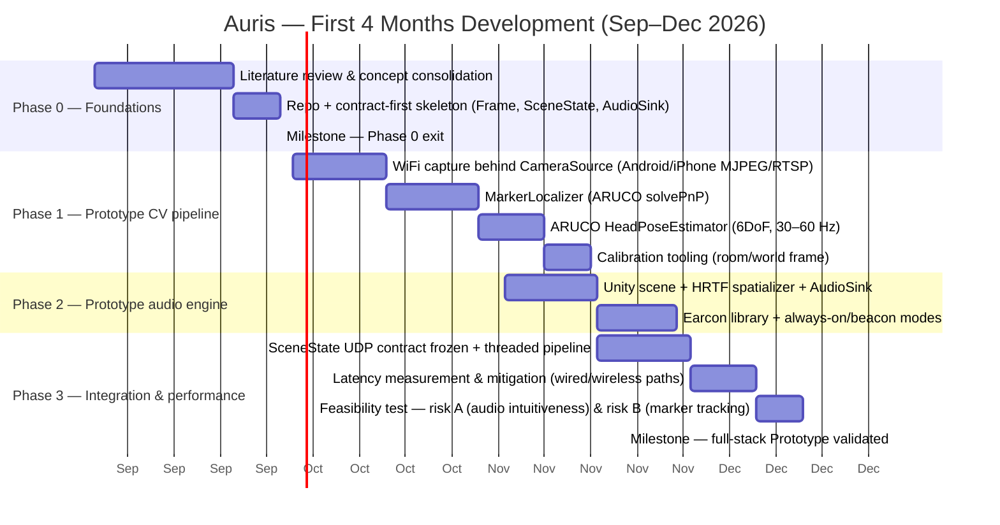

# Auris — First 4 Months Development Gantt

Phase timeline for the first four months (Sep–Dec 2026), matching the revised development phases.

```mermaid
gantt
    title Auris — First 4 Months Development (Sep–Dec 2026)
    dateFormat YYYY-MM-DD
    axisFormat %b

    section Phase 0 — Foundations
    Literature review & concept consolidation                 :p0, 2026-09-01, 21d
    Repo + contract-first skeleton (Frame, SceneState, AudioSink) :p0b, after p0, 7d
    Milestone — Phase 0 exit                                  :m0, 2026-09-29, 0d

    section Phase 1 — Prototype CV pipeline
    WiFi capture behind CameraSource (Android/iPhone MJPEG/RTSP) :p1a, 2026-10-01, 14d
    MarkerLocalizer (ARUCO solvePnP)                          :p1b, after p1a, 14d
    ARUCO HeadPoseEstimator (6DoF, 30–60 Hz)                  :p1c, after p1b, 10d
    Calibration tooling (room/world frame)                    :p1d, after p1c, 7d

    section Phase 2 — Prototype audio engine
    Unity scene + HRTF spatializer + AudioSink                :p2a, 2026-11-02, 14d
    Earcon library + always-on/beacon modes                   :p2b, after p2a, 12d

    section Phase 3 — Integration & performance
    SceneState UDP contract frozen + threaded pipeline        :p3a, 2026-11-16, 14d
    Latency measurement & mitigation (wired/wireless paths)   :p3b, after p3a, 10d
    Feasibility test — risk A (audio intuitiveness) & risk B (marker tracking) :p3c, after p3b, 7d
    Milestone — full-stack Prototype validated                :m1, 2026-12-31, 0d
```
