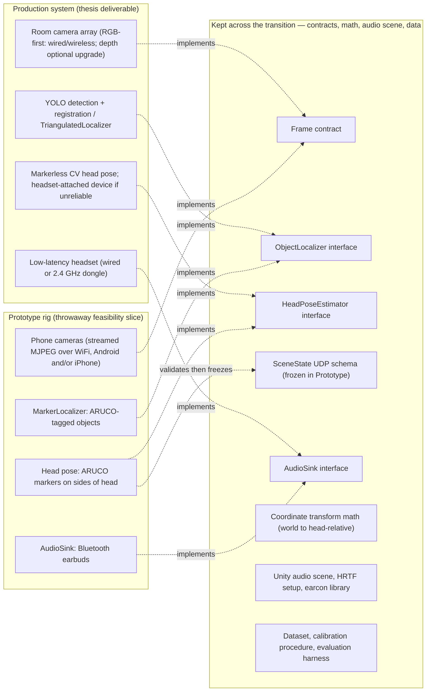

# Auris — Prototype-to-Production Transition

What swaps vs what is kept across the hardware transition. Paste the Mermaid source below into Lucidchart via *Diagram as code* if needed.

```mermaid
flowchart LR
    subgraph PROTO["Prototype rig (throwaway feasibility slice)"]
        direction TB
        P1["Phone cameras (streamed MJPEG over WiFi, Android and/or iPhone)"]
        P2["MarkerLocalizer: ARUCO-tagged objects"]
        P3["Head pose: ARUCO markers on sides of head"]
        P4["AudioSink: Bluetooth earbuds"]
    end

    subgraph KEEP["Kept across the transition — contracts, math, audio scene, data"]
        direction TB
        K1["Frame contract"]
        K2["ObjectLocalizer interface"]
        K3["HeadPoseEstimator interface"]
        K4["SceneState UDP schema (frozen in Prototype)"]
        K5["AudioSink interface"]
        K6["Coordinate transform math (world to head-relative)"]
        K7["Unity audio scene, HRTF setup, earcon library"]
        K8["Dataset, calibration procedure, evaluation harness"]
    end

    subgraph PROD["Production system (thesis deliverable)"]
        direction TB
        R1["Room camera array (RGB-first: wired/wireless; depth optional upgrade)"]
        R2["YOLO detection + registration / TriangulatedLocalizer"]
        R3["Markerless CV head pose; headset-attached device if unreliable"]
        R4["Low-latency headset (wired or 2.4 GHz dongle)"]
    end

    P1 -. "implements" .-> K1
    P2 -. "implements" .-> K2
    P3 -. "implements" .-> K3
    P3 -. "validates then freezes" .-> K4
    P4 -. "implements" .-> K5
    R1 -. "implements" .-> K1
    R2 -. "implements" .-> K2
    R3 -. "implements" .-> K3
    R4 -. "implements" .-> K5
```
