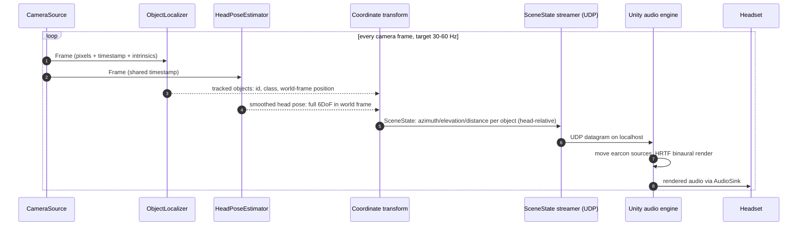

# Auris — One SceneState Update Cycle

Runtime sequence, repeating per camera frame. Paste the Mermaid source below into Lucidchart via *Diagram as code* if needed.

```mermaid
sequenceDiagram
    autonumber
    participant Cam as CameraSource
    participant Obj as ObjectLocalizer
    participant HP as HeadPoseEstimator
    participant XF as Coordinate transform
    participant TX as SceneState streamer (UDP)
    participant AU as Unity audio engine
    participant HS as Headset

    loop every camera frame, target 30-60 Hz
        Cam->>Obj: Frame (pixels + timestamp + intrinsics)
        Cam->>HP: Frame (shared timestamp)
        Obj-->>XF: tracked objects: id, class, world-frame position
        HP-->>XF: smoothed head pose: full 6DoF in world frame
        XF->>TX: SceneState: azimuth/elevation/distance per object (head-relative)
        TX->>AU: UDP datagram on localhost
        AU->>AU: move earcon sources, HRTF binaural render
        AU->>HS: rendered audio via AudioSink
    end
```
