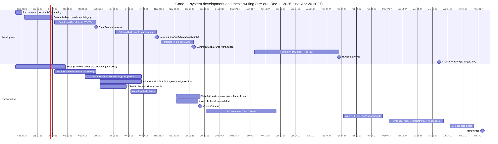

# Cane — Project Schedule (Development + Thesis)

> The canonical calendar for the whole project, on one Gantt: the system-development phases (defined in the project [README §6](../README.md#6-development-phases)) and the thesis-writing stages (defined in the thesis writing plan, [§4 Drafting schedule](auris-thesis/README.md#4-drafting-schedule)), dated against the two defense milestones. Built 2026-09-16. Section lists and exit criteria stay owned by the two READMEs; this file fixes their dates. Labels are always written out — the phase and stage codes (P, W) appear only in parentheses next to their names, and bench-test numbers (T0–T8) are the numbered tests of [`bench-tests.md`](bench-tests.md). Decisions locked 2026-09-16: the human mobility study runs **after** the pre-oral defense; the pre-oral defends the full paper drafted per what is complete on the date; purchase sign-off lands within days (ordering by Sep 20).

## 1. Defense milestones (fixed)

| Defense | Date | Defended scope |
|---|---|---|
| **Pre-oral defense** | **Fri Dec 11, 2026** | the full paper — front matter through Curriculum Vitae, both twins — drafted per what is complete on the date: chapters 1–3 complete, chapter 4 carrying real bench and calibration results with the human-study results marked in-progress, conclusions provisional |
| **Final defense** | **Tue Apr 20, 2027** | system and paper 100% — every acceptance target met, both twins complete and final-formatted |

## 2. Development track

| Task | Window | Exit / gate |
|---|---|---|
| Purchase-approval sign-off and ordering of the full parts list (pre-soldered rule) | Sep 17–20, 2026 | project [README §9](../README.md#9-open-items); parts arrive ~Oct 1–5 |
| Phase P2 — breadboard bench: wiring, power bring-up, all bench tests, drift curves, tracking tiers | Oct 1 – Oct 24, 2026 | every bench test (T0–T8) meets its acceptance row in [`bench-tests.md`](bench-tests.md); phase exits **Oct 24** |
| Phase P3 — soldered build, 3D prints (pointer shell, wearable strap mounts), parity re-run | Nov 2 – Nov 21, 2026 | breadboard parity; phase exits **Nov 21** |
| Phase P4 — integration and calibration: gain curve, head-to-pointer offset, elevation tuning, magnetometer checks; course room pinned | Nov 23 – Dec 8, 2026 | calibrated placement on the course; phase exits **Dec 8** |
| Phase P5 — human mobility study: recruitment Jan 5–16, execution Jan 19 – Feb 13 | Jan 5 – Feb 13, 2027 | study complete **Feb 13**; its acceptance targets (the M7–M9 spine rows of the thesis plan) signed off ([thesis plan §5](auris-thesis/README.md#5-thesis-specific-open-items)) |
| System complete — every latency-budget stage and engineering accuracy target met; tracking-tier keep/drop decisions executed | by **Mar 31, 2027** | project [README §4.2](../README.md#42-latency-budget-motion-to-sound-target--100-ms), §6 |

## 3. Thesis writing track

Each stage lands in **both twins** in the same pass (drafting order and stage numbers per thesis [README §4](auris-thesis/README.md#4-drafting-schedule)):

| Writing stage | Sections | Window |
|---|---|---|
| Stage W1 — Review of Related Literature | §2 (2.1–2.8) | Sep 17 – Oct 10, 2026 |
| Stage W2 — The Problem and Its Setting | §1 (1.1–1.6) | Oct 5 – 24, 2026 |
| Stage W3 — Methodology design text | §3.1–§3.4 | Oct 19 – Nov 14, 2026 |
| Stage W4 — system-design sections | §3.2, §3.5, §3.7, §3.8 (§3.6 opened) | Oct 26 – Nov 14, 2026 |
| Stage W5 — bench-validation results | §4.1 + §3.4 E1 confirmation | Oct 26 – Nov 7, 2026 |
| Stage W6 — build details | §3.6 | Nov 9 – 21, 2026 |
| Stage W7 — calibration results | §4.2 + threshold revisit + comparison-arm gate decision | Nov 30 – Dec 11, 2026 |
| Stage W8a — assemble the full pre-oral draft | §3.3 finalize; §4.3–§4.5 in-progress; §5 provisional; front matter, `Refrences`, `Appendices` drafts | Nov 30 – Dec 10, 2026 |
| **Pre-oral defense** | the full paper | **Fri Dec 11, 2026** |
| Panel-revision window | pre-oral feedback folded into §1–§3 | Dec 14, 2026 – Jan 15, 2027 |
| Stage W8b — human-study results and conclusions | §4.3–§4.5 + §5 final | Feb 15 – Mar 5, 2027 |
| Stage W9 — front matter and final packaging | Absctract, ToC, lists, final `Refrences`, Appendices, hyperlink strip | Mar 8 – Apr 2, 2027 |
| **Final defense** | the paper and the system, 100% | **Tue Apr 20, 2027** |

Track coupling: the bench-validation write-up consumes the breadboard phase; the build-details write-up consumes the soldered-build phase; the calibration-results write-up consumes the calibration phase; the human-study write-up consumes the study; the pre-oral draft waits for calibration but **not** for the human study; the final defense waits for everything (front-matter packaging + system completion).

## 4. Gantt

## 5. Contingency (slippage ladder)

1. **Ordering slips** — order on the sign-off day; parts-arrival drift moves the breadboard start and the whole development right side in equal measure; a slip ≤ 1 week absorbs without moving the pre-oral date.
2. **Breadboard bench slips past Nov 1** — the December familiarization/pilot contingency is dropped and the pre-oral draft's chapter-4 scope shrinks to bench-complete results (§4.1) with calibration marked in-progress; the bench-results write-up completes after the defense.
3. **Buffer consumed from the end only** — the Apr 5–16 prep window exists to absorb late slippage; the final defense never moves without an explicit user decision.
4. **Tracking-tier bench gate fails (the vision and UWB tests of [`bench-tests.md`](bench-tests.md), T7–T8)** — the keep/drop decision executes at the gate (project [README §9](../README.md#9-open-items)); the schedule holds either way because the tier is removable ✚ hardware.
5. Assumption: the panel-revision window spans the university break (mid-Dec – early Jan); if the calendar differs, it compresses but must finish before study recruitment (Jan 5, 2027).
