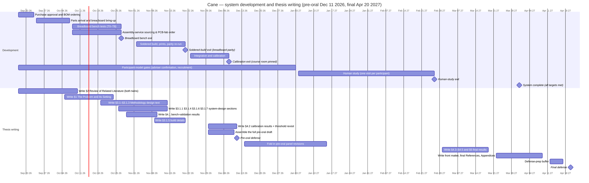

# Cane — Project Schedule (Development + Thesis)

> The canonical calendar for the whole project, on one Gantt: the system-development phases (defined in the project [README §6](../README.md#6-development-phases)) and the thesis-writing stages (defined in the thesis writing plan, [§4 Drafting schedule](../thesis/README.md#4-drafting-schedule)), dated against the two defense milestones. Built 2026-09-16; **updated 2026-09-21** — the ordering window was extended 3 days (Sep 17–23) for the co-researcher's component selection ([README §3](../README.md#3-hardware)); **the selection landed 2026-09-26** (ESP32-S3 on both devices, branch esp32-s3 — [README §9](../README.md#9-open-items)), leaving the purchase-approval sign-off as the remaining ordering gate; the 3-day slip is absorbed in the pre-P3 buffer, so the November–December phases, both defenses, and the human study are unchanged. Section lists and exit criteria stay owned by the two READMEs; this file fixes their dates. Labels are always written out — the phase and stage codes (P, W) appear only in parentheses next to their names, and bench-test numbers (T0–T8) are the numbered tests of [`bench-tests.md`](bench-tests.md). Decisions 2026-09-16: the human mobility study runs **after** the pre-oral defense; the pre-oral defends the full paper drafted per what is complete on the date; purchase sign-off lands within the ordering window (Sep 17–23). **Participant model — third revision (2026-09-16, panel constraints; thesis plan decision 2)**: within-subject aid-off vs aid-on, one visit per participant, **N = 6–8 actual VI participants** — the longitudinal single-case primary and the blindfolded-sighted fallback are both struck; adviser confirmation of the revised design plus **recruitment as the sole hard gate** (no fallback exists). Added 2026-09-26: **assembly-service sourcing** (local hand-solder service quotes/vetting/booking, handoff-package draft, PCB-fab order with spares) runs inside the P2 window, exiting Oct 27 with the breadboard exit, per [README §3.9](../README.md#39-assembly--outsourcing-p3) and [`assembly.md`](assembly.md) — the P3 window (Nov 2–21) and its breadboard-parity exit are unchanged; the new failure mode (service turnaround, failed-inspection build) is ladder item 7.

## 1. Defense milestones (fixed)

| Defense | Date | Defended scope |
|---|---|---|
| **Pre-oral defense** | **Fri Dec 11, 2026** | the full paper — front matter through Curriculum Vitae, both twins — drafted per what is complete on the date: chapters 1–3 complete, chapter 4 carrying real bench and calibration results with the human-study results marked in-progress, conclusions provisional |
| **Final defense** | **Tue Apr 20, 2027** | system and paper 100% — every acceptance target met, both twins complete and final-formatted |

## 2. Development track

| Task | Window | Exit / gate |
|---|---|---|
| Purchase-approval sign-off and ordering of the full parts list (pre-soldered rule) — **window extended 3 days (2026-09-21) for the co-researcher's component selection** ([README §3](../README.md#3-hardware)) | Sep 17–23, 2026 | project [README §9](../README.md#9-open-items); parts arrive ~Oct 4–8 |
| Phase P2 — breadboard bench: wiring, power bring-up, all bench tests, drift curves, tracking tiers | Oct 1 – Oct 27, 2026 (bring-up starts on parts arrival, ~Oct 4–8) | every bench test (T0–T8) meets its acceptance row in [`bench-tests.md`](bench-tests.md); phase exits **Oct 27** |
| Phase P3 — soldered build, 3D prints (pointer shell, wearable strap mounts), parity re-run | Nov 2 – Nov 21, 2026 | breadboard parity; phase exits **Nov 21** |
| Assembly-service sourcing (added 2026-09-26) — local hand-solder service quotes + capability vetting + booking (per-build quote, turnaround inside the P3 window), handoff-package draft, PCB-fab order with spares at the breadboard exit ([README §3.9](../README.md#39-assembly--outsourcing-p3), [`assembly.md`](assembly.md)); quotes fold into the purchase-approval sign-off lane | inside the P2 window, exit **Oct 27** with the breadboard exit | service booked before P3 entry; fab order placed at the P2 gate; both absorbed by the pre-P3 buffer if late |
| Phase P4 — integration and calibration: gain curve, head-to-pointer offset, elevation tuning, magnetometer checks; course room pinned | Nov 23 – Dec 8, 2026 | calibrated placement on the course; phase exits **Dec 8** |
| Participant-model gates — adviser confirmation of the revised design (third revision, 2026-09-16); VI-participant recruitment — **N = 6–8 actual VI participants** (recruit 8–10, floor 6) via VI organizations/schools (Resources for the Blind Inc., ATRIEV, NCDA network) — outreach starts immediately; ethics/accessible-consent prep (accessible consent incl. the recorded-audio option, O&M-specialist consult, spotter, stopping rules) | Sep 17, 2026 – Jan 3, 2027 | recruitment is the **sole hard gate** — the study runs only with ≥ 6 confirmed participants by **Jan 3, 2027**; **no fallback exists** (thesis plan decision 2, third revision — [thesis plan §5](../thesis/README.md#5-thesis-specific-open-items)); a pipeline confirmed by ~Dec 15 keeps the January session window (thesis plan §5 item 9), and a shortfall slips the study start, not the pre-oral defense |
| Phase P5 — human study (third revision): within-subject aid-off vs aid-on, **one visit per participant** (~1.5–2 h: accessible consent → device briefing/practice → point-to-sound localization test → 5–6 draggable-layout traversals, one condition per layout, assignment randomized per participant and counterbalanced across participants → SUS + NASA-TLX); visits scheduled per participant availability | Jan 4 – Feb 26, 2027 (outer envelope; the 6–8 visits can complete earlier) | study complete **Feb 26**; its acceptance targets (the M7–M9 spine rows of the thesis plan) signed off ([thesis plan §5](../thesis/README.md#5-thesis-specific-open-items)) |
| System complete — every latency-budget stage and engineering accuracy target met; tracking-tier board-level decisions executed | by **Mar 31, 2027** | project [README §4.2](../README.md#42-latency-budget-motion-to-sound-target--100-ms), §6 |

## 3. Thesis writing track

Each stage lands in **both twins** in the same pass (drafting order and stage numbers per thesis [README §4](../thesis/README.md#4-drafting-schedule)):

| Writing stage | Sections | Window |
|---|---|---|
| Stage W1 — Review of Related Literature | §2 (2.1–2.9), incl. §2.8 VI-participant methodology | Sep 17 – Oct 10, 2026 (§2.1–2.9 + `References` drafted Sep 17; the window runs to Oct 10 for revisions) |
| Stage W2 — The Problem and Its Setting | §1 (1.1–1.6) | Oct 5 – 24, 2026 |
| Stage W3 — Methodology design text | §3.1–§3.1.3 | Oct 19 – Nov 14, 2026 |
| Stage W4 — system-design sections | §3.1.1, §3.1.4, §3.1.6, §3.1.7 (§3.1.5 opened) | Oct 26 – Nov 14, 2026 |
| Stage W5 — bench-validation results | §4.1 + §3.1.3 E1 confirmation | Oct 29 – Nov 10, 2026 (bench phase exits Oct 27) |
| Stage W6 — build details | §3.1.5 | Nov 9 – 21, 2026 |
| Stage W7 — calibration results | §4.2 + threshold revisit + comparison-arm gate decision | Nov 30 – Dec 11, 2026 |
| Stage W8a — assemble the full pre-oral draft | §3.1.2 finalize; §4.3–§4.5 in-progress; §5 provisional; front matter, `References`, `Appendices` drafts | Nov 30 – Dec 10, 2026 |
| **Pre-oral defense** | the full paper | **Fri Dec 11, 2026** |
| Panel-revision window | pre-oral feedback folded into §1–§3 | Dec 14, 2026 – Jan 15, 2027 |
| Stage W8b — human-study results and conclusions | §4.3–§4.5 + §5 final | Mar 1 – 19, 2027 |
| Stage W9 — front matter and final packaging | Abstract, ToC, lists, final `References`, Appendices, hyperlink strip | Mar 22 – Apr 9, 2027 |
| **Final defense** | the paper and the system, 100% | **Tue Apr 20, 2027** |

Track coupling: the bench-validation write-up consumes the breadboard phase; the build-details write-up consumes the soldered-build phase; the calibration-results write-up consumes the calibration phase; the human-study write-up consumes the study; the pre-oral draft waits for calibration but **not** for the human study; the final defense waits for everything (front-matter packaging + system completion).

## 4. Gantt

```mermaid
%%{init: {"gantt": {"topAxis": true, "useWidth": 2400, "useMaxWidth": false}} }%%
gantt
    title Cane — system development and thesis writing (pre-oral Dec 11 2026, final Apr 20 2027)
    dateFormat YYYY-MM-DD
    axisFormat %b %d %y
    tickInterval 1week

    section Development
    Purchase approval and BOM ordering         :d1, 2026-09-17, 2026-09-23
    Parts arrival and breadboard bring-up      :d2, 2026-09-24, 2026-10-07
    Breadboard bench tests (T0–T8)             :d3, 2026-10-08, 2026-10-27
    Assembly-service sourcing & PCB-fab order  :d3a, 2026-10-08, 2026-10-27
    Breadboard bench exit                      :milestone, p2x, 2026-10-27, 0d
    Soldered build, prints, parity re-run      :d4, 2026-11-02, 2026-11-21
    Soldered-build exit (breadboard parity)    :milestone, p3x, 2026-11-21, 0d
    Integration and calibration                :d5, 2026-11-23, 2026-12-08
    Calibration exit (course room pinned)      :milestone, p4x, 2026-12-08, 0d
    Participant-model gates (adviser confirmation, recruitment) :dg, 2026-09-17, 2027-01-03
    Human study (one visit per participant) :d6, 2027-01-04, 2027-02-26
    Human-study exit                           :milestone, p5x, 2027-02-26, 0d
    System complete (all targets met)          :milestone, s100, 2027-03-31, 0d

    section Thesis writing
    Write §2 Review of Related Literature (both twins) :t1, 2026-09-17, 2026-10-10
    Write §1 The Problem and Its Setting       :t2, 2026-10-05, 2026-10-24
    Write §3.1–§3.1.3 Methodology design text  :t3, 2026-10-19, 2026-11-14
    Write §3.1.1 §3.1.4 §3.1.6 §3.1.7 system-design sections :t4, 2026-10-26, 2026-11-14
    Write §4.1 bench-validation results        :t5, 2026-10-29, 2026-11-10
    Write §3.1.5 build details                 :t6, 2026-11-09, 2026-11-21
    Write §4.2 calibration results + threshold revisit :t7, 2026-11-30, 2026-12-11
    Assemble the full pre-oral draft           :t8, 2026-11-30, 2026-12-10
    Pre-oral defense                           :milestone, m1, 2026-12-11, 0d
    Fold in pre-oral panel revisions           :t9, 2026-12-14, 2027-01-15
    Write §4.3–§4.5 and §5 final results       :t10, 2027-03-01, 2027-03-19
    Write front matter, final References, Appendices :t12, 2027-03-22, 2027-04-09
    Defense-prep buffer                        :t13, 2027-04-12, 2027-04-17
    Final defense                              :milestone, m2, 2027-04-20, 0d
```

## 5. Contingency (slippage ladder)

1. **Ordering slips** — order on the sign-off day; parts-arrival drift moves the breadboard start and the whole development right side in equal measure; a slip ≤ 1 week absorbs without moving the pre-oral date. The 2026-09-21 3-day extension of the ordering window (co-researcher's component selection, [README §3](../README.md#3-hardware)) is absorbed this way: the bench exit moves Oct 24 → Oct 27 and the pre-P3 buffer shrinks from 8 to 5 days — the November–December phases, both defenses, and the human study are untouched.
2. **Breadboard bench slips past Nov 3** — the December familiarization/pilot contingency is dropped and the pre-oral draft's chapter-4 scope shrinks to bench-complete results (§4.1) with calibration marked in-progress; the bench-results write-up completes after the defense.
3. **Buffer consumed from the end only** — the Apr 5–16 prep window exists to absorb late slippage; the final defense never moves without an explicit user decision.
4. **Tracking-tier bench gate fails (the vision and UWB tests of [`bench-tests.md`](bench-tests.md), T7–T8)** — the gates force the board-level redesign decision (camera capture strategy / alternate-frame capture / SPI remap, and — under the fallback protocol — the **board class**, via the pinned raspi-4 fallback) at the gate (project [README §9](../README.md#9-open-items)); the schedule holds either way because the decision lands before the P3 build. The tracking hardware itself is part of the final design and is never dropped.
5. Assumption: the panel-revision window spans the university break (mid-Dec – early Jan); if the calendar differs, it compresses but must finish before study execution begins (Jan 4, 2027).
6. **Recruitment shortfall** — there is **no fallback design** (third revision): if fewer than 6 participants are confirmed by Jan 3, 2027, the study start slips and the calendar right-shifts in equal measure; W8b (Mar 1–19) and the defense-prep buffer absorb up to ~2 weeks before the final defense is at risk — a larger shortfall forces an explicit user decision on the defense dates.
7. **Assembly-service turnaround slips or a returned build fails inspection (added 2026-09-26)** — the local hand-solder service sits between the handoff package and the parity re-run ([README §3.9](../README.md#39-assembly--outsourcing-p3), [`assembly.md`](assembly.md)). Mitigations land earlier: the service is booked inside the P2 window, quoted with turnaround inside the P3 window, and locally sourced (drop-off/pick-up fix loop, no shipping); the fab order carries **≥ 2 spare carrier PCBs per device**, so a defective board costs a re-solder, never a re-fab (typ. ≤ 2 weeks); a single re-fab still fits the ladder's item-2 relief — the December familiarization contingency drops and pre-oral chapter-4 scope shrinks to bench-complete results before the defense date ever moves. Systematic workmanship faults route back to the service; the in-house rework kit covers trivial fixes only.
