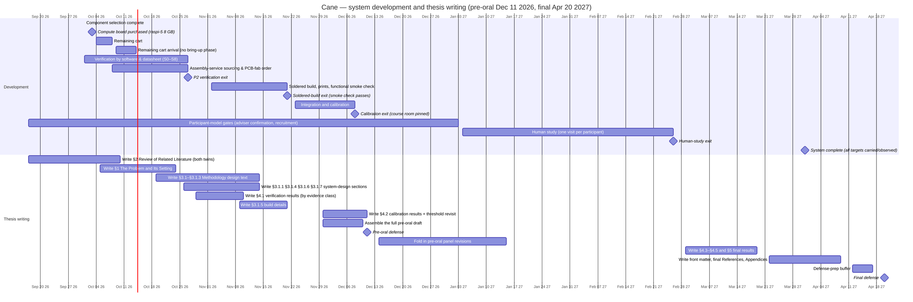

# Cane — Project Schedule (Development + Thesis)

> The canonical calendar for the whole project, on one Gantt: the system-development phases (defined in the project [README §6](../README.md#6-development-phases)) and the thesis-writing stages (defined in the thesis writing plan, [§4 Drafting schedule](../thesis/README.md#4-drafting-schedule)), dated against the two defense milestones. Built 2026-09-16; **updated 2026-09-21** — the ordering window was extended 3 days (Sep 17–23) for the co-researcher's component selection ([README §3](../README.md#3-hardware)); **updated 2026-10-01** — the component selection is **complete**: the wearable is a Raspberry Pi 5 (board class decided 2026-10-01; the vision tier's camera count of 1 or 2 is decided at P2 from the FOV-geometry and co-residence analysis), itemized in [`hardware.md`](hardware.md) with the cart in [`purchase-list.md`](purchase-list.md) ([README §3](../README.md#3-hardware), [§9](../README.md#9-open-items)); **also updated 2026-10-01 — the hardware bench phase is dropped**: P2 becomes verification by software & datasheet (SPICE, desktop pipeline sim, cycle/MAD budgets, Monte-Carlo error propagation, citation ledger) and needs no parts, the T0–T8 thresholds survive as the acceptance specification, and P3's exit becomes the functional smoke check; **updated 2026-10-03 — the compute board is purchased: a Raspberry Pi 5, 8 GB at ₱6,000**, which retires the ordering lane for that row (only the received-goods inspection remains), leaves **every other cart row still to buy** at ≈ ₱15,800–31,300, and closes the board class with no alternative carried — so contingency 1 is narrowed to the remaining rows, the flip branch is deleted from contingency 4, and a new risk 12 ("no board-class escape") carries what the flip path used to ([README §3](../README.md#3-hardware), [§7](../README.md#7-risks-and-limitations)). The November–December phases, both defenses, and the human study are unchanged. Section lists and exit criteria stay owned by the two READMEs; this file fixes their dates. Labels are always written out — the phase and stage codes (P, W) appear only in parentheses next to their names, and gate numbers (T0–T8 for the acceptance thresholds, S0–S8 for their evidence rows) are the numbered entries of [`bench-tests.md`](bench-tests.md). Decisions 2026-09-16: the human mobility study runs **after** the pre-oral defense; the pre-oral defends the full paper drafted per what is complete on the date; purchase sign-off lands within the ordering window (Sep 17–23). **Participant model — third revision (2026-09-16, panel constraints; thesis plan decision 2)**: within-subject aid-off vs aid-on, one visit per participant, **N = 6–8 actual VI participants** — the longitudinal single-case primary and the blindfolded-sighted fallback are both struck; adviser confirmation of the revised design plus **recruitment as the sole hard gate** (no fallback exists). Added 2026-09-26: **assembly-service sourcing** (local hand-solder service quotes/vetting/booking, handoff-package draft, PCB-fab order with spares) runs inside the P2 window, exiting Oct 27 with the P2 verification exit, per [README §3.9](../README.md#39-assembly--outsourcing-p3) and [`assembly.md`](assembly.md) — the P3 window (Nov 2–21) and its smoke-check exit are unchanged; the new failure mode (service turnaround, failed-inspection build) is ladder item 7.

## 1. Defense milestones (fixed)

| Defense | Date | Defended scope |
|---|---|---|
| **Pre-oral defense** | **Fri Dec 11, 2026** | the full paper — front matter through Curriculum Vitae, both twins — drafted per what is complete on the date: chapters 1–3 complete, chapter 4 carrying real bench and calibration results with the human-study results marked in-progress, conclusions provisional |
| **Final defense** | **Tue Apr 20, 2027** | system and paper 100% — every acceptance target met, both twins complete and final-formatted |

## 2. Development track

| Task | Window | Exit / gate |
|---|---|---|
| Compute board **purchased 2026-10-03** — Raspberry Pi 5, 8 GB, ₱6,000, class closed, no alternative carried ([README §3](../README.md#3-hardware), [§7](../README.md#7-risks-and-limitations) risk 12); received-goods inspection done or outstanding per [`purchase-list.md`](purchase-list.md) §10 lane A | board in hand from 2026-10-03; **the remaining cart** (pointer electronics, agnostic rows, cooler, microSD, cameras — count 1 or 2 still open, PD bank, tools, materials, study hardware) still needs the purchase-approval sign-off and ordering at ≈ ₱15,800–31,300 (working envelope: sign-off ~Oct 8, arrival ~Oct 10–13 — contingency 1) | project [README §9](../README.md#9-open-items) |
| Phase P2 — verification by software & datasheet: the evidence program (SPICE, desktop pipeline sim, cycle/MAD budgets, Monte-Carlo error propagation, citation ledger), carrier-board pin/overlay set | Oct 1 – Oct 27, 2026 (no parts dependency — this phase needs no hardware) | every §4.2 stage and every T0–T8 threshold has a labelled evidence entry meeting it in [`bench-tests.md`](bench-tests.md); camera count and marker dictionary/size pinned; residuals named; phase exits **Oct 27** |
| Phase P3 — soldered build, 3D prints (pointer shell, wearable strap mounts), functional smoke check | Nov 2 – Nov 21, 2026 | incoming inspection + first power-up + end-to-end smoke check passes ([`bench-tests.md`](bench-tests.md) § P3 smoke check); phase exits **Nov 21** |
| Assembly-service sourcing (added 2026-09-26) — local hand-solder service quotes + capability vetting + booking (per-build quote, turnaround inside the P3 window), handoff-package draft, PCB-fab order with spares at the P2 verification exit ([README §3.9](../README.md#39-assembly--outsourcing-p3), [`assembly.md`](assembly.md)); quotes fold into the purchase-approval sign-off lane | inside the P2 window, exit **Oct 27** with the P2 verification exit | service booked before P3 entry; fab order placed at the P2 gate; both absorbed by the pre-P3 buffer if late |
| Phase P4 — integration and calibration: gain curve, head-to-pointer offset, elevation tuning, magnetometer checks; course room pinned | Nov 23 – Dec 8, 2026 | calibrated placement on the course; phase exits **Dec 8** |
| Participant-model gates — adviser confirmation of the revised design (third revision, 2026-09-16); VI-participant recruitment — **N = 6–8 actual VI participants** (recruit 8–10, floor 6) via VI organizations/schools (Resources for the Blind Inc., ATRIEV, NCDA network) — outreach starts immediately; ethics/accessible-consent prep (accessible consent incl. the recorded-audio option, O&M-specialist consult, spotter, stopping rules) | Sep 17, 2026 – Jan 3, 2027 | recruitment is the **sole hard gate** — the study runs only with ≥ 6 confirmed participants by **Jan 3, 2027**; **no fallback exists** (thesis plan decision 2, third revision — [thesis plan §5](../thesis/README.md#5-thesis-specific-open-items)); a pipeline confirmed by ~Dec 15 keeps the January session window (thesis plan §5 item 9), and a shortfall slips the study start, not the pre-oral defense |
| Phase P5 — human study (third revision): within-subject aid-off vs aid-on, **one visit per participant** (~1.5–2 h: accessible consent → device briefing/practice → point-to-sound localization test → 5–6 draggable-layout traversals, one condition per layout, assignment randomized per participant and counterbalanced across participants → SUS + NASA-TLX); visits scheduled per participant availability | Jan 4 – Feb 26, 2027 (outer envelope; the 6–8 visits can complete earlier) | study complete **Feb 26**; its acceptance targets (the M7–M9 spine rows of the thesis plan) signed off ([thesis plan §5](../thesis/README.md#5-thesis-specific-open-items)) |
| System complete — every latency-budget stage and engineering accuracy target carried by labelled evidence, and the ones measurable in use observed on the worn device; tracking-tier board-level decisions executed | by **Mar 31, 2027** | project [README §4.2](../README.md#42-latency-budget-motion-to-sound-target--100-ms), §6 |

## 3. Thesis writing track

Each stage lands in **both twins** in the same pass (drafting order and stage numbers per thesis [README §4](../thesis/README.md#4-drafting-schedule)):

| Writing stage | Sections | Window |
|---|---|---|
| Stage W1 — Review of Related Literature | §2 (2.1–2.9), incl. §2.8 VI-participant methodology | Sep 17 – Oct 10, 2026 (§2.1–2.9 + `References` drafted Sep 17; the window runs to Oct 10 for revisions) |
| Stage W2 — The Problem and Its Setting | §1 (1.1–1.6) | Oct 5 – 24, 2026 |
| Stage W3 — Methodology design text | §3.1–§3.1.3 | Oct 19 – Nov 14, 2026 |
| Stage W4 — system-design sections | §3.1.1, §3.1.4, §3.1.6, §3.1.7 (§3.1.5 opened) | Oct 26 – Nov 14, 2026 |
| Stage W5 — verification results (§4.1 system verification: simulated/budgeted/propagated/cited, by evidence class) | §4.1 + §3.1.3 verification-methodology confirmation | Oct 29 – Nov 10, 2026 (P2 verification phase exits Oct 27) |
| Stage W6 — build details | §3.1.5 | Nov 9 – 21, 2026 |
| Stage W7 — calibration results | §4.2 + threshold revisit + comparison-arm gate decision | Nov 30 – Dec 11, 2026 |
| Stage W8a — assemble the full pre-oral draft | §3.1.2 finalize; §4.3–§4.5 in-progress; §5 provisional; front matter, `References`, `Appendices` drafts | Nov 30 – Dec 10, 2026 |
| **Pre-oral defense** | the full paper | **Fri Dec 11, 2026** |
| Panel-revision window | pre-oral feedback folded into §1–§3 | Dec 14, 2026 – Jan 15, 2027 |
| Stage W8b — human-study results and conclusions | §4.3–§4.5 + §5 final | Mar 1 – 19, 2027 |
| Stage W9 — front matter and final packaging | Abstract, ToC, lists, final `References`, Appendices, hyperlink strip | Mar 22 – Apr 9, 2027 |
| **Final defense** | the paper and the system, 100% | **Tue Apr 20, 2027** |

Track coupling: the verification write-up consumes the P2 evidence phase; the build-details write-up consumes the soldered-build phase; the calibration-results write-up consumes the calibration phase; the human-study write-up consumes the study; the pre-oral draft waits for calibration but **not** for the human study; the final defense waits for everything (front-matter packaging + system completion).

## 4. Gantt

```mermaid
%%{init: {"gantt": {"topAxis": true, "useWidth": 2400, "useMaxWidth": false}} }%%
gantt
    title Cane — system development and thesis writing (pre-oral Dec 11 2026, final Apr 20 2027)
    dateFormat YYYY-MM-DD
    axisFormat %b %d %y
    tickInterval 1week

    section Development
    Component selection complete            :d0, 2026-10-01, 2026-10-01
    Compute board purchased (raspi-5 8 GB)  :milestone, db, 2026-10-03, 0d
    Remaining cart: sign-off and ordering   :d1, 2026-10-04, 2026-10-08
    Remaining cart arrival (no bring-up phase) :d2, 2026-10-09, 2026-10-14
    Verification by software & datasheet (S0–S8) :d3, 2026-10-01, 2026-10-27
    Assembly-service sourcing & PCB-fab order  :d3a, 2026-10-08, 2026-10-27
    P2 verification exit                        :milestone, p2x, 2026-10-27, 0d
    Soldered build, prints, functional smoke check :d4, 2026-11-02, 2026-11-21
    Soldered-build exit (smoke check passes)   :milestone, p3x, 2026-11-21, 0d
    Integration and calibration                :d5, 2026-11-23, 2026-12-08
    Calibration exit (course room pinned)      :milestone, p4x, 2026-12-08, 0d
    Participant-model gates (adviser confirmation, recruitment) :dg, 2026-09-17, 2027-01-03
    Human study (one visit per participant) :d6, 2027-01-04, 2027-02-26
    Human-study exit                           :milestone, p5x, 2027-02-26, 0d
    System complete (all targets carried/observed) :milestone, s100, 2027-03-31, 0d

    section Thesis writing
    Write §2 Review of Related Literature (both twins) :t1, 2026-09-17, 2026-10-10
    Write §1 The Problem and Its Setting       :t2, 2026-10-05, 2026-10-24
    Write §3.1–§3.1.3 Methodology design text  :t3, 2026-10-19, 2026-11-14
    Write §3.1.1 §3.1.4 §3.1.6 §3.1.7 system-design sections :t4, 2026-10-26, 2026-11-14
    Write §4.1 verification results (by evidence class) :t5, 2026-10-29, 2026-11-10
    Write §3.1.5 build details                 :t6, 2026-11-09, 2026-11-21
    Write §4.2 calibration results + threshold revisit :t7, 2026-11-30, 2026-12-11
    Assemble the full pre-oral draft           :t8, 2026-11-30, 2026-12-10
    Pre-oral defense                           :milestone, m1, 2026-12-11, 0d
    Fold in pre-oral panel revisions           :t9, 2026-12-14, 2027-01-15
    Write §4.3–§4.5 and §5 final results       :t10, 2027-03-01, 2027-03-19
    Write front matter, final References, Appendices :t12, 2027-03-22, 2027-04-09
    Defense-prep buffer                        :t13, 2027-04-12, 2027-04-17
    Final defense                              :milestone, m2, 2027-04-20, 0d
```

## 5. Contingency (slippage ladder)

1. **Ordering slips — now narrowed to the remaining rows** (the compute board was bought 2026-10-03, so it is no longer in this lane; its failure mode is a **dead-on-arrival replacement from a local seller**, not a slip — a logged deviation under [risk 12](../README.md#7-risks-and-limitations), with no manufacturer warranty assumed). For everything still to buy: order on the sign-off day; parts-arrival drift moves the P3 build start and the development right side in equal measure, while **P2 does not wait on parts at all** (the evidence phase needs no hardware), so the pre-P3 buffer absorbs an ordering slip directly. The 2026-09-29 clearing (compatibility re-selection, [README §9](../README.md#9-open-items)) re-opened ordering past the expired Sep 17–23 window: the working envelope lands sign-off ~Oct 8 and arrival ~Oct 10–13, about one week past the recorded plan, absorbed by the pre-P3 buffer (5 days); if ordering slips past ~mid-October, contingency 2's scope relief applies (December familiarization drops; pre-oral chapter-4 shrinks to the verification results that exist) while the defense dates still hold. **The camera order is the lane's one deliberate decision point**: the count (1 or 2) is settled at P2 and is free to reduce while nothing is bought, so it should not be ordered before that analysis lands.
2. **P2 verification slips past Nov 3** — the December familiarization/pilot contingency is dropped and the pre-oral draft's chapter-4 scope shrinks to the evidence entries that are complete (§4.1, each labelled by class) with calibration marked in-progress; the verification write-up completes after the defense. Because P2 needs no parts, a slip here is a workload slip, not a supply-chain one.
3. **Buffer consumed from the end only** — the Apr 5–16 prep window exists to absorb late slippage; the final defense never moves without an explicit user decision.
4. **Tracking-tier evidence gate is insufficient or the device reveals more than the evidence did (the vision and UWB gates of [`bench-tests.md`](bench-tests.md) S7–S8, plus first-power-up observation at P4)** — the gates force the tracking redesign decision (camera count / detection cadence / SPI remap) at P2, before the P3 build; and if the first-power-up observation contradicts the P2 evidence, the redesign lands then, on the spare-carrier-PCB margin rather than before fabrication. **This is the structural cost of the no-bench decision**: the design decision that was once forced cheaply on a breadboard is now forced late, with a re-fab as the failure mode. **The board-class flip that used to be the deepest fallback here is deleted** (the class is purchased, [risk 12](../README.md#7-risks-and-limitations)), so the response set is now: feature-level re-scoping (one camera, detect-then-track), the USB-audio-dongle fallback for the audio path, and the spare-PCB margin — all within the chosen class. The tracking hardware itself is part of the final design and is never dropped; the mitigation is that S7's margin argument runs on the Pi 5's architectural headroom, and **neither camera has been purchased**, so a count change costs ₱0 rather than a re-buy.
5. Assumption: the panel-revision window spans the university break (mid-Dec – early Jan); if the calendar differs, it compresses but must finish before study execution begins (Jan 4, 2027).
6. **Recruitment shortfall** — there is **no fallback design** (third revision): if fewer than 6 participants are confirmed by Jan 3, 2027, the study start slips and the calendar right-shifts in equal measure; W8b (Mar 1–19) and the defense-prep buffer absorb up to ~2 weeks before the final defense is at risk — a larger shortfall forces an explicit user decision on the defense dates.
7. **Assembly-service turnaround slips or a returned build fails inspection (added 2026-09-26)** — the local hand-solder service sits between the handoff package and the functional smoke check ([README §3.9](../README.md#39-assembly--outsourcing-p3), [`assembly.md`](assembly.md)). Mitigations land earlier: the service is booked inside the P2 window, quoted with turnaround inside the P3 window, and locally sourced (drop-off/pick-up fix loop, no shipping); the fab order carries **≥ 2 spare carrier PCBs per device**, so a defective board costs a re-solder, never a re-fab (typ. ≤ 2 weeks); a single re-fab still fits the ladder's item-2 relief — the December familiarization contingency drops and pre-oral chapter-4 scope shrinks to the verification results that exist before the defense date ever moves. Systematic workmanship faults route back to the service; the in-house rework kit covers trivial fixes only. **No bench means no post-solder fallback measurement**: a returned build is judged by inspection and the smoke check, so a workmanship fault that hides from both is caught by P4 calibration, one phase later than it would have been by a parity re-run.
